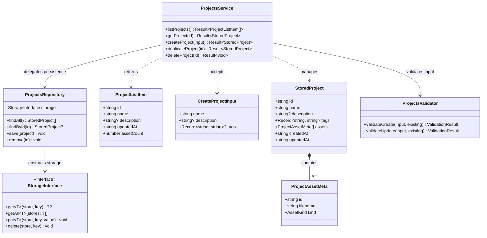
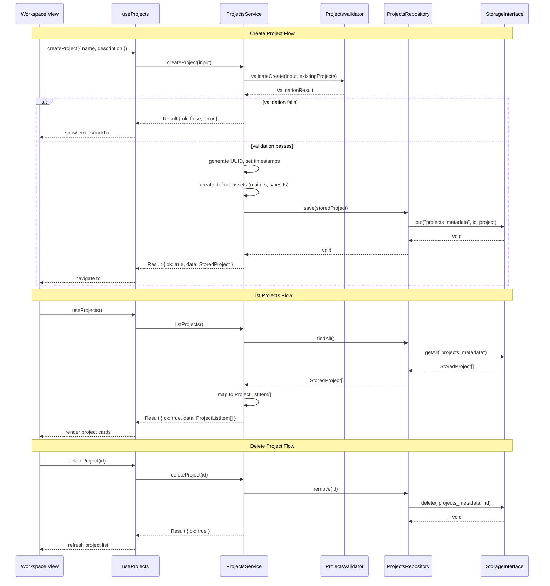
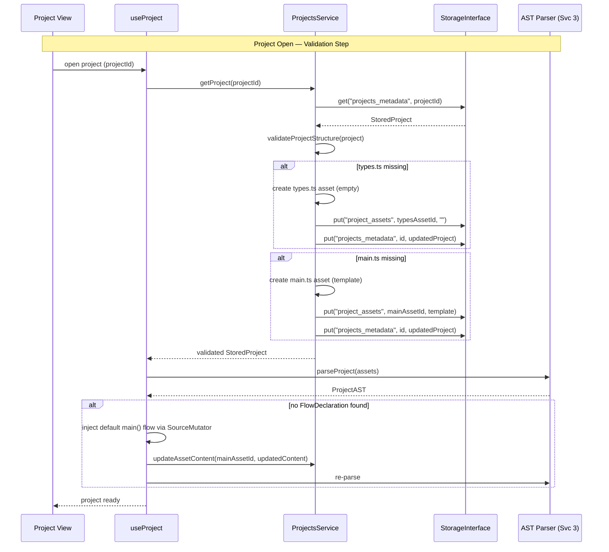

# Service 1: Projects Management — Architecture

> **Service:** Projects Management (Service 1)
> **Testing:** Jest (`lib/projects/`) | Cypress (`views/workspace/`)
> **Depends on:** Storage Abstraction (`lib/storage/`)
> **Consumed by:** UI Layer (Workspace View), Project Management (Service 2)
> **Defined types:** `StoredProject`, `ProjectListItem`, `CreateProjectInput`

## Overview

The Projects Management service handles workspace-level operations: listing, creating, duplicating, and deleting
projects stored in IndexedDB. It defines the canonical **Project BOM** (Bill of Materials) — the `StoredProject`
interface that all other services reference when they need to know what a project contains.

This service is intentionally thin. It delegates persistence to the Storage Abstraction layer
(`lib/storage/storage-interface.ts`), which means the underlying storage backend (IndexedDB today, Git or file
system in the future) can be swapped without changing any service logic. Validation (name uniqueness, required
fields) is handled by a dedicated validator component.

The frontend counterpart is the Workspace view — a project cards grid with create/delete dialogs, accessed via the
`#workspace` hash route.

## Structural Diagram



> `ProjectAsset` (content) and `ProjectAssetMeta` are defined in [02_PROJECT_SERVICE_ARCH.md](02_PROJECT_SERVICE_ARCH.md).

## Behavioral Diagram



## Key Interfaces

```typescript
interface StoredProject {
    id: string; // UUID v4
    name: string; // User-defined, unique within workspace
    description?: string;
    tags: Record<string, string>; // Arbitrary key-value metadata
    assets: ProjectAssetMeta[]; // List of assets (metadata only, no content)
    createdAt: string; // ISO 8601
    updatedAt: string; // ISO 8601
}

interface ProjectAssetMeta {
    id: string;
    filename: string;
    kind: AssetKind;
}

interface ProjectListItem {
    id: string;
    name: string;
    description?: string;
    updatedAt: string;
    assetCount: number; // Derived from assets.length
}

interface CreateProjectInput {
    name: string;
    description?: string;
    tags?: Record<string, string>;
}
```

## Components

### ProjectsService (`projects-service.ts`)

Orchestrates all project CRUD operations. Coordinates between the validator (input checks) and the repository
(persistence). Generates UUIDs for new projects, manages timestamps, and creates default assets on project creation.

**Test strategy (Jest):** Mock `ProjectsRepository`, verify correct delegation, timestamp generation, and error
handling for duplicate names.

### ProjectsRepository (`projects-repository.ts`)

Thin adapter between the service layer and the `StorageInterface`. Maps `StoredProject` objects to/from the
`"projects"` store. Contains no business logic — purely a data access layer.

**Test strategy (Jest):** Mock `StorageInterface`, verify correct store name and key usage.

### ProjectsValidator (`projects-validator.ts`)

Validates `CreateProjectInput` and update inputs. Enforces business rules:

- Project name is required and non-empty
- Project name is unique within the workspace (checked against existing projects list)
- Name length and character constraints

**Test strategy (Jest):** Pure function tests with various valid/invalid inputs.

## Default Project Assets

When a new project is created, two default assets are generated:

1. **`main.ts`** (`kind: 'source'`) — the primary TypeScript source file, initially containing a minimal `main()`
   function template with `@nodeType flow` annotation
2. **`types.ts`** (`kind: 'types'`) — the default types file for user-defined interfaces, initially empty

## Project Validation Step

Every time a project is **opened** (i.e., navigated to via `#flow/:projectId` or any project-scoped route), a
validation step runs to ensure the project meets structural invariants. This prevents downstream errors in the
Flow Editor, Types Editor, and Execution Engine.

**When it runs:** After the project metadata and asset list are loaded from IndexedDB, before any view renders.

**Validation rules:**

1. **Ensure `types.ts` exists.** If no asset with `kind: 'types'` and `filename: 'types.ts'` is found in the
   project's asset list, create one with empty content and persist it.
2. **Ensure `main.ts` exists.** If no asset with `kind: 'source'` and `filename: 'main.ts'` is found, create one
   with a minimal `main()` flow function template and persist it.
3. **Ensure at least one flow exists.** After loading and parsing assets via AST Parsing (Service 3), check the
   `declarations` for at least one `FlowDeclaration` (nodeType `'flow'`). If none is found, inject a default
   `main()` flow function into `main.ts` via `SourceMutator` and persist the updated content.



**Implementation location:** `ProjectsService.validateProjectStructure()` for asset-level checks.
Flow existence check runs in `useProject` hook after AST parsing.

> For file structure, see
> [ARCHITECTURE.md — Proposed Project Component Structure](ARCHITECTURE.md#proposed-project-component-structure).
