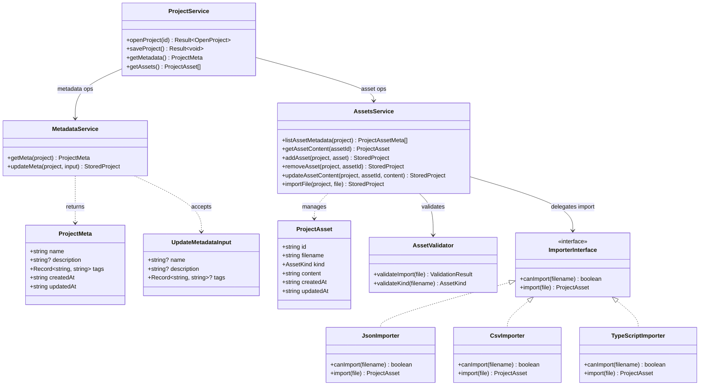
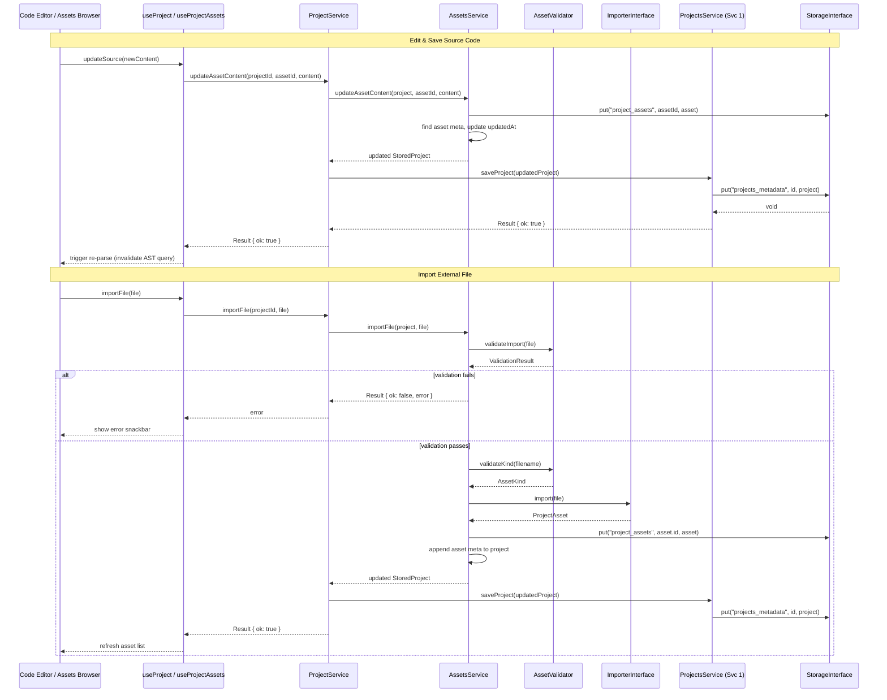

# Service 2: Project Management — Architecture

> **Service:** Project Management (Service 2)
> **Testing:** Jest (`lib/project/`) | Cypress (`views/code-editor/`, `views/types-editor/`, `views/assets-browser/`)
> **Depends on:** Projects Management (Service 1) for `StoredProject`, AST Parsing (Service 3) for metadata extraction,
> Types Service (Service 4) for schema management, Storage Abstraction (`lib/storage/`)
> **Consumed by:** UI Layer (Code Editor, Types Editor, Assets Browser), Flow Modeling (Service 5), Execution Engine
> (Service 6)
> **Defined types:** `ProjectAsset`, `AssetKind`, `ProjectMeta`, `ImporterInterface`

## Overview

The Project Management service orchestrates operations on a **single open project**. It is the "work surface" between
the workspace (Service 1, which manages the collection of projects) and the downstream consumers (AST Parsing,
Types Registry, Flow Modeling, Execution Engine).

The service is divided into two primary sub-domains:

- **Metadata** — project name, description, tags, and timestamp management. Simple CRUD.
- **Assets** — manages project files. Each asset has a `kind` discriminator (`source`, `types`, `json`, `csv`,
  `utility`, `service`) and a text-based `content` field. Format-specific importers handle parsing during file import.

**Types Management Note:** Type extraction and schema registry logic have been moved to the **Types Service (Service 4)**. 
Service 2 provides the raw asset content to Service 4 and receives the structured `ManagedType[]` for rendering in the 
Types Editor view.

The `ProjectService` acts as a façade, exposing a unified API that coordinates the sub-services. Hooks
(`use-project`, `use-project-assets`) bridge this service to the React UI layer.

## Structural Diagram



## Behavioral Diagram



## Key Interfaces

```typescript
type AssetKind = 'source' | 'types' | 'json' | 'csv' | 'utility' | 'service';

interface ProjectAsset {
    id: string; // UUID v4
    filename: string; // e.g. "main.ts", "config.json"
    kind: AssetKind; // Discriminator for UI rendering and import handling
    content: string; // File contents (text-based)
    createdAt: string; // ISO 8601
    updatedAt: string; // ISO 8601
}

interface ProjectMeta {
    name: string;
    description?: string;
    tags: Record<string, string>;
    createdAt: string;
    updatedAt: string;
}

interface UpdateMetadataInput {
    name?: string;
    description?: string;
    tags?: Record<string, string>;
}

interface ImporterInterface {
    canImport(filename: string): boolean;
    import(file: File | string): ProjectAsset;
}
```

## Components

### ProjectService (`project-service.ts`)

Façade that coordinates metadata and assets sub-services. Provides a single entry point for hooks to
interact with a currently open project. Manages the "save to Service 1" workflow.

**Test strategy (Jest):** Mock sub-services, verify correct delegation and save coordination.

### MetadataService (`metadata/metadata-service.ts`)

Reads and updates project metadata fields. Automatically manages `updatedAt` timestamps on any change.

**Test strategy (Jest):** Pure functions — input/output pairs for metadata updates.

### AssetsService (`assets/assets-service.ts`)

Asset CRUD operations: add, remove, rename, update content, and import. Coordinates with the validator and importers
during file import. Does not directly persist — returns the updated `StoredProject` for the caller to save.

**Test strategy (Jest):** Mock validators and importers, verify asset list manipulation.

### AssetValidator (`assets/asset-validator.ts`)

Validates file imports: checks file extension against allowed kinds, enforces size limits, detects duplicate filenames
within the project.

**Test strategy (Jest):** Pure validation functions with valid/invalid file inputs.

### Importers (`assets/importers/`)

Each importer implements `ImporterInterface`:

- **JsonImporter** — validates JSON syntax, creates `kind: 'json'` asset
- **CsvImporter** — parses CSV headers, creates `kind: 'csv'` asset
- **TypeScriptImporter** — reads TypeScript source, creates `kind: 'source'` or `kind: 'utility'` asset

**Test strategy (Jest):** Input file content → output `ProjectAsset` assertions.

> For file structure, see
> [ARCHITECTURE.md — Proposed Project Component Structure](ARCHITECTURE.md#proposed-project-component-structure).
