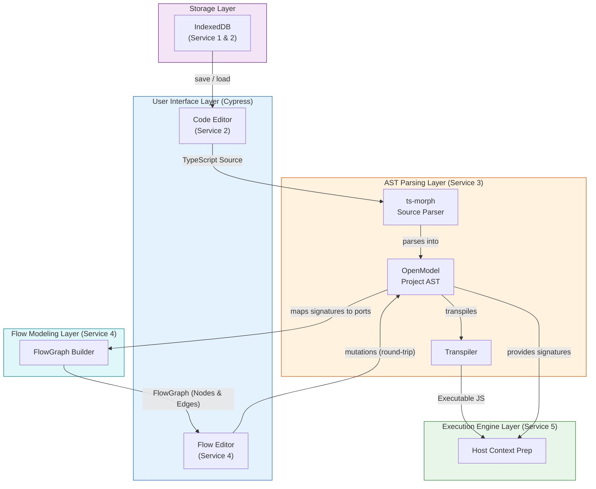
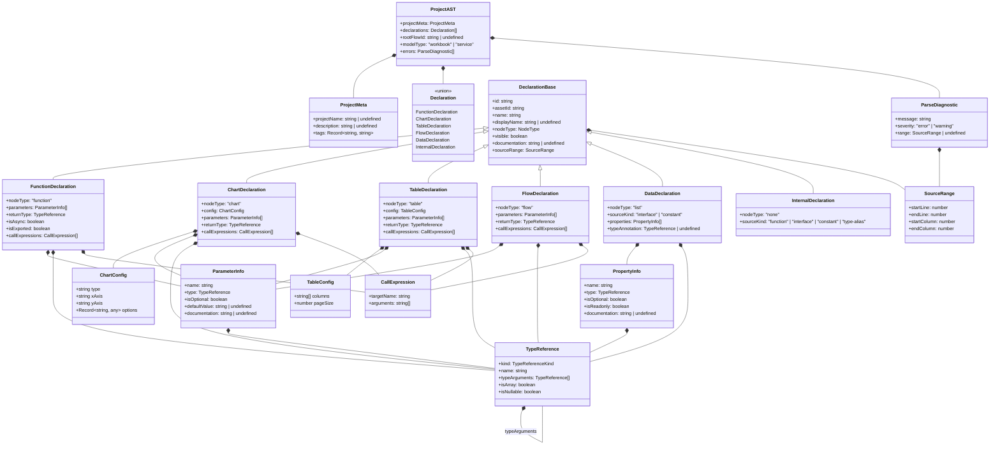
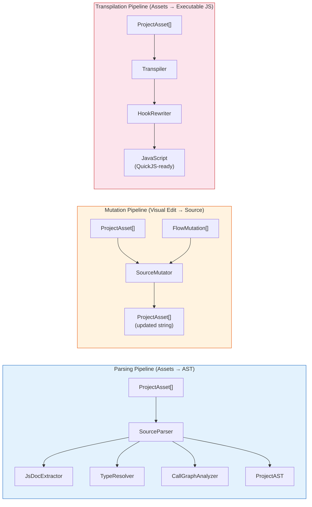

# Service 3: AST Parsing — Architecture

> **Service:** AST Parsing (Service 3)
> **Testing:** Jest only — this service is strictly React-free
> **Depends on:** Nothing (pure logic, no service dependencies)
> **Consumed by:** Project Management (2), Flow Modeling (4), Execution Engine (5)
> **Defined types:** `ProjectAST`, `Declaration`, `TypeReference`, `ParameterInfo`, `CallExpression`, `NodeType`

## Overview

The AST Parsing service defines the intermediate representation (`ProjectAST`) used to bridge TypeScript source code
and all downstream consumers. The AST is produced by **ts-morph** during the Analysis Phase and serves as the single
source of truth for:

- Extracting function signatures, types, and metadata from TypeScript source
- Serializing AST changes back to TypeScript source (round-trip editing)
- Transpiling TypeScript to QuickJS-ready JavaScript for execution
- Providing type information to the Flow Modeling service (see [04_FLOW_MODELING_ARCH.md](04_FLOW_MODELING_ARCH.md))

This document specifies all TypeScript interfaces that compose the Project AST, the parsing pipeline components,
and the hooks type system.

> **Flow graph derivation, node components, and visual editing are defined in [04_FLOW_MODELING_ARCH.md](04_FLOW_MODELING_ARCH.md).**
> **Persistence model (StoredProject) is defined in [ARCHITECTURE.md](ARCHITECTURE.md) under Service 1.**

## Architectural Views

To correctly model the system, we strictly separate the compilation phase from the sandboxed execution runtime. Mixing these concepts leads to blurred boundaries. The architecture is represented through two distinct models:

### 1. Compilation & Transformation Pipeline (Data Flow)

This pipeline focuses strictly on how data mutates when the user types code or edits the visual graph, aligning with the **Services Architecture**. The AST Parsing (Service 3) translates type signatures into port configurations for Flow Modeling (Service 4), while simultaneously providing executable JS and input metadata to the Execution Engine (Service 5) host environment.



### 2. Runtime Execution Architecture (Moved)

> **Note:** The Runtime Execution Architecture (Host vs. Guest) model has been extracted and moved to its correct bounded context in **Service 5: Execution Engine**. See [05_EXECUTION_ENGINE_ARCH.md](05_EXECUTION_ENGINE_ARCH.md).

## AST Structural Diagram



## TypeScript Interface Definitions

## Code Annotations For Parsing

- **@nodeType** — Specifies the visual node type for a declaration (e.g. function, chart, table) in the flow editor.
- **@displayName** — Provides a human-friendly label for nodes in the flow editor, overriding the raw declaration name.
- **@description** — A longer text description that can be used for documentation tooltips or the project README. Can
  also be wrapped to another line.
- **@visible** - when set to `none` or `hidden`, the declaration is parsed but not rendered as a node in the flow
  editor. Also, all declarations that are missing `@nodeType` will be treated as `@visible none` by default.

### Node Type Enum

The `@nodeType` JSDoc tag maps script declarations to visual node types in the flow editor and determines the structural type of the `Declaration` in the AST.

```typescript
/**
 * Visual node types supported by the ReactFlow editor.
 *
 * - function  — A computation step rendered as a standard node.
 * - chart     — A visualization node that renders MUI X Charts output.
 * - table     — A visualization node that renders tabular output.
 * - flow      — A flow graph. If it is the root flow function, it defines the main canvas. Otherwise, it renders as a `<SubFlowNode>` containing its own nested graph.
 * - list      — A data-shape node representing a collection type (e.g. an interface used as a list item).
 * - none      — An internal declaration (type, utility function) not visible in the flow graph.
 */
type NodeType = 'function' | 'chart' | 'table' | 'flow' | 'list' | 'none';
```

### Component Configurations

Specific configurations parsed from JSDoc for specialized node types.

```typescript
interface ChartConfig {
    type: 'line' | 'bar' | 'pie' | 'scatter';
    xAxis?: string;
    yAxis?: string;
    /** Additional library-specific options. */
    options: Record<string, any>;
}

interface TableConfig {
    /** Column names to display. If empty, all properties are shown. */
    columns: string[];
    pageSize: number;
}
```

### Source Range

Tracks the exact location of a declaration in the TypeScript source, enabling round-trip serialization between the code
editor and the flow graph.

```typescript
interface SourceRange {
    startLine: number;
    endLine: number;
    startColumn: number;
    endColumn: number;
}
```

### Parse Diagnostic

Captures errors or warnings emitted by ts-morph during AST analysis.

```typescript
interface ParseDiagnostic {
    message: string;
    severity: 'error' | 'warning';
    range?: SourceRange;
}
```

### Project Metadata

Top-level metadata extracted from the file-level JSDoc comment block (`@projectName`, `@description`).

```typescript
interface ProjectMeta {
    projectName?: string;
    description?: string;
    /** Arbitrary key-value tags from JSDoc (e.g. @author, @version). */
    tags: Record<string, string>;
}
```

### Type Reference

A recursive representation of TypeScript types. Supports primitives, user-defined types, arrays, generics, and
nullable unions.

```typescript
type TypeReferenceKind = 'primitive' | 'reference' | 'literal' | 'union' | 'void' | 'any' | 'unknown';

interface TypeReference {
    kind: TypeReferenceKind;
    /** The type name (e.g. "number", "PaymentLine", "string"). */
    name: string;
    /** Generic type arguments (e.g. Promise<string> → typeArguments: [{name: "string"}]). */
    typeArguments: TypeReference[];
    /** True when the type is T[] or Array<T>. */
    isArray: boolean;
    /** True when the type includes null or undefined in a union. */
    isNullable: boolean;
}
```

### Parameter Info

Describes a function parameter, including type, optionality, and default value.

```typescript
interface ParameterInfo {
    name: string;
    type: TypeReference;
    isOptional: boolean;
    defaultValue?: string;
    /** Documentation extracted from @param JSDoc tags. */
    documentation?: string;
}
```

### Property Info

Describes a property on an interface or an object literal constant.

```typescript
interface PropertyInfo {
    name: string;
    type: TypeReference;
    isOptional: boolean;
    isReadonly: boolean;
    documentation?: string;
}
```

### Call Expression

Represents a function call found inside a function body. Used to derive data-flow edges in the flow graph.

```typescript
interface CallExpression {
    /** The name of the called function. */
    targetName: string;
    /** String representations of the arguments passed to the call. */
    arguments: string[];
}
```

### Declaration Base

Common fields shared by all declarations. The `nodeType` is the primary discriminator.

```typescript
interface DeclarationBase {
    /** Unique identifier derived from the declaration name. */
    id: string;
    /** The ID of the ProjectAsset where this declaration is defined. */
    assetId: string;
    /** The declaration name as written in source (e.g. "calculateMonthlyPayment"). */
    name: string;
    /** Human-readable label from @displayName JSDoc tag. */
    displayName?: string;
    /** 
     * The visual node type.
     * Every declaration has a nodeType. If @nodeType is missing, it defaults to 'none'.
     */
    nodeType: NodeType;
    /**
     * Whether this declaration is visible as a node in the flow editor.
     * Derived from @visible JSDoc tag. Defaults to true for all types except 'none'.
     */
    visible: boolean;
    /** Full JSDoc comment body (excluding tag lines). */
    documentation?: string;
    /** Location in the TypeScript source file. */
    sourceRange: SourceRange;
}
```

### Function Declaration

Represents a standard computational function (`@nodeType function`).

```typescript
interface FunctionDeclaration extends DeclarationBase {
    nodeType: 'function';
    parameters: ParameterInfo[];
    returnType: TypeReference;
    isAsync: boolean;
    isExported: boolean;
    /** Function calls found in the body — used to derive flow edges. */
    callExpressions: CallExpression[];
}
```

### Chart Declaration

Represents a visualization function that renders a chart (`@nodeType chart`).

```typescript
interface ChartDeclaration extends DeclarationBase {
    nodeType: 'chart';
    /** Configuration for MUI X Charts, parsed from JSDoc @nodeType chart { JSON }. */
    config: ChartConfig;
    parameters: ParameterInfo[];
    returnType: TypeReference;
    callExpressions: CallExpression[];
}
```

### Table Declaration

Represents a visualization function that renders a data grid (`@nodeType table`).

```typescript
interface TableDeclaration extends DeclarationBase {
    nodeType: 'table';
    /** Configuration for the data table, parsed from JSDoc. */
    config: TableConfig;
    parameters: ParameterInfo[];
    returnType: TypeReference;
    callExpressions: CallExpression[];
}
```

### Flow Declaration

Represents a sub-graph entry point (`@nodeType flow`).

```typescript
interface FlowDeclaration extends DeclarationBase {
    nodeType: 'flow';
    parameters: ParameterInfo[];
    returnType: TypeReference;
    callExpressions: CallExpression[];
}
```

### Data Declaration

Represents a data structure definition (`interface` or `const` with `@nodeType list`).

```typescript
interface DataDeclaration extends DeclarationBase {
    nodeType: 'list';
    /** Whether this was defined as an 'interface' or a 'constant' in source. */
    sourceKind: 'interface' | 'constant';
    /** Explicit type annotation for constants, or the interface structure. */
    typeAnnotation?: TypeReference;
    /** Properties of the interface or object literal. */
    properties: PropertyInfo[];
}
```

### Internal Declaration

Represents non-visual declarations (`@nodeType none` or missing).

```typescript
interface InternalDeclaration extends DeclarationBase {
    nodeType: 'none';
    /** The original TypeScript construct kind. */
    sourceKind: 'function' | 'interface' | 'constant' | 'type-alias';
}
```

### Declaration Union

The discriminated union of all declaration kinds using `nodeType` as discriminator.

```typescript
type Declaration =
    | FunctionDeclaration
    | ChartDeclaration
    | TableDeclaration
    | FlowDeclaration
    | DataDeclaration
    | InternalDeclaration;
```

## Project AST (Root)

The top-level AST node representing an entire parsed project script.

> **Architectural Constraint:** The `ProjectAST` strictly defines the logical structure and signatures of the project but does **not** store the raw source code text (function bodies or constant initializers). When the UI (e.g., the Code Editor) or the Transpiler needs the actual source text, it loads the underlying `ProjectAsset` from IndexedDB and extracts the text using the declaration's `sourceRange`. This ensures the asset in IndexedDB remains the single source of truth without bloating the AST in memory.

```typescript
interface ProjectAST {
    /** Metadata extracted from file-level JSDoc. */
    projectMeta: ProjectMeta;
    /** All top-level declarations found in the script. */
    declarations: Declaration[];
    /** The declaration ID of the root flow function. */
    rootFlowId?: string;
    /** The execution model of the project, inferred from the root flow function. */
    modelType: 'workbook' | 'service';
    /** Diagnostics emitted during parsing. */
    errors: ParseDiagnostic[];
}
```

## Example: Loan Return Script → AST

Given [examples/example-loan-return.ts](examples/example-loan-return.ts), the parser produces:

```typescript
const projectAST: ProjectAST = {
    projectMeta: {
        projectName: 'Example Loan Return Application',
        description: 'Configure the INPUT_VARIABLES below with your loan details...',
        tags: {},
    },
    declarations: [
        {
            nodeType: 'none',
            sourceKind: 'interface',
            id: 'PaymentLine',
            name: 'PaymentLine',
            displayName: 'Payment Line',
            visible: false,
            documentation: undefined,
            assetId: 'loan-script-id',
            sourceRange: {startLine: 15, endLine: 21, startColumn: 1, endColumn: 2},
            properties: [
                {
                    name: 'paymentDate',
                    type: {kind: 'reference', name: 'Date', typeArguments: [], isArray: false, isNullable: false},
                    isOptional: false,
                    isReadonly: false,
                },
                {
                    name: 'amount',
                    type: {kind: 'primitive', name: 'number', typeArguments: [], isArray: false, isNullable: false},
                    isOptional: false,
                    isReadonly: false,
                },
                {
                    name: 'principalPaid',
                    type: {kind: 'primitive', name: 'number', typeArguments: [], isArray: false, isNullable: false},
                    isOptional: false,
                    isReadonly: false,
                },
                {
                    name: 'interestPaid',
                    type: {kind: 'primitive', name: 'number', typeArguments: [], isArray: false, isNullable: false},
                    isOptional: false,
                    isReadonly: false,
                },
                {
                    name: 'remainingBalance',
                    type: {kind: 'primitive', name: 'number', typeArguments: [], isArray: false, isNullable: false},
                    isOptional: false,
                    isReadonly: false,
                },
            ],
        },
        {
            nodeType: 'list',
            sourceKind: 'constant',
            id: 'INPUT_VARIABLES',
            name: 'INPUT_VARIABLES',
            displayName: 'Input Variables',
            visible: true,
            documentation: undefined,
            assetId: 'loan-script-id',
            sourceRange: {startLine: 26, endLine: 31, startColumn: 1, endColumn: 3},
            typeAnnotation: undefined,
            properties: [
                {
                    name: 'loanAmount',
                    type: {kind: 'primitive', name: 'number', typeArguments: [], isArray: false, isNullable: false},
                    isOptional: false,
                    isReadonly: false,
                },
                {
                    name: 'annualInterestRate',
                    type: {kind: 'primitive', name: 'number', typeArguments: [], isArray: false, isNullable: false},
                    isOptional: false,
                    isReadonly: false,
                },
                {
                    name: 'termMonths',
                    type: {kind: 'primitive', name: 'number', typeArguments: [], isArray: false, isNullable: false},
                    isOptional: false,
                    isReadonly: false,
                },
                {
                    name: 'startDate',
                    type: {kind: 'reference', name: 'Date', typeArguments: [], isArray: false, isNullable: false},
                    isOptional: false,
                    isReadonly: false,
                },
            ],
        },
        {
            nodeType: 'function',
            id: 'calculateMonthlyPayment',
            name: 'calculateMonthlyPayment',
            displayName: 'Calculate Monthly Payment',
            visible: true,
            documentation:
                'Calculates the fixed monthly payment for a loan based on the principal, annual interest rate, and loan term in months.',
            assetId: 'loan-script-id',
            sourceRange: {startLine: 44, endLine: 49, startColumn: 1, endColumn: 2},
            parameters: [
                {
                    name: 'principal',
                    type: {kind: 'primitive', name: 'number', typeArguments: [], isArray: false, isNullable: false},
                    isOptional: false,
                },
                {
                    name: 'annualRate',
                    type: {kind: 'primitive', name: 'number', typeArguments: [], isArray: false, isNullable: false},
                    isOptional: false,
                },
                {
                    name: 'months',
                    type: {kind: 'primitive', name: 'number', typeArguments: [], isArray: false, isNullable: false},
                    isOptional: false,
                },
            ],
            returnType: {kind: 'primitive', name: 'number', typeArguments: [], isArray: false, isNullable: false},
            isAsync: false,
            isExported: false,
            callExpressions: [],
        },
        {
            nodeType: 'function',
            id: 'generateLoanSchedule',
            name: 'generateLoanSchedule',
            displayName: undefined,
            visible: true,
            documentation: undefined,
            assetId: 'loan-script-id',
            sourceRange: {startLine: 59, endLine: 90, startColumn: 1, endColumn: 2},
            parameters: [
                {
                    name: 'loanAmount',
                    type: {kind: 'primitive', name: 'number', typeArguments: [], isArray: false, isNullable: false},
                    isOptional: false,
                },
                {
                    name: 'monthlyPayment',
                    type: {kind: 'primitive', name: 'number', typeArguments: [], isArray: false, isNullable: false},
                    isOptional: false,
                },
                {
                    name: 'annualInterestRate',
                    type: {kind: 'primitive', name: 'number', typeArguments: [], isArray: false, isNullable: false},
                    isOptional: false,
                },
                {
                    name: 'termMonths',
                    type: {kind: 'primitive', name: 'number', typeArguments: [], isArray: false, isNullable: false},
                    isOptional: false,
                },
                {
                    name: 'startDate',
                    type: {kind: 'reference', name: 'Date', typeArguments: [], isArray: false, isNullable: false},
                    isOptional: false,
                },
            ],
            returnType: {kind: 'reference', name: 'PaymentLine', typeArguments: [], isArray: true, isNullable: false},
            isAsync: false,
            isExported: false,
            callExpressions: [],
        },
        {
            nodeType: 'chart',
            config: {
                type: 'line',
                xAxis: 'paymentDate',
                yAxis: 'remainingBalance',
                options: {color: '#8884d8'},
            },
            id: 'renderLoanBalanceChart',
            name: 'renderLoanBalanceChart',
            displayName: undefined,
            visible: true,
            documentation: undefined,
            assetId: 'loan-script-id',
            sourceRange: {startLine: 96, endLine: 98, startColumn: 1, endColumn: 2},
            parameters: [
                {
                    name: 'schedule',
                    type: {kind: 'reference', name: 'PaymentLine', typeArguments: [], isArray: true, isNullable: false},
                    isOptional: false,
                },
            ],
            returnType: {kind: 'void', name: 'void', typeArguments: [], isArray: false, isNullable: false},
            callExpressions: [],
        },
        {
            nodeType: 'table',
            config: {
                columns: ['paymentDate', 'principalPaid', 'interestPaid', 'remainingBalance'],
                pageSize: 12,
            },
            id: 'renderLoanScheduleTable',
            name: 'renderLoanScheduleTable',
            displayName: undefined,
            visible: true,
            documentation: undefined,
            assetId: 'loan-script-id',
            sourceRange: {startLine: 104, endLine: 106, startColumn: 1, endColumn: 2},
            parameters: [
                {
                    name: 'schedule',
                    type: {kind: 'reference', name: 'PaymentLine', typeArguments: [], isArray: true, isNullable: false},
                    isOptional: false,
                },
            ],
            returnType: {kind: 'void', name: 'void', typeArguments: [], isArray: false, isNullable: false},
            callExpressions: [],
        },
        {
            nodeType: 'flow',
            id: 'main',
            name: 'main',
            displayName: undefined,
            visible: true,
            documentation: undefined,
            assetId: 'loan-script-id',
            sourceRange: {startLine: 111, endLine: 117, startColumn: 1, endColumn: 2},
            parameters: [],
            returnType: {kind: 'void', name: 'void', typeArguments: [], isArray: false, isNullable: false},
            callExpressions: [
                {targetName: 'calculateMonthlyPayment', arguments: ['loanAmount', 'annualInterestRate', 'termMonths']},
                {
                    targetName: 'generateLoanSchedule',
                    arguments: ['loanAmount', 'monthlyPayment', 'annualInterestRate', 'termMonths', 'startDate'],
                },
                {targetName: 'renderLoanBalanceChart', arguments: ['schedule']},
                {targetName: 'renderLoanScheduleTable', arguments: ['schedule']},
            ],
        },
    ],
    rootFlowId: 'main',
    modelType: 'workbook',
    errors: [],
};
```

## Root Flow Detection Algorithm

During AST construction, the parser determines the `rootFlowId` and `modelType` using the following algorithm:

1. **Find all flow nodes:** Locate all declarations tagged with `@nodeType flow`.
2. **Determine Root:**
    - If a flow node is named `main`, it is designated as the root flow (`rootFlowId = 'main'`). All other flow nodes are treated as nested sub-flows.
    - If there is no `main` function, but exactly _one_ flow node exists, that single node is designated as the root flow.
    - If there are no flow nodes at all, but a `main` function exists (even without the `@nodeType flow` tag), `main` is designated as the root flow.
    - If there is no `main` function and _multiple_ flow nodes exist, the parser throws an error (ambiguous entry point).
3. **Determine Model Type:**
    - If the root flow function has **no arguments**, `modelType` is set to `'workbook'`. This indicates a script that can be immediately executed (e.g., just paints graphs or runs a static pipeline).
    - If the root flow function **has arguments**, `modelType` is set to `'service'`. This indicates a decision service that requires external input values to execute (e.g., via the Testing Service).

## Parser Components Architecture

The parsing pipeline is designed as a set of **pure, composable functions** that can be tested independently with Jest.
No component depends on React, the DOM, or IndexedDB — they operate on plain TypeScript strings and AST data
structures.

### Component Diagram



> **Note:** The Flow Pipeline (AST ↔ ReactFlow) has been moved to Service 4 — see [04_FLOW_MODELING_ARCH.md](04_FLOW_MODELING_ARCH.md).

### Component Specifications

Each component is a pure function or a stateless class. All live in `src/lib/ast/`.

> **FlowGraphBuilder and FlowGraphSync** have been moved to `src/lib/flow/` (Service 4).
> See [04_FLOW_MODELING_ARCH.md](04_FLOW_MODELING_ARCH.md) for their specifications.

#### SourceParser

The top-level orchestrator for the parsing pipeline.

```typescript
/**
 * Parses project assets into a unified ProjectAST.
 * Delegates to sub-components for JSDoc extraction, type resolution, and call analysis.
 * Stateless — produces a fresh ProjectAST on every invocation.
 *
 * MVP Limitation: Acts as a "Project Compiler" but currently only takes the FIRST asset
 * with `kind: 'source'` (or 'typescript') and ignores the rest. True multi-file module
 * resolution is deferred.
 */
function parseProject(assets: ProjectAsset[]): ProjectAST;
```

**Test strategy:** Input/output pairs. Provide arrays of `ProjectAsset`, assert the resulting `ProjectAST` structure includes the correct `assetId`.

#### JsDocExtractor

Extracts structured annotation data from JSDoc comment blocks.

```typescript
interface JsDocAnnotations {
    nodeType?: NodeType;
    displayName?: string;
    visible?: boolean;
    description?: string;
    paramDocs: Record<string, string>;
    returnDoc?: string;
    tags: Record<string, string>;
}

/** Extracts @nodeType, @displayName, @visible, @param, and @return from a JSDoc block. */
function extractJsDoc(jsDocText: string): JsDocAnnotations;
```

**Test strategy:** Unit test with isolated JSDoc strings. Verify each annotation variant, edge cases (missing tags,
multiline descriptions, unknown tags).

#### TypeResolver

Converts ts-morph type nodes into the portable `TypeReference` structure.

```typescript
/**
 * Resolves a ts-morph Type object into a TypeReference.
 * Handles primitives, references, arrays, generics, unions, void, and unknown.
 */
function resolveType(type: ts.Type): TypeReference;
```

**Test strategy:** Create ts-morph Project instances with known source, assert resolved `TypeReference` for each type
variation (primitive, array, generic, union, nullable).

#### CallGraphAnalyzer

Extracts function call relationships from function bodies.

```typescript
/**
 * Analyzes a function body to extract all call expressions that reference
 * top-level declared functions. Ignores method calls, built-ins, and chains.
 */
function analyzeCallGraph(functionBody: ts.Block, knownFunctionNames: Set<string>): CallExpression[];
```

**Test strategy:** Provide function bodies with various call patterns (simple calls, chained calls, nested calls,
calls to unknowns). Assert only top-level function references are captured.

#### SourceMutator

Applies visual flow editor mutations directly to the underlying TypeScript source strings using `ts-morph`. Since `ProjectAST` no longer holds the function bodies or constant initializers (to prevent memory bloat and state sync issues), we must mutate the `ProjectAsset` directly rather than re-serializing the entire AST.

**Key transformation logic:**
- **Structural edits:** Adding/removing functions or updating parameters uses the standard `ts-morph` AST manipulation API.
- **Configuration edits:** When receiving an `update-node-config` mutation, the mutator locates the declaration's JSDoc block and performs a surgical string replacement of the `@nodeType` tag payload (e.g., rewriting `@nodeType chart { ...old... }` to `@nodeType chart { ...new... }`).
- **Data Flow edits:** Connectors (edges) are updated by rewriting the `CallExpression` statements inside the parent flow function's body.

```typescript
/**
 * Applies a list of flow editor mutations to the project's source code.
 * Reconstructs a temporary ts-morph project in memory, applies the AST changes,
 * and returns the updated ProjectAsset[].
 */
function applyMutationsToSource(assets: ProjectAsset[], mutations: FlowMutation[]): ProjectAsset[];
```

**Test strategy:** Round-trip testing. Provide a `ProjectAsset` array, apply a mutation (e.g. `add-node`, `update-parameter`, `add-edge`), and assert the resulting string is valid TypeScript with the expected structural changes.

#### Transpiler

Converts TypeScript source to JavaScript suitable for QuickJS execution.

```typescript
interface TranspileResult {
    javascript: string;
    sourceMap?: string;
    errors: ParseDiagnostic[];
}

/**
 * Transpiles project assets to JavaScript using ts-morph emit.
 * Strips type annotations, resolves enums, preserves async/await.
 *
 * MVP Limitation: Currently only transpiles the first asset with `kind: 'source'`.
 */
function transpileProject(assets: ProjectAsset[]): TranspileResult;
```

**Test strategy:** Transpile known `ProjectAsset` arrays, assert the output is valid JavaScript. Verify type annotations
are stripped, async functions are preserved, and hook imports are rewritten.

#### HookRewriter

Rewrites `@openmodeler/hooks` imports into QuickJS-compatible module references.

```typescript
/**
 * Rewrites import statements from '@openmodeler/hooks' into
 * the QuickJS module format that the sandbox module resolver understands.
 */
function rewriteHookImports(javascript: string): string;
```

**Test strategy:** Provide JS with various import styles, assert correct rewriting.
