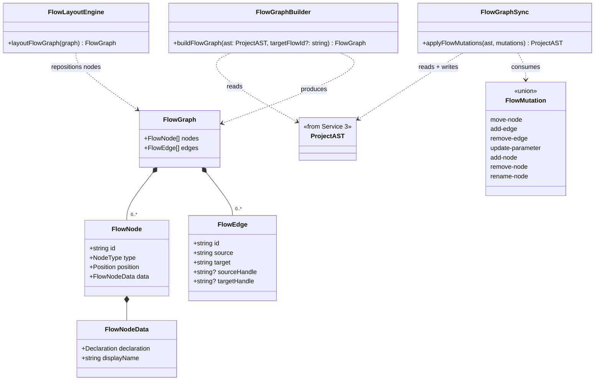
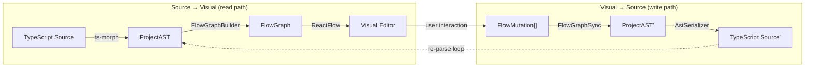

# Service 4: Flow Modeling — Architecture

> **Service:** Flow Modeling (Service 4)
> **Testing:** `lib/flow/` — Jest | `components/nodes/`, `components/views/flow-editor/` — Cypress
> **Depends on:** AST Parsing (Service 3) for `ProjectAST` data structures
> **Consumed by:** UI Layer (Flow Editor View)
> **Defined types:** `FlowGraph`, `FlowNode`, `FlowEdge`, `FlowMutation`

## Overview

The Flow Modeling service is the visual layer of Open Modeler. It takes the `ProjectAST` produced by the AST Parsing
service and transforms it into a ReactFlow-compatible graph of nodes and edges. It also handles the reverse direction —
applying visual editor mutations (node additions, edge changes, parameter edits) back to the `ProjectAST`.

This service has two distinct layers with fundamentally different testing strategies:

| Layer               | Directory                                 | Testing | Responsibility                      |
|---------------------|-------------------------------------------|---------|-------------------------------------|
| Data transformation | `lib/flow/`                               | Jest    | AST ↔ FlowGraph pure conversion     |
| React UI            | `components/nodes/`, `views/flow-editor/` | Cypress | ReactFlow rendering and interaction |

The `lib/flow/` layer is **strictly React-free** — it operates on plain TypeScript data structures and can be tested
in isolation with Jest. The React layer depends on `lib/flow/` but never the reverse.

## Structural Diagram



## Flow Graph Derivation

The flow graph is **scoped** to a specific flow function (the `targetFlowId`). It is derived from the `ProjectAST` (defined in [03-AST-PARSING.md](03-AST-PARSING.md)) using these rules:

1. **Graph Scope:** The builder starts at the function defined by `targetFlowId` (which defaults to the AST's `rootFlowId`). 
2. **Nodes:** The builder analyzes the code body of the target flow function. In a flow function, each line of code typically follows the pattern `{variable} = {function}({args})`. For every function called within the body, a ReactFlow node is generated. The `id`, `displayName` (or `name`), and `nodeType` map directly to the called function's declaration.
3. **Edges (Data Flow):** Edges are derived from the `CallExpression` relationships and variable assignments within the target flow function's body. By parsing which output `{variable}` is passed as `{args}` into subsequent functions, the builder knows exactly which output pin connects to which input pin.
4. **Ports:** Input ports are derived from `ParameterInfo[]` and output ports from `returnType`. Port type labels come from `TypeReference.name`.
5. **Constants as Input Nodes:** A `ConstantDeclaration` that is destructured or passed as an argument within the target flow function becomes an input node with output ports matching its properties.

## Nodes

The flow editor renders a fixed set of node types. Each node type has a corresponding React component in
`components/nodes/`.

### `<FunctionNode>` — `function`

- **Component:** `components/nodes/function-node/function-node.tsx`
- **Node Type:** `function`
- **Display:** Parameters become input ports on the left side, return type becomes the output port on the right side.
  Each port shows the parameter name and type (e.g. `loanAmount: number`). The node header shows the `displayName`
  or function name.
- **Edit:** Opens the Code Editor view (`views/code-editor/`) with CodeMirror for the function body. Parameters and
  return type are edited via a form UI. Changes are parsed back to update the AST.

### `<ChartNode>` — `chart`

- **Component:** `components/nodes/chart-node/chart-node.tsx`
- **Node Type:** `chart`
- **Display:** Renders an inline MUI X Charts preview based on the last execution output. Chart type (line, bar, pie)
  is inferred from the data shape or from `ChartConfig.type`.
- **Edit:** TBD — may support chart type selection via dropdown.

### `<TableNode>` — `table`

- **Component:** `components/nodes/table-node/table-node.tsx`
- **Node Type:** `table`
- **Display:** Renders a compact data table preview. Column headers are derived from object keys. Shows a limited
  number of rows with a "show more" affordance.
- **Edit:** TBD — may support column visibility and sort configuration.

### `<SubFlowNode>` and Root Flow — `flow`

- **Component (Sub-Flow):** `components/nodes/subflow-node/subflow-node.tsx`
- **Node Type:** `flow`
- **Display:** 
  - **Root Flow:** If a function (e.g., `main()`) is tagged with `@nodeType flow` and acts as the root flow, it is **not** rendered as a visible node. Instead, it defines the root ReactFlow canvas itself.
  - **Sub-Flow Node:** If other functions are tagged with `@nodeType flow` (i.e., they are not the root flow), they are rendered as a `<SubFlowNode>`.
- **Edit:** 
  - **Root Flow:** Users interact with the ReactFlow canvas directly in the flow editor view (`views/flow-editor/`).
  - **Sub-Flow Node:** Interacting with a `<SubFlowNode>` will navigate into and open another ReactFlow canvas specifically for that sub-graph.

### `<ListNode>` — `list`

- **Component:** `components/nodes/list-node/list-node.tsx`
- **Node Type:** `list`
- **Display:** Represents a data-shape node (e.g. `INPUT_VARIABLES` constant or an interface used as a collection
  type). Output ports correspond to the object's properties.
- **Edit:** Inline property editing with name, type, and value fields.

## Flow Pipeline Components

These components live in `lib/flow/` and are pure, React-free functions tested with Jest.

### FlowGraphBuilder

Converts the `ProjectAST` into ReactFlow-compatible node and edge arrays.

```typescript
interface FlowGraph {
    nodes: FlowNode[];
    edges: FlowEdge[];
}

/**
 * Builds a scoped ReactFlow graph from a ProjectAST starting from a specific flow function.
 * - targetFlowId: The ID of the flow function to render (from the route /#flow/:projectId/:targetFlowId).
 *   If omitted or "root", defaults to the AST's `rootFlowId`.
 * 
 * Traverses the Call Graph starting from the target flow function, deriving edges 
 * from CallExpressions within that function's body.
 */
function buildFlowGraph(ast: ProjectAST, targetFlowId?: string): FlowGraph;
```

**Test strategy:** Provide known `ProjectAST` structures, assert the correct nodes are created (visible only),
correct edges are derived from call expressions, and positions are assigned.

### FlowGraphSync

Applies flow editor mutations back to the `ProjectAST`. This is the reverse direction — when users interact with the
visual editor (adding nodes, connecting edges, editing parameters), those changes must be reflected in the AST.

```typescript
type FlowMutation =
    | { type: 'move-node'; nodeId: string; position: { x: number; y: number } }
    | { type: 'add-edge'; sourceId: string; targetId: string }
    | { type: 'remove-edge'; edgeId: string }
    | { type: 'update-parameter'; functionId: string; paramIndex: number; update: Partial<ParameterInfo> }
    | { type: 'add-node'; nodeType: NodeType; name: string; position: { x: number; y: number } }
    | { type: 'remove-node'; nodeId: string }
    | { type: 'rename-node'; nodeId: string; newName: string };

/**
 * Applies a list of flow editor mutations to the ProjectAST.
 * Returns a new ProjectAST (immutable update).
 */
function applyFlowMutations(ast: ProjectAST, mutations: FlowMutation[]): ProjectAST;
```

**Test strategy:** Apply mutations to known ASTs and assert the resulting AST reflects the change. Verify that
serializing the mutated AST (via Service 3's `AstSerializer`) produces valid TypeScript.

### FlowLayoutEngine

Automatically positions nodes when the graph is first built or when the user requests auto-layout.

```typescript
/**
 * Assigns x/y positions to FlowNodes based on their edge relationships.
 * Uses a layered graph layout (e.g. Sugiyama) to minimize edge crossings.
 */
function layoutFlowGraph(graph: FlowGraph): FlowGraph;
```

**Test strategy:** Provide graphs with known topologies, assert no overlapping nodes and correct layer ordering.

### FlowNode and FlowEdge Types

```typescript
interface FlowNode {
    id: string;
    type: NodeType;
    position: { x: number; y: number };
    parentId?: string; // Used to visually nest nodes within sub-flows
    data: {
        declaration: Declaration;
        displayName: string;
    };
}

interface FlowEdge {
    id: string;
    source: string;
    target: string;
    sourceHandle?: string;
    targetHandle?: string;
}
```

## Bidirectional Flow

The flow modeling service supports bidirectional data flow between source code and the visual editor:



When a user adds a new node in the flow editor:

1. `FlowGraphSync` receives an `add-node` mutation
2. It creates a new `FunctionDeclaration` in the `ProjectAST`
3. The AST Serializer (Service 3) converts the updated AST back to TypeScript source
4. The source is persisted and re-parsed, completing the round-trip

## Persistence Model

The flow graph is **not persisted directly**. The TypeScript source string is the canonical stored form (see
Service 1 — `StoredProject`). The `ProjectAST` is re-derived on load via ts-morph parsing, and the `FlowGraph` is
re-derived from the AST via `FlowGraphBuilder`. This ensures a single source of truth with no stale visual state.

> For the complete file structure, see
> [ARCHITECTURE.md — Proposed Project Component Structure](ARCHITECTURE.md#proposed-project-component-structure).
