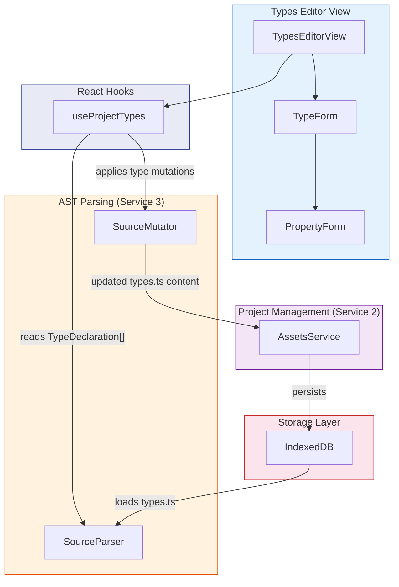
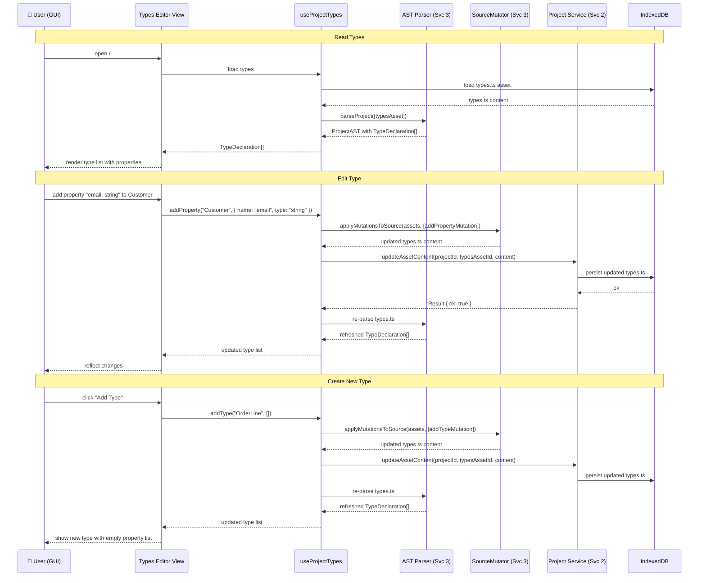

# Types Editor — Architecture

> **Component:** Types Editor (UI View)
> **Testing:** Cypress (`views/types-editor/`)
> **Depends on:** AST Parsing (Service 3) for `TypeDeclaration` extraction, Project Management (Service 2) for
> `types.ts` asset persistence
> **Consumed by:** Flow Modeling (Service 5) for port schemas, Execution Engine (Service 6) for FFI marshalling

## Overview

The Types Editor is a **GUI component** that provides a structured visual interface for managing the project's type
definitions. It is **not** a standalone service — it reads type information from
the AST Parsing Service (Service 3) and writes changes back to the `types.ts` asset through the same service.

**Architectural position:** The Types Editor is a UI view (`components/views/types-editor/`) with a supporting React
hook (`use-project-types.ts`). It follows the same pattern as the Code Editor and Flow Editor — a presentation layer
that delegates all parsing and mutation logic to the AST Parsing Service.

**Data flow:**

1. **Read:** Types Editor reads `TypeDeclaration[]` from the `ProjectAST` produced by Service 3.
2. **Edit:** User adds/removes/modifies types and properties through the GUI.
3. **Write:** Edits are translated into `SourceMutator` mutations that update the `types.ts` source content.
4. **Persist:** Updated `types.ts` content is saved to IndexedDB via the Project Management Service (Service 2).

## Structural Diagram



## Behavioral Diagram: Type Editing Cycle



## Types Storage

Types are stored as a `types.ts` file in `project_assets` (Service 2) with `kind: 'types'`. This file follows the
same lazy-loading pattern as other project assets — content is not kept in memory, but loaded on demand and parsed
via the AST Parsing Service.

**Example `types.ts` content:**

```typescript
interface Customer {
    name: string;
    email: string;
    age?: number;
}

interface OrderLine {
    product: string;
    quantity: number;
    unitPrice: number;
}
```

When the project is first created, a default `types.ts` asset is created with an empty file. The Types Editor
allows the user to add interfaces and properties through the GUI, which generates the TypeScript source.

## Components

### TypesEditorView (`types-editor-view.tsx`)

The main view rendered at `/#types/:projectId`. Lists all `TypeDeclaration` entries from the parsed AST in a
structured panel. Provides actions to add new types, delete existing types, and navigate into individual type
forms.

**Test strategy (Cypress):** Navigate to types route, verify type list renders, add/edit/delete types through the
GUI, verify round-trip persistence by refreshing and checking state.

### TypeForm (`type-form.tsx`)

Renders an individual type's properties in an editable form. Each property row shows name, type selector, optional
flag, and documentation. Supports adding, removing, and reordering properties.

**Test strategy (Cypress):** Add properties, change types, toggle optionality, verify form state maps correctly to
TypeScript source.

### PropertyForm (`property-form.tsx`)

Inline form for editing a single property within a type. Provides a type selector (primitives: `string`, `number`,
`boolean`, `Date`; references: other declared types; arrays) and optional/readonly toggles.

**Test strategy (Cypress):** Verify type dropdown includes declared project types, test edge cases (self-reference,
circular reference warning).

## Hook: `useProjectTypes`

The bridge between the Types Editor UI and the AST + Project services.

```typescript
interface UseProjectTypesReturn {
    /** All TypeDeclarations parsed from types.ts */
    types: TypeDeclaration[];
    /** Loading state */
    isLoading: boolean;
    /** Add a new interface to types.ts */
    addType: (name: string) => Promise<void>;
    /** Remove an interface from types.ts */
    removeType: (typeId: string) => Promise<void>;
    /** Rename an interface */
    renameType: (typeId: string, newName: string) => Promise<void>;
    /** Add a property to a type */
    addProperty: (typeId: string, property: PropertyInfo) => Promise<void>;
    /** Remove a property from a type */
    removeProperty: (typeId: string, propertyName: string) => Promise<void>;
    /** Update a property on a type */
    updateProperty: (typeId: string, oldName: string, property: PropertyInfo) => Promise<void>;
}

function useProjectTypes(projectId: string): UseProjectTypesReturn;
```

**Implementation pattern:**

1. Load `types.ts` content from Service 2
2. Parse via `parseProject()` from Service 3 to get `TypeDeclaration[]`
3. On mutation, construct the appropriate `FlowMutation`, apply via `SourceMutator`
4. Save updated content via Service 2
5. Invalidate TanStack Query cache to trigger re-parse

## Clean Architecture: Separation of Concerns

| Layer                              | Responsibility                                                               | Location                             |
|:-----------------------------------|:-----------------------------------------------------------------------------|:-------------------------------------|
| **AST Parsing (Service 3)**        | Parse `types.ts` → `TypeDeclaration[]`. Apply mutations via `SourceMutator`. | `src/lib/ast/`                       |
| **Project Management (Service 2)** | Load/save `types.ts` asset content from/to IndexedDB.                        | `src/lib/project/`                   |
| **Hook (`useProjectTypes`)**       | Orchestrate read/write cycle between UI and services.                        | `src/hooks/`                         |
| **Types Editor (View)**            | Present types in an editable GUI. Capture user intent.                       | `src/components/views/types-editor/` |

> For the `TypeDeclaration` interface definition, see
> [03_AST_PARSING_ARCH.md — Type Declaration](03_AST_PARSING_ARCH.md#type-declaration).
>
> For file structure, see
> [ARCHITECTURE.md — Proposed Project Component Structure](ARCHITECTURE.md#proposed-project-component-structure).