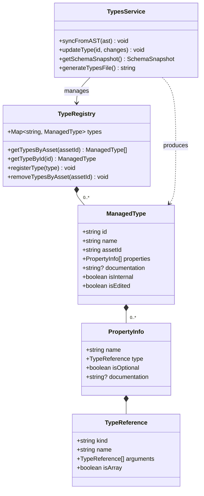
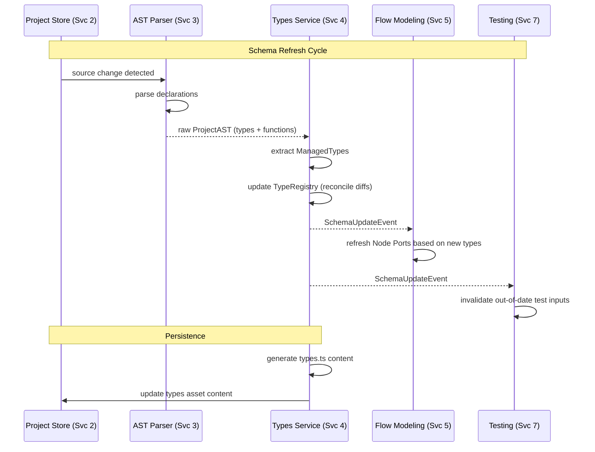

# Service 4: Types Service — Architecture

> **Service:** Types Service (Service 4)
> **Testing:** Jest (`lib/types-registry/`) | Cypress (`views/types-editor/`)
> **Depends on:** AST Parsing (Service 3) for type extraction
> **Consumed by:** Flow Modeling (Service 5), Execution Engine (Service 6), Testing Service (7)
> **Defined types:** `ManagedType`, `PropertyInfo`, `TypeRegistry`, `SchemaSnapshot`

## Overview

The Types Service acts as the **Sovereign Schema Registry** for the entire project. While AST Parsing (Service 3)
performs the raw extraction of TypeScript constructs, the Types Service elevates these into a managed system-wide
registry.

It transitions types from "static file content" to "living schema entities." This service is responsible for:

1. **Type Cataloging:** Indexing all interfaces and types across multiple project assets.
2. **Schema Evolution:** Managing changes to types and notifying downstream consumers (Flow ports, Test inputs).
3. **FFI Preparation:** Providing the Execution Engine with the metadata required for JSON-to-TypeScript marshalling.
4. **UI Representation:** Providing the Types Editor with a structured, editable model of the project's data shapes.

## Structural Diagram



## Behavioral Diagram: Type Synchronization

The Types Service orchestrates the flow from raw source code to a system-wide schema available for visual modeling
and execution validation.



## Key Interfaces

```typescript
interface ManagedType {
    id: string; // Globally unique within project (usually AssetID:TypeName)
    name: string; // The TypeScript interface/type name
    assetId: string; // Source asset
    properties: PropertyInfo[];
    documentation?: string;
    isInternal: boolean; // True if it lacks @visible tag
    isEdited: boolean; // Track manual overrides via Types Editor
}

interface PropertyInfo {
    name: string;
    type: TypeReference; // Portable type representation from Service 3
    isOptional: boolean;
    documentation?: string;
}

interface SchemaSnapshot {
    version: string;
    types: ManagedType[];
    timestamp: string;
}
```

## Components

### TypeRegistry (`types-registry.ts`)

An in-memory (and occasionally persisted) store of all types. It ensures that when Service 5 needs a port for a
function, it gets the latest schema. It handles cross-asset resolution (e.g., a function in `main.ts` using an
interface from `types.ts`).

**Test strategy (Jest):** Verify cross-asset resolution and name collision handling.

### TypesService (`types-service.ts`)

The primary façade. It consumes the `ProjectAST` from Service 3 and transforms the raw `InterfaceDeclaration` and
`TypeAlias` objects into `ManagedType` entities. It also provides a hook for the UI to modify types manually.

**Test strategy (Jest):** Reconcile AST changes → verify Registry updates → verify event emission.

### SchemaValidator (`schema-validator.ts`)

Checks for structural errors in the type system that TypeScript might allow but visual modeling might not
(e.g., circular dependencies that break the Flow UI).

**Test strategy (Jest):** Provide circular and deeply nested types, assert correct warnings/errors.

> For file structure, see
> [ARCHITECTURE.md — Proposed Project Component Structure](ARCHITECTURE.md#proposed-project-component-structure).