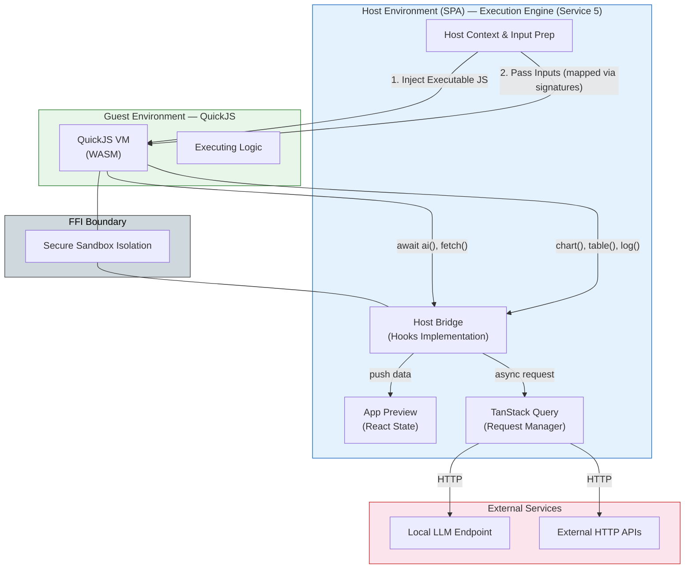
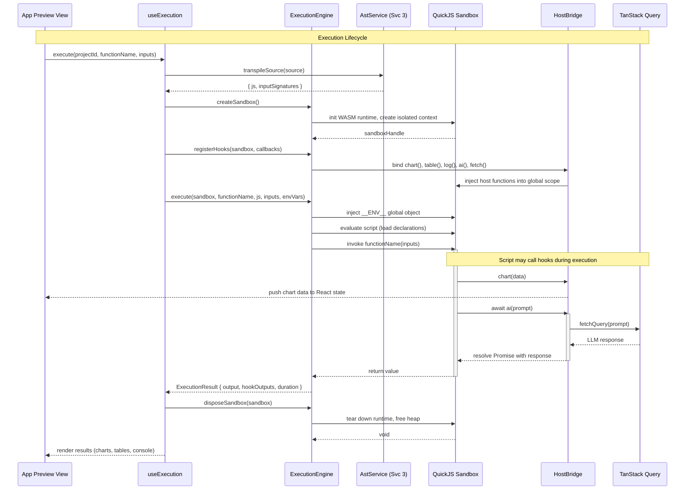

# Service 5: Execution Engine — Architecture

> **Service:** Execution Engine (Service 5)
> **Testing:** Jest (`lib/engine/`) | Cypress (`views/app-preview/`)
> **Depends on:** AST Parsing (Service 3) for transpilation
> **Consumed by:** Testing Service (6), UI Layer (App Preview View)
> **Defined types:** `ExecutionResult`, `ExecutionContext`, `HookCallbacks`, `ChartConfig`, `AiRequestOptions`

## Overview

The Execution Engine service provides secure, sandboxed execution of user-written business logic scripts. It manages
the complete lifecycle: sandbox creation → hook registration → script execution → result collection → sandbox disposal.

The host environment (SPA) communicates with the guest environment (QuickJS VM) through a strict **FFI boundary**.
The guest is completely unaware of TypeScript, the AST, or the DOM — it only executes transpiled JavaScript. All
communication flows through registered hooks:

- **Push hooks** (`chart()`, `table()`, `log()`) — fire-and-forget calls from script to host for rendering output.
- **Bidirectional hooks** (`ai()`, `fetch()`) — async request-response calls where the script suspends, the host
  performs an external operation (via TanStack Query), and resumes the script with the result.

The engine follows an adapter pattern: `engine-interface.ts` defines the abstract contract, and the `quickjs/`
directory implements it. Future engines (Pyodide for Python, Deno for enhanced JS) implement the same interface
without changing consumers.

## Structural Diagram

This view focuses on the Host vs. Guest execution boundary, memory isolation, and host-guest communication.



## Behavioral Diagram

The execution lifecycle follows a strict sequence: prepare → create sandbox → register hooks → execute → collect →
dispose. The sandbox is stateless by design — each run gets a fresh instance with no state leaking between runs.



## Key Interfaces

```typescript
interface EngineInterface {
    createSandbox(): Promise<SandboxHandle>;
    registerHooks(sandbox: SandboxHandle, callbacks: HookCallbacks): void;
    execute(sandbox: SandboxHandle, functionName: string, js: string, inputs: Record<string, unknown>, envVars?: Record<string, string>, assets?: ProjectAsset[]): Promise<ExecutionResult>;
    dispose(sandbox: SandboxHandle): void;
}

interface ExecutionResult {
    output: unknown;                   // Function return value
    hookOutputs: HookOutput[];         // All hook calls captured during execution
    duration: number;                  // Execution time in ms
    error?: ExecutionError;            // Set if script threw
}

interface ExecutionContext {
    projectId: string;
    functionName: string;
    inputs: Record<string, unknown>;
    envVars: Record<string, string>;   // Environment variables to inject as __ENV__
    timeout: number;                   // Max execution time in ms
    allowedDomains: string[];          // For fetch() domain allowlist
}

interface HookCallbacks {
    onChart: (config: ChartConfig) => void;
    onTable: (data: unknown[]) => void;
    onLog: (...args: unknown[]) => void;
    onAi: (options: AiRequestOptions) => Promise<unknown>;
    onFetch: (options: FetchRequestOptions) => Promise<unknown>;
}

interface HookOutput {
    hook: 'chart' | 'table' | 'log' | 'ai' | 'fetch';
    timestamp: number;
    payload: unknown;
}
```

## Hooks

| Hook      | Category      | Direction     | Host Action                    |
|-----------|---------------|---------------|--------------------------------|
| `chart()` | Push          | Script → Host | Update React state → re-render |
| `table()` | Push          | Script → Host | Update React state → re-render |
| `log()`   | Push          | Script → Host | Append to console buffer       |
| `ai()`    | Bidirectional | Script ↔ Host | TanStack Query → LLM HTTP      |
| `fetch()` | Bidirectional | Script ↔ Host | TanStack Query → HTTP API      |

> Hook type definitions (`ChartConfig`, `AiRequestOptions`, etc.) and the `@openmodeler/hooks` virtual module
> are specified in [03-AST-PARSING.md — Hooks System Architecture](03-AST-PARSING.md#hooks-system-architecture).

## Components

### QuickJS Engine (`engines/quickjs/quickjs-engine.ts`)

Implements `EngineInterface` using `quickjs-emscripten`. Manages VM lifecycle: WASM initialization, context creation,
script evaluation, and disposal. Each execution creates an isolated heap with no shared state.

**Test strategy (Jest):** Execute known scripts, assert return values. Verify sandbox isolation (globals don't leak
between runs).

### QuickJS Module Resolver (`engines/quickjs/quickjs-module-resolver.ts`)

Resolves the `openmodeler:hooks` virtual module import within the QuickJS VM. When the guest script imports from
`@openmodeler/hooks`, the hook rewriter (Service 3) rewrites it to `openmodeler:hooks`, and this resolver provides
the module with host-bound function references.

It is also designed to resolve local `./` imports from the `ProjectAsset[]` array, enabling multi-file projects where scripts can import utility functions or data from other assets in the project.

**Test strategy (Jest):** Verify module resolution produces callable hook functions.

### QuickJS Sandbox (`engines/quickjs/quickjs-sandbox.ts`)

Creates the isolated sandbox context with security boundaries. Configures memory limits, disables dangerous APIs
(`eval`, `Function`), and sets up the host function injection points. During execution setup, it also injects a frozen `__ENV__` global object so scripts can securely access environment variables without exposing the host's actual `process.env`.

**Test strategy (Jest):** Verify sandbox prevents access to host globals. Test memory limit enforcement.

### Host Bridge (`hooks/host-bridge.ts`)

Bidirectional communication bridge between host and guest. Translates QuickJS FFI calls into JavaScript function
calls on the host side. Handles the async suspension pattern for bidirectional hooks (script suspends → host
performs external call → script resumes).

**Test strategy (Jest):** Mock QuickJS handles, verify correct marshalling of arguments and return values.

### Push Hooks (`hooks/push-hooks.ts`)

Implements `chart()`, `table()`, `log()` — fire-and-forget hooks that push data from script to host. Each hook
validates payload size (via `payload-limiter.ts`) before forwarding to the registered callback.

**Test strategy (Jest):** Verify payload is forwarded to callback. Test size limit rejection.

### Bidirectional Hooks (`hooks/bidirectional-hooks.ts`)

Implements `ai()`, `fetch()` — async request-response hooks. The script suspends and yields control to the host,
which performs the operation (via TanStack Query), then resumes the script with the result.

**Test strategy (Jest):** Mock TanStack Query, verify suspension → resolution → resumption cycle.

### Security Components (`security/`)

- **Domain Allowlist** — restricts which domains `fetch()` can reach. Configurable per project.
- **Payload Limiter** — enforces maximum payload size for push hooks to prevent memory abuse.
- **Execution Timeout** — kills scripts that exceed the configured time limit.

**Test strategy (Jest):** Each security component is a pure function — test with allowed/denied inputs.

> For file structure, see
> [ARCHITECTURE.md — Proposed Project Component Structure](ARCHITECTURE.md#proposed-project-component-structure).
