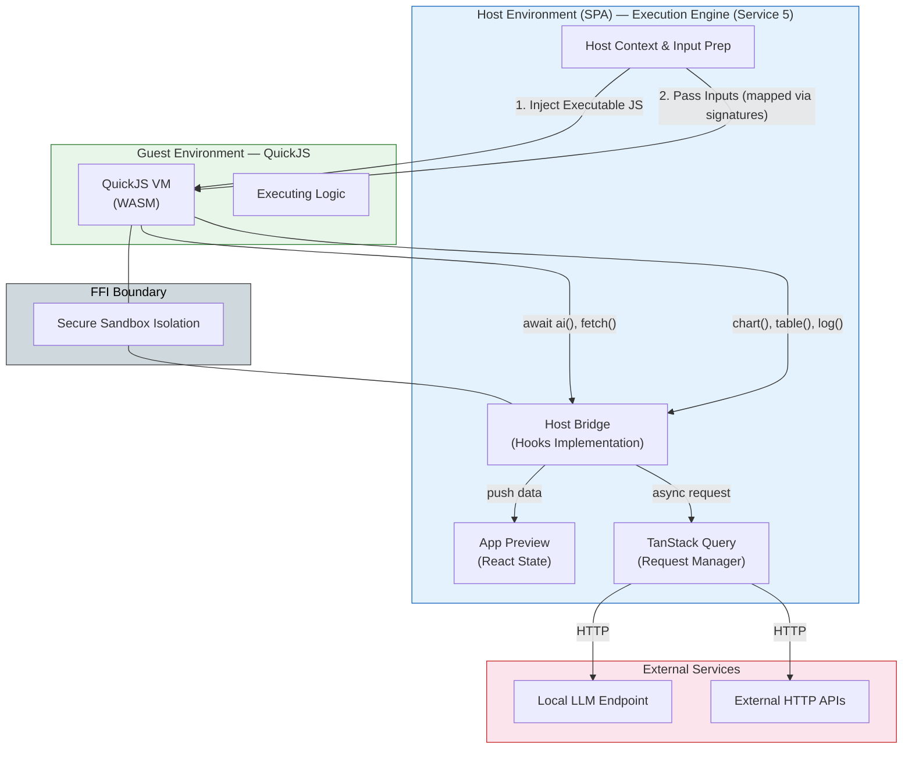
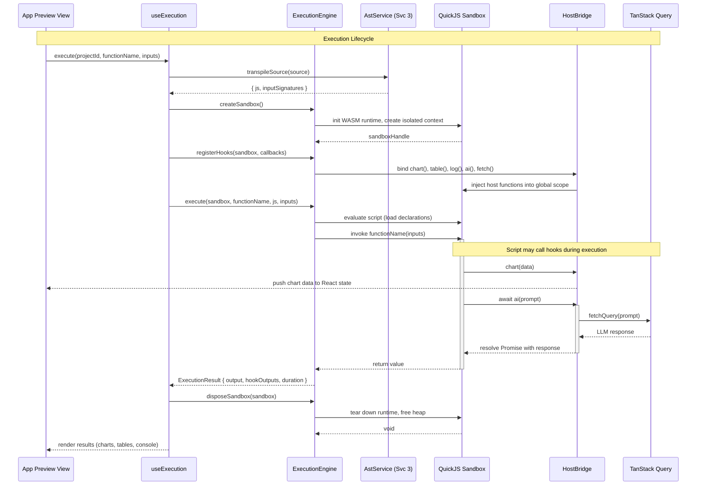
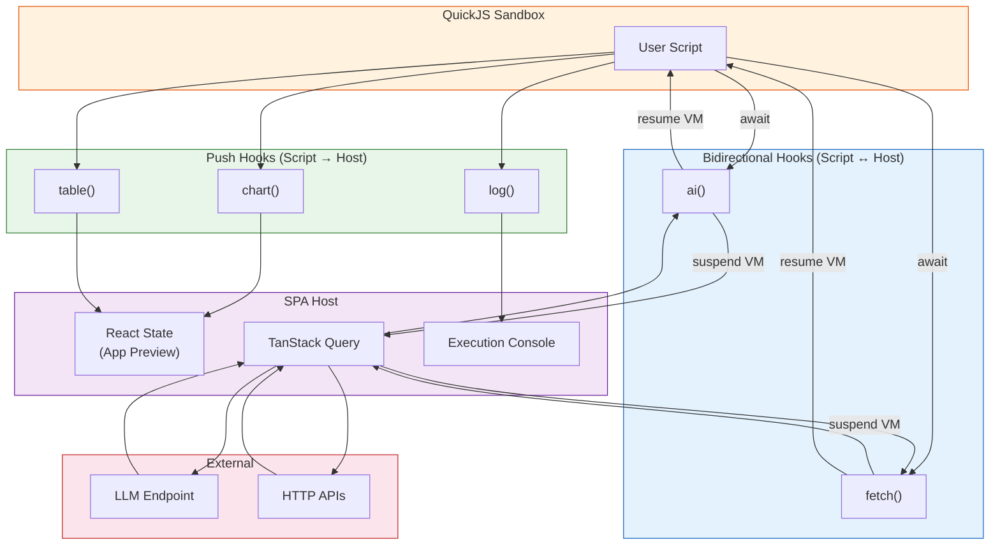
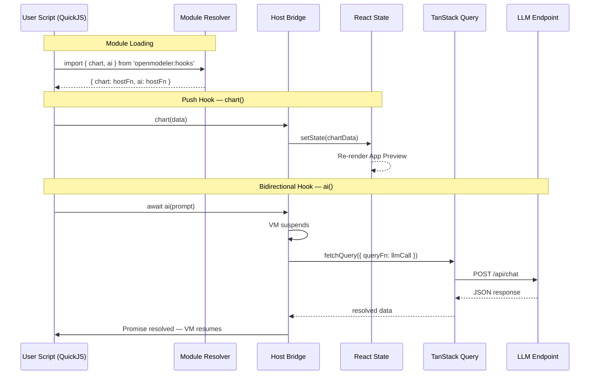

# Service 5: Execution Engine — Architecture

> **Service:** Execution Engine (Service 5)
> **Testing:** Jest (`lib/engine/`) | Cypress (`views/app-preview/`)
> **Depends on:** AST Parsing (Service 3) for transpilation
> **Consumed by:** Testing Service (6), UI Layer (App Preview View)
> **Defined types:** `ExecutionResult`, `ExecutionContext`, `HookCallbacks`, `ChartConfig`, `AiRequestOptions`

## Overview

The Execution Engine service provides secure, sandboxed execution of user-written business logic scripts. It manages
the complete lifecycle: sandbox creation → hook registration → script execution → result collection → sandbox disposal.

The host environment (SPA) communicates with the guest environment (QuickJS VM) through a strict **FFI boundary**.
The guest is completely unaware of TypeScript, the AST, or the DOM — it only executes transpiled JavaScript. All
communication flows through registered hooks:

- **Push hooks** (`chart()`, `table()`, `log()`) — fire-and-forget calls from script to host for rendering output.
- **Bidirectional hooks** (`ai()`, `fetch()`) — async request-response calls where the script suspends, the host
  performs an external operation (via TanStack Query), and resumes the script with the result.

The engine follows an adapter pattern: `engine-interface.ts` defines the abstract contract, and the `quickjs/`
directory implements it. Future engines (Pyodide for Python, Deno for enhanced JS) implement the same interface
without changing consumers.

## Structural Diagram

This view focuses on the Host vs. Guest execution boundary, memory isolation, and host-guest communication.



## Behavioral Diagram

The execution lifecycle follows a strict sequence: prepare → create sandbox → register hooks → execute → collect →
dispose. The sandbox is stateless by design — each run gets a fresh instance with no state leaking between runs.



## Key Interfaces

```typescript
interface EngineInterface {
    createSandbox(): Promise<SandboxHandle>;
    registerHooks(sandbox: SandboxHandle, callbacks: HookCallbacks): void;
    execute(
        sandbox: SandboxHandle,
        functionName: string,
        js: string,
        inputs: Record<string, unknown>,
        assets?: ProjectAsset[],
    ): Promise<ExecutionResult>;
    dispose(sandbox: SandboxHandle): void;
}

interface ExecutionResult {
    output: unknown; // Function return value
    hookOutputs: HookOutput[]; // All hook calls captured during execution
    duration: number; // Execution time in ms
    error?: ExecutionError; // Set if script threw
}

interface ExecutionContext {
    projectId: string;
    functionName: string;
    inputs: Record<string, unknown>;
    timeout: number; // Max execution time in ms
    allowedDomains: string[]; // For fetch() domain allowlist
}

interface HookCallbacks {
    onChart: (config: ChartConfig) => void;
    onTable: (data: unknown[]) => void;
    onLog: (...args: unknown[]) => void;
    onAi: (options: AiRequestOptions) => Promise<unknown>;
    onFetch: (options: FetchRequestOptions) => Promise<unknown>;
}

interface HookOutput {
    hook: 'chart' | 'table' | 'log' | 'ai' | 'fetch';
    /** The ID of the declaration (function) that triggered the hook. */
    callerId: string;
    timestamp: number;
    payload: unknown;
}
```

## Reactive Refresh Pattern

To ensure charts and tables update automatically after each execution:

1. **Execution Store:** The `useExecution` hook maintains a global (or context-level) state of `HookOutput[]` from the last run.
2. **Node Subscription:** Each `<ChartNode>` or `<TableNode>` in ReactFlow subscribes to this state, filtering by its own `declaration.id === callerId`.
3. **Trigger:** When a new `ExecutionResult` is received, the state updates, triggering a re-render of only the affected nodes. This enables real-time visual feedback as the user edits code or inputs and clicks "Run".
## Hooks

| Hook      | Category      | Direction     | Host Action                    |
| --------- | ------------- | ------------- | ------------------------------ |
| `chart()` | Push          | Script → Host | Update React state → re-render |
| `table()` | Push          | Script → Host | Update React state → re-render |
| `log()`   | Push          | Script → Host | Append to console buffer       |
| `ai()`    | Bidirectional | Script ↔ Host | TanStack Query → LLM HTTP      |
| `fetch()` | Bidirectional | Script ↔ Host | TanStack Query → HTTP API      |

> Hook type definitions (`ChartConfig`, `AiRequestOptions`, etc.) and the `@openmodeler/hooks` virtual module
> are specified in the [Hooks System Architecture](#hooks-system-architecture) below.

## Components

### QuickJS Engine (`engines/quickjs/quickjs-engine.ts`)

Implements `EngineInterface` using `quickjs-emscripten`. Manages VM lifecycle: WASM initialization, context creation,
script evaluation, and disposal. Each execution creates an isolated heap with no shared state.

#### WASM Loading Strategy (SSG Compatibility)

Because the application is deployed as an SSG on S3, the `quickjs-emscripten` WASM binary cannot be loaded via a dynamic server route.

1. **Asset Location:** The WASM binary (`.wasm` file) must be placed in the `public/pkg-quickjs/` directory so it is exported statically.
2. **Initialization:** During the first call to `createSandbox()`, the engine must explicitly configure the `quickjs-emscripten` loader to fetch the WASM binary using a standard browser `fetch()` call pointed at the `/pkg-quickjs/` path.
3. **Caching:** The loaded WASM module is cached in memory for the lifetime of the SPA session so subsequent executions are fast.

**Test strategy (Jest):** Execute known scripts, assert return values. Verify sandbox isolation (globals don't leak
between runs).

### QuickJS Module Resolver (`engines/quickjs/quickjs-module-resolver.ts`)

Resolves the `openmodeler:hooks` virtual module import within the QuickJS VM. When the guest script imports from
`@openmodeler/hooks`, the hook rewriter (Service 3) rewrites it to `openmodeler:hooks`, and this resolver provides
the module with host-bound function references.

It is also designed to resolve local `./` imports from the `ProjectAsset[]` array, enabling multi-file projects where scripts can import utility functions or data from other assets in the project.

**Test strategy (Jest):** Verify module resolution produces callable hook functions.

### QuickJS Sandbox (`engines/quickjs/quickjs-sandbox.ts`)

Creates the isolated sandbox context with security boundaries. Configures memory limits, disables dangerous APIs
(`eval`, `Function`), and sets up the host function injection points.

**Test strategy (Jest):** Verify sandbox prevents access to host globals. Test memory limit enforcement.

### Host Bridge (`hooks/host-bridge.ts`)

Bidirectional communication bridge between host and guest. Translates QuickJS FFI calls into JavaScript function
calls on the host side. Handles the async suspension pattern for bidirectional hooks (script suspends → host
performs external call → script resumes).

**Test strategy (Jest):** Mock QuickJS handles, verify correct marshalling of arguments and return values.

### Push Hooks (`hooks/push-hooks.ts`)

Implements `chart()`, `table()`, `log()` — fire-and-forget hooks that push data from script to host. Each hook
validates payload size (via `payload-limiter.ts`) before forwarding to the registered callback.

**Test strategy (Jest):** Verify payload is forwarded to callback. Test size limit rejection.

### Bidirectional Hooks (`hooks/bidirectional-hooks.ts`)

Implements `ai()`, `fetch()` — async request-response hooks. The script suspends and yields control to the host,
which performs the operation (via TanStack Query), then resumes the script with the result.

**Test strategy (Jest):** Mock TanStack Query, verify suspension → resolution → resumption cycle.

### Security Components (`security/`)

- **Domain Allowlist** — restricts which domains `fetch()` can reach. Configurable per project.
- **Payload Limiter** — enforces maximum payload size for push hooks to prevent memory abuse.
- **Execution Timeout** — kills scripts that exceed the configured time limit.

**Test strategy (Jest):** Each security component is a pure function — test with allowed/denied inputs.

> For file structure, see
> [ARCHITECTURE.md — Proposed Project Component Structure](ARCHITECTURE.md#proposed-project-component-structure).

## Hooks System Architecture

Hooks are the bridge between user-authored business logic (running inside the QuickJS sandbox) and the host SPA
environment. They enable scripts to push data to the UI and to make external requests.

### Hook Categories



### Hook Usage in Scripts

Hooks are imported as a standard ES module. The import statement is recognized by the parser and rewritten by the
`HookRewriter` during transpilation. In the user's TypeScript source, hooks look like ordinary typed function calls:

```typescript
import {chart, table, log, ai} from '@openmodeler/hooks';

/**
 * @nodeType chart
 */
function renderLoanBalanceChart(schedule: PaymentLine[]): void {
    chart(schedule);
}

/**
 * @nodeType table
 */
function renderLoanScheduleTable(schedule: PaymentLine[]): void {
    table(schedule);
}

/**
 * @nodeType function
 */
async function classifyRisk(customer: Customer): Promise<string> {
    const result = await ai(`Classify risk for customer: ${JSON.stringify(customer)}`);
    return result.text;
}
```

### Hook Type Declarations (`@openmodeler/hooks`)

This module is a **virtual module** — it has no physical file. Type declarations are provided for editor intellisense
and type checking. At runtime in QuickJS, the module resolver intercepts the import and returns host-registered
functions.

```typescript
// --- Push Hooks (fire-and-forget, script → host) ---

/**
 * Push a dataset to render as a chart in App Preview.
 * The host infers chart type (line, bar, pie) from the data shape.
 *
 * @param data - Array of objects or a ChartConfig with explicit series/axis definitions.
 */
export declare function chart(data: Record<string, unknown>[] | ChartConfig): void;

/**
 * Push a dataset to render as a table in App Preview.
 * Column headers are derived from object keys.
 *
 * @param data - Array of objects representing table rows.
 */
export declare function table(data: Record<string, unknown>[]): void;

/**
 * Log a message to the execution console panel.
 * Supports structured data (objects are serialized to JSON).
 */
export declare function log(...args: unknown[]): void;

// --- Bidirectional Hooks (async request-response, script ↔ host) ---

/**
 * Send a prompt to a configured AI/LLM endpoint and await the response.
 * The VM suspends while the host resolves the request via TanStack Query.
 *
 * @param prompt - The natural-language prompt to send.
 * @param options - Optional configuration (model, temperature, maxTokens).
 * @returns Parsed LLM response.
 */
export declare function ai(prompt: string, options?: AiRequestOptions): Promise<AiResponse>;

/**
 * Make an HTTP request through the host environment.
 * The VM suspends while the host resolves the request.
 * Restricted to configured allowlisted domains for security.
 *
 * @param url - The URL to fetch.
 * @param options - Standard request options (method, headers, body).
 * @returns Parsed response with status, headers, and body.
 */
export declare function fetch(url: string, options?: FetchRequestOptions): Promise<FetchResponse>;
```

### Hook Supporting Types

```typescript
interface ChartConfig {
    type: 'line' | 'bar' | 'pie';
    title?: string;
    xAxis?: string;
    yAxis?: string;
    series: ChartSeries[];
}

interface ChartSeries {
    name: string;
    dataKey: string;
    color?: string;
}

interface AiRequestOptions {
    model?: string;
    temperature?: number;
    maxTokens?: number;
    responseFormat?: 'text' | 'json';
}

interface AiResponse {
    text: string;
    parsed?: unknown;
    model: string;
    usage: {promptTokens: number; completionTokens: number};
}

interface FetchRequestOptions {
    method?: 'GET' | 'POST' | 'PUT' | 'DELETE' | 'PATCH';
    headers?: Record<string, string>;
    body?: string | Record<string, unknown>;
}

interface FetchResponse {
    status: number;
    headers: Record<string, string>;
    body: unknown;
    text: string;
}
```

### Hook Resolution at Runtime

When the transpiled JavaScript is loaded into QuickJS, hook resolution follows this sequence:

1. **HookRewriter** (build-time) — Rewrites `import { chart } from '@openmodeler/hooks'` into a
   QuickJS-compatible `import` referencing the virtual module ID `openmodeler:hooks`.

2. **Module Resolver** (runtime) — The QuickJS module resolver intercepts `openmodeler:hooks` and returns a module
   object whose exports are host-registered functions.

3. **Host Bridge** (runtime) — Each hook function is a thin wrapper that:
    - For **push hooks**: serializes the argument, passes it to a host callback, and returns immediately.
    - For **bidirectional hooks**: serializes the argument, passes it to a host callback that returns a QuickJS
      Promise. The VM suspends until the host resolves or rejects the Promise.

4. **Host Callback** (runtime) — On the SPA side:
    - `chart()` / `table()` → update React state → triggers re-render of App Preview.
    - `log()` → appends to the execution console buffer.
    - `ai()` → calls `queryClient.fetchQuery()` → HTTP to LLM → resolves the QuickJS Promise.
    - `fetch()` → calls `queryClient.fetchQuery()` → HTTP to API → resolves the QuickJS Promise.



### Hook Security Constraints

- **No raw `globalThis` access** — hooks are the only way scripts interact with the host.
- **Domain allowlist** — `fetch()` is restricted to domains configured in project settings.
- **Timeout** — bidirectional hooks have a configurable timeout (default: 30s). If the host does not resolve within
  the timeout, the Promise is rejected and the script receives an error.
- **Payload size limit** — push hooks enforce a maximum serialized payload size to prevent memory exhaustion in the
  host.

# Architect Comments

1. Rethink `initializer` - I have a doubt we will need it.
