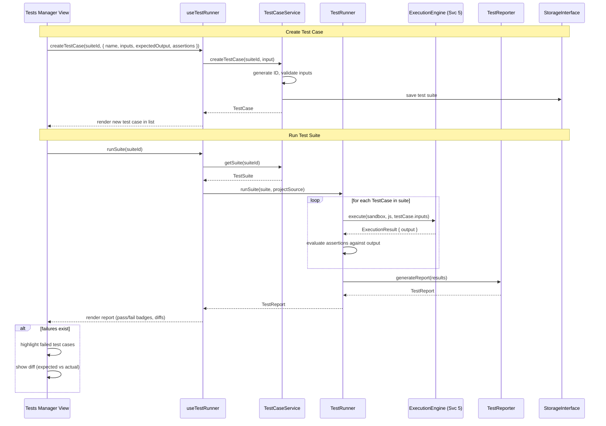

# Service 6: Testing Service — Architecture

> **Service:** Testing Service (Service 6)
> **Testing:** Jest (`lib/testing/`) | Cypress (`views/tests-manager/`)
> **Depends on:** Execution Engine (Service 5) for script execution, Storage Abstraction (`lib/storage/`)
> **Consumed by:** UI Layer (Tests Manager View)
> **Defined types:** `TestCase`, `TestSuite`, `TestResult`, `TestReport`, `TestAssertion`

## Overview

The Testing Service manages the lifecycle of user-defined test cases: creation, execution, and reporting. Users
define test cases with input data and expected outputs. The service executes them through the Execution Engine
(Service 5) and compares actual results against assertions.

A test case targets a specific function in the project's source code. The user provides input parameters and defines
one or more assertions (deep equality, property matching, or type checks) against the expected output. The test
runner batches test cases into a `TestSuite`, executes each through the sandbox, and produces a `TestReport` with
pass/fail status, execution times, and diff output for failures.

This service does not parse or transpile code — it delegates execution entirely to Service 5. It also persists test
cases as part of the project (via Service 1's `StoredProject` assets with `kind: 'test'`).

## Structural Diagram

```mermaid
classDiagram
    direction TB

    class TestSuite {
        +string id
        +string name
        +string projectId
        +string targetFunction
        +TestCase[] cases
    }

    class TestCase {
        +string id
        +string name
        +string? description
        +Record~string, unknown~ inputs
        +unknown expectedOutput
        +TestAssertion[] assertions
    }

    class TestAssertion {
        +AssertionType type
        +string? path
        +unknown expected
    }

    class AssertionType {
        <<enumeration>>
        deepEqual
        propertyEquals
        typeOf
        contains
        greaterThan
        lessThan
    }

    class TestResult {
        +string testCaseId
        +TestStatus status
        +unknown actualOutput
        +number duration
        +string? errorMessage
        +AssertionResult[] assertionResults
    }

    class AssertionResult {
        +number index
        +boolean passed
        +string? message
    }

    class TestReport {
        +string suiteId
        +number total
        +number passed
        +number failed
        +number errors
        +number totalDuration
        +TestResult[] results
    }

    class TestCaseService {
        +createTestCase(suiteId, input) TestCase
        +updateTestCase(id, changes) TestCase
        +deleteTestCase(suiteId, id) void
        +getSuite(id) TestSuite
        +listSuites(projectId) TestSuite[]
    }

    class TestRunner {
        +runSuite(suite, source) TestReport
        +runSingle(testCase, source) TestResult
    }

    class TestReporter {
        +generateReport(results) TestReport
        +formatFailureDiff(expected, actual) string
    }

    TestSuite *-- "1..*" TestCase
    TestCase *-- "0..*" TestAssertion
    TestReport *-- "1..*" TestResult
    TestResult *-- "0..*" AssertionResult

    TestCaseService ..> TestSuite : manages
    TestRunner ..> TestResult : produces
    TestRunner --> "Service 5" : executes via
    TestReporter ..> TestReport : generates
```

## Behavioral Diagram



## Key Interfaces

```typescript
interface TestSuite {
    id: string;                        // UUID v4
    name: string;                      // e.g. "Loan Calculator Tests"
    projectId: string;                 // Parent project
    targetFunction: string;            // Function name to test (e.g. "calculateLoan")
    cases: TestCase[];
}

interface TestCase {
    id: string;
    name: string;                      // e.g. "Standard 30-year mortgage"
    description?: string;
    inputs: Record<string, unknown>;   // Function parameters
    expectedOutput: unknown;           // Expected return value
    assertions: TestAssertion[];       // How to compare actual vs expected
}

type AssertionType = 'deepEqual' | 'propertyEquals' | 'typeOf' | 'contains' | 'greaterThan' | 'lessThan';

interface TestAssertion {
    type: AssertionType;
    path?: string;                     // Optional JSONPath for nested property checks
    expected: unknown;                 // Expected value for this assertion
}

interface TestResult {
    testCaseId: string;
    status: 'passed' | 'failed' | 'error';
    actualOutput: unknown;
    duration: number;                  // Execution time in ms
    errorMessage?: string;
    assertionResults: AssertionResult[];
}

interface AssertionResult {
    index: number;                     // Assertion index in TestCase.assertions
    passed: boolean;
    message?: string;                  // Human-readable failure reason
}

interface TestReport {
    suiteId: string;
    total: number;
    passed: number;
    failed: number;
    errors: number;
    totalDuration: number;
    results: TestResult[];
}
```

## Components

### TestCaseService (`test-case-service.ts`)

CRUD operations for test suites and test cases. Manages persistence through the storage layer. Each test suite is
stored as a project asset with `kind: 'test'` in JSON format.

**Test strategy (Jest):** Mock storage, verify CRUD operations produce correct test suite structures.

### TestRunner (`test-runner.ts`)

Executes test cases through the Execution Engine (Service 5). For each test case, it:
1. Creates a sandbox via the engine
2. Executes the target function with the test case inputs
3. Evaluates each assertion against the actual output
4. Disposes the sandbox
5. Collects results

**Test strategy (Jest):** Mock ExecutionEngine, provide known inputs/outputs, verify assertion evaluation logic.

### TestReporter (`test-reporter.ts`)

Aggregates individual `TestResult` entries into a `TestReport`. Calculates pass/fail counts, total duration, and
generates human-readable diff strings for failed assertions.

**Test strategy (Jest):** Provide known results, verify aggregation and diff formatting.

> For file structure, see
> [ARCHITECTURE.md — Proposed Project Component Structure](ARCHITECTURE.md#proposed-project-component-structure).