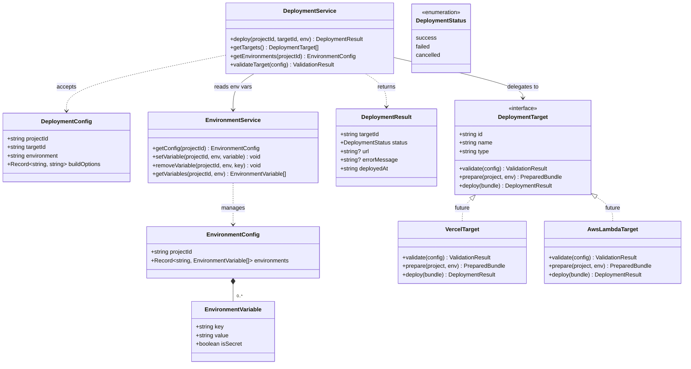
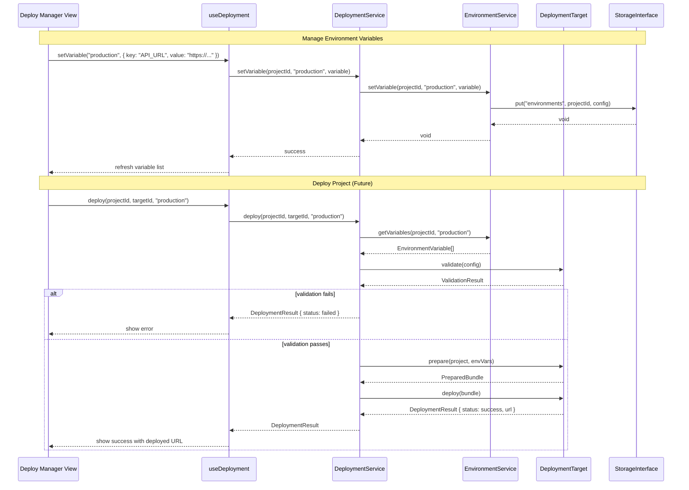

# Service 8: Deployment Service — Architecture (OUT OF SCOPE)

> 🚫 **OUT OF SCOPE FOR MVP**
> The Open Modeler acts purely as a stand-alone IDE for the MVP release. This service, including environment variable management and deployment targeting, has been deferred. This document remains as a structural placeholder for future implementation.

> **Service:** Deployment Service (Service 8)
> **Testing:** Jest (`lib/deployment/`) | Cypress (`views/deploy-manager/`)
> **Depends on:** Storage Abstraction (`lib/storage/`), Execution Engine (Service 6) for environment injection
> **Consumed by:** UI Layer (Deploy Manager View)
> **Defined types:** `DeploymentConfig`, `DeploymentTarget`, `EnvironmentVariable`, `EnvironmentConfig`

## Overview

The Deployment Service manages deployment targets and environment variables. For MVP, this service is primarily a
**skeleton** — the interfaces and types are defined, but actual deployment integrations (Vercel, AWS Lambda) are
deferred to future releases.

**MVP scope:** Environment variables management only. Users define key-value pairs per environment (`development`,
`staging`, `production`) that are injected into the script execution context via Service 6. This allows scripts to
reference configuration values (API keys, endpoint URLs) without hardcoding them.

The deployment target system follows an adapter pattern: `target-interface.ts` defines the abstract contract for
deployment backends. Each target (Vercel, AWS Lambda, custom) implements this interface. The `DeploymentService`
orchestrates the deployment workflow: validate → prepare → deploy → report.

## Structural Diagram



## Behavioral Diagram



## Key Interfaces

```typescript
interface DeploymentConfig {
    projectId: string;
    targetId: string;
    environment: string; // "development" | "staging" | "production"
    buildOptions: Record<string, string>;
}

interface DeploymentTarget {
    id: string;
    name: string; // e.g. "Vercel", "AWS Lambda"
    type: string; // e.g. "vercel", "aws-lambda"
    validate(config: DeploymentConfig): ValidationResult;
    prepare(project: StoredProject, envVars: EnvironmentVariable[]): Promise<PreparedBundle>;
    deploy(bundle: PreparedBundle): Promise<DeploymentResult>;
}

interface DeploymentResult {
    targetId: string;
    status: 'success' | 'failed' | 'cancelled';
    url?: string; // Deployed URL (if applicable)
    errorMessage?: string;
    deployedAt: string; // ISO 8601
}

interface EnvironmentConfig {
    projectId: string;
    environments: Record<string, EnvironmentVariable[]>;
}

interface EnvironmentVariable {
    key: string;
    value: string;
    isSecret: boolean; // If true, value is masked in UI
}
```

## Components

### DeploymentService (`deployment-service.ts`)

Orchestrates the deployment workflow. Coordinates between environment variables (which environment to use) and
deployment targets (which platform to deploy to). For MVP, only environment variable management is active —
the `deploy()` method returns a "not implemented" result.

**Test strategy (Jest):** Mock targets and environment service, verify orchestration flow.

### EnvironmentService (`environment/environment-service.ts`)

CRUD operations for environment variables. Manages per-project, per-environment variable sets. Variables marked
`isSecret: true` are stored but masked when displayed in the UI.

**Test strategy (Jest):** Verify variable CRUD, environment isolation (production vars don't leak into development).

### Deployment Targets (`targets/`)

Each target implements `DeploymentTarget`:

- **VercelTarget** (future) — bundles the project and deploys via Vercel API
- **AwsLambdaTarget** (future) — packages as Lambda function and deploys via AWS SDK

For MVP, only `target-interface.ts` exists — no concrete targets are implemented.

**Test strategy (Jest):** Interface compliance tests when targets are implemented.

> For file structure, see
> [ARCHITECTURE.md — Proposed Project Component Structure](ARCHITECTURE.md#proposed-project-component-structure).
