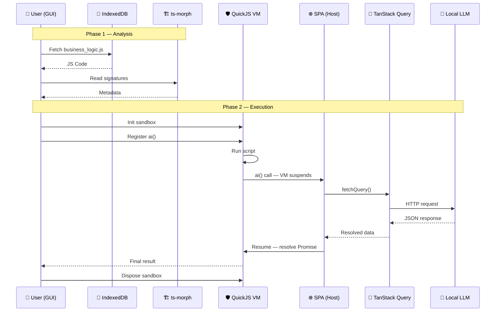
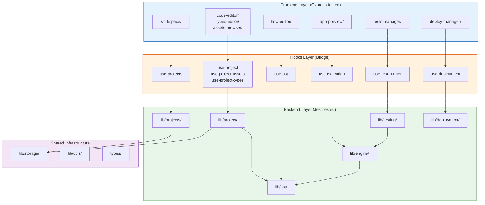

# Open Modeler TS Architecture Document

Project is in design phase.

## Master Business Case

1. User can edit and save business logic scripts edited in a code editor (e.g. CodeMirror) within the React Flow
   low-code environment. Example of the script: [example-loan-return.ts](example-loan-return.ts)
2. Script is the project. Multiple projects can be stored in IndexedDB and listed in the landing page.
3. The script is parsed to the higher level OpenModel Project AST (using ts-morph) to generate the graph in the React
   Flow editor. Flow editor changes are serialized back to the script and saved in IndexedDB.
4. Script can be executed in a secure sandbox (QuickJS). Depending on hooks in the script, the sandbox can call out to
   the host environment to fetch data or call an LLM, or render graph or output table in the UI.

## Stack

- **QuickJS VM** — Secure, isolated JavaScript sandbox for business logic execution.
- **ts-morph** — TypeScript AST analysis for signature extraction and transpilation.
- **TanStack Query** — Imperative LLM request management, caching, and retries.
- **IndexedDB** — Local storage for business logic scripts.
- **Next.js & React** — Core SPA framework for the host environment.
- **TypeScript** — Primary development language for host and logic.

## Sequence Diagram



## Phase 1 — Analysis

1. **Fetch business_logic.js** — GUI loads the script from IndexedDB.
2. **JS Code** — Raw JS returned to the caller.
3. **Read signatures** — ts-morph parses the AST to extract function names, parameter names/types, and return
   shapes. If the file is TypeScript, call `sourceFile.getEmitOutput()` or `project.emit()` here to get transpiled JS
   before passing to the VM.
4. **Metadata** — Signature metadata returned to the host so it knows what inputs to prepare before execution
   starts.

## Phase 2 — Execution

5. **Init sandbox** — A fresh QuickJS runtime instance is created: isolated heap, own global scope, no access to
   browser DOM or fetch.
6. **Register ai()** — The host injects `ai(prompt)` into the sandbox global scope before the script runs. Business
   logic can call it like any normal async function.
7. **Run script** — QuickJS executes business_logic.js inside the sandbox.
8. **ai() call — VM suspends** — When business logic hits `await ai("...")`, the VM yields control back to the SPA
   host and waits for the Promise to resolve.
9. **fetchQuery()** — Host calls `queryClient.fetchQuery()` imperatively to trigger the LLM HTTP call via TanStack
   Query.
10. **HTTP request** — TanStack Query sends the request to the LLM endpoint, with built-in deduplication, caching,
    and retry.
11. **JSON response** — LLM returns structured JSON.
12. **Resolved data** — TanStack Query hands the result back to the host.
13. **Resume — resolve Promise** — Host resolves the `ai()` Promise with the LLM result; the VM resumes from where
    it suspended.
14. **Final result** — Business logic finishes and returns its output to the GUI.
15. **Dispose sandbox** — QuickJS runtime is torn down, freeing heap memory and ensuring no state leaks into the
    next execution.

## Notes

### Analysis Phase

ts-morph is primarily a TypeScript AST tool but works on plain JS too. If input is TypeScript, call
`sourceFile.getEmitOutput()` or `project.emit()` to get transpiled JS directly from ts-morph — no esbuild needed. For
plain JS, ts-morph is purely used for signature extraction.

### Isolated Sandbox

A QuickJS sandbox is a self-contained JS runtime instance with its own heap, global scope, and event loop. It has zero
access to the browser DOM, `fetch`, or any host API unless explicitly registered. This is the security boundary —
business logic cannot reach outside it.

### The ai() Bridge

`ai()` is not standard JS — it is a host function registered into the sandbox global scope before execution starts. When
business logic calls `await ai("...")`, the VM suspends and yields control to the SPA host. The host resolves the LLM
response and resumes the VM by resolving the Promise. The business logic script sees it as a normal async call.

### TanStack Query

The LLM HTTP call is managed by TanStack Query. The host calls `queryClient.fetchQuery()` imperatively from within the
`ai()` bridge handler — outside of any React component. This gives you deduplication, caching, and retry for free,
without wiring up a hook.

### Context Disposal

Each execution run gets a fresh sandbox instance. Disposing it after the run frees the QuickJS heap and guarantees no
globals, closures, or module-level state persist into the next run. This is intentional — business logic scripts are
stateless by design.

## Proposed Project Component Structure

The application uses a **layered, service-oriented architecture** within a single Next.js project. This is intentionally
not a multi-package monorepo — the module boundaries are enforced through directory structure, barrel exports
(`index.ts`), and a strict dependency direction rule. This gives us the separation benefits of a monorepo without the
build tooling overhead, which is the right trade-off for a browser-only SPA at this stage.

### Architecture Principles

1. **Dependency direction flows downward:** `app/ → components/ → hooks/ → lib/`. Never reverse.
2. **`lib/` is React-free:** All business logic in `lib/` must be framework-agnostic, tested with Jest.
3. **`components/` is UI-only:** React components consume `lib/` through `hooks/`. Tested with Cypress.
4. **Barrel exports enforce boundaries:** Each service exposes a public API via `index.ts`. Internal modules are
   implementation details. Consumers import from `@/lib/ast`, never from `@/lib/ast/parsers/typescript/source-parser`.
5. **Interface-driven extensibility:** Storage, parsers, and engines use abstract interfaces for future swap-ability
   (Git storage, Python parser, Pyodide engine) without touching consumers.

### High-Level Structure

```text
open-modeler-ts/
├── docs/                                     # Architecture & design documents
│   ├── ARCHITECTURE.md                       # This document
│   ├── PROJECT_AST.md                        # AST specification & type definitions
│   └── example-loan-return.ts                # Reference example script
│
├── cypress/                                  # E2E tests (frontend, Cypress)
│   ├── e2e/
│   │   ├── health.cy.ts                      # Critical: must pass before all others
│   │   ├── workspace.cy.ts                   # Service 1 — project listing, create, delete
│   │   ├── project-editor.cy.ts              # Service 2 — metadata, assets, types editing
│   │   ├── flow-editor.cy.ts                 # Service 3 — flow graph interaction
│   │   ├── code-editor.cy.ts                 # Service 3 — code editing round-trip
│   │   ├── execution.cy.ts                   # Service 4 — script execution, hook output
│   │   ├── test-manager.cy.ts                # Service 5 — test case management
│   │   └── deployment.cy.ts                  # Service 6 — deployment configuration
│   ├── fixtures/                             # Test data (sample projects, scripts)
│   └── support/                              # Cypress helpers, commands, IndexedDB cleanup
│
├── public/                                   # Static assets, WASM binaries (pkg-*)
│
├── src/
│   ├── app/                                  # Next.js App Router
│   │   ├── layout.tsx                        # Root layout (providers, global CSS)
│   │   ├── page.tsx                          # SPA hash-based router
│   │   ├── globals.css                       # Global styles
│   │   └── health/
│   │       └── page.tsx                      # Health check endpoint
│   │
│   ├── components/                           # React UI layer (Cypress-tested)
│   │   ├── common/                           # Shared reusable UI elements
│   │   │   ├── snackbar/                     # notistack provider and notification hooks
│   │   │   │   ├── snackbar-provider.tsx
│   │   │   │   └── use-notification.ts
│   │   │   ├── dialogs/                      # Reusable dialog components
│   │   │   │   ├── confirm-dialog.tsx
│   │   │   │   └── form-dialog.tsx
│   │   │   ├── toolbar/                      # Shared toolbar components
│   │   │   │   └── action-toolbar.tsx
│   │   │   └── loading/
│   │   │       └── loading-spinner.tsx
│   │   │
│   │   ├── layouts/                          # Page-level structural templates
│   │   │   ├── landing-layout.tsx            # Multi-project management shell
│   │   │   └── project-layout.tsx            # In-project navigation shell
│   │   │
│   │   ├── nodes/                            # Custom ReactFlow node components
│   │   │   ├── common/                       # Shared node chrome (ports, labels)
│   │   │   │   └── node-wrapper.tsx
│   │   │   ├── function-node/
│   │   │   │   └── function-node.tsx         # Computation step node
│   │   │   ├── chart-node/
│   │   │   │   └── chart-node.tsx            # MUI X Charts visualization node
│   │   │   ├── table-node/
│   │   │   │   └── table-node.tsx            # Tabular output node
│   │   │   └── list-node/
│   │   │       └── list-node.tsx             # Data-shape / collection node
│   │   │
│   │   └── views/                            # Feature views (swapped by hash router)
│   │       ├── workspace/                    # → Service 1: Projects listing
│   │       │   ├── workspace-view.tsx        # Main workspace grid
│   │       │   ├── project-card.tsx          # Individual project card
│   │       │   └── create-project-dialog.tsx # New project dialog
│   │       ├── flow-editor/                  # → Service 3: ReactFlow editor
│   │       │   ├── flow-editor-view.tsx      # Main flow canvas
│   │       │   ├── flow-toolbar.tsx          # Flow-specific actions
│   │       │   └── flow-sidebar.tsx          # Node palette / properties
│   │       ├── code-editor/                  # → Service 2/3: CodeMirror editor
│   │       │   ├── code-editor-view.tsx      # Editor with TypeScript support
│   │       │   └── editor-toolbar.tsx        # Editor actions (save, format, run)
│   │       ├── types-editor/                 # → Service 2: Interface management
│   │       │   ├── types-editor-view.tsx     # Types listing and editing
│   │       │   └── type-form.tsx             # Individual type/interface form
│   │       ├── assets-browser/               # → Service 2: Asset management
│   │       │   ├── assets-browser-view.tsx   # Asset listing with filters
│   │       │   ├── asset-list.tsx            # Sortable asset table
│   │       │   └── asset-import-dialog.tsx   # Import dialog (file upload, paste)
│   │       ├── app-preview/                  # → Service 4: Execution output
│   │       │   ├── app-preview-view.tsx      # Preview container
│   │       │   ├── chart-panel.tsx           # chart() hook output
│   │       │   ├── table-panel.tsx           # table() hook output
│   │       │   └── console-panel.tsx         # log() hook output
│   │       ├── tests-manager/                # → Service 5: Test management
│   │       │   ├── tests-manager-view.tsx    # Test suite listing
│   │       │   ├── test-case-editor.tsx      # Individual test case form
│   │       │   └── test-results-panel.tsx    # Execution results display
│   │       ├── deploy-manager/               # → Service 6: Deployment
│   │       │   ├── deploy-manager-view.tsx   # Deployment targets listing
│   │       │   ├── target-config.tsx         # Target configuration form
│   │       │   └── environment-editor.tsx    # Environment variables editor
│   │       └── landing/                      # Public landing / marketing
│   │           └── landing-view.tsx
│   │
│   ├── hooks/                                # React hooks (bridge lib/ → components/)
│   │   ├── use-hash-route.ts                 # Hash-based SPA navigation
│   │   ├── use-projects.ts                   # Service 1 — projects CRUD
│   │   ├── use-project.ts                    # Service 2 — single project state
│   │   ├── use-project-assets.ts             # Service 2 — asset operations
│   │   ├── use-project-types.ts              # Service 2 — types management
│   │   ├── use-ast.ts                        # Service 3 — AST parsing trigger
│   │   ├── use-execution.ts                  # Service 4 — script execution
│   │   ├── use-test-runner.ts                # Service 5 — test execution
│   │   └── use-deployment.ts                 # Service 6 — deployment ops
│   │
│   ├── providers/                            # React context providers
│   │   ├── MuiProvider.tsx                   # Material UI theme provider
│   │   └── QueryProvider.tsx                 # TanStack Query provider
│   │
│   ├── theme/
│   │   └── theme.ts                          # MUI theme configuration
│   │
│   ├── lib/                                  # Core business logic (Jest-tested, React-free)
│   │   │
│   │   ├── projects/                         # ── Service 1: Projects Management ──
│   │   │   ├── index.ts                      # Public API barrel export
│   │   │   ├── projects-service.ts           # CRUD orchestration (list, create, update, delete)
│   │   │   ├── projects-repository.ts        # Storage abstraction → calls storage adapter
│   │   │   ├── projects-types.ts             # StoredProject, ProjectListItem, CreateProjectInput
│   │   │   ├── projects-validator.ts         # Input validation (name uniqueness, required fields)
│   │   │   └── __tests__/
│   │   │       ├── projects-service.test.ts
│   │   │       ├── projects-repository.test.ts
│   │   │       └── projects-validator.test.ts
│   │   │
│   │   ├── project/                          # ── Service 2: Project Management ──
│   │   │   ├── index.ts                      # Public API barrel export
│   │   │   ├── project-service.ts            # Single project operations orchestrator
│   │   │   ├── metadata/
│   │   │   │   ├── metadata-service.ts       # Project name, description, tags CRUD
│   │   │   │   └── metadata-types.ts         # ProjectMeta, UpdateMetadataInput
│   │   │   ├── types-management/
│   │   │   │   ├── types-extractor.ts        # Extract interfaces from source via AST service
│   │   │   │   ├── types-service.ts          # Types CRUD, default types.ts creation
│   │   │   │   └── types-management-types.ts # ManagedType, TypesConfig
│   │   │   ├── assets/
│   │   │   │   ├── assets-service.ts         # Asset CRUD (add, remove, rename, list)
│   │   │   │   ├── assets-types.ts           # ProjectAsset, AssetKind (typescript | json | csv | utility | service)
│   │   │   │   ├── asset-validator.ts        # File type validation, size limits
│   │   │   │   └── importers/               # Format-specific import handlers
│   │   │   │       ├── importer-interface.ts # Abstract importer contract
│   │   │   │       ├── json-importer.ts      # JSON file import and validation
│   │   │   │       ├── csv-importer.ts       # CSV parsing and import
│   │   │   │       └── typescript-importer.ts# TypeScript file import
│   │   │   └── __tests__/
│   │   │       ├── project-service.test.ts
│   │   │       ├── metadata-service.test.ts
│   │   │       ├── types-extractor.test.ts
│   │   │       ├── assets-service.test.ts
│   │   │       └── importers/
│   │   │           ├── json-importer.test.ts
│   │   │           ├── csv-importer.test.ts
│   │   │           └── typescript-importer.test.ts
│   │   │
│   │   ├── ast/                              # ── Service 3: AST Parsing ──
│   │   │   ├── index.ts                      # Public API: parseSource, serializeAst, buildFlowGraph, transpileSource
│   │   │   ├── parsers/
│   │   │   │   ├── parser-interface.ts       # Abstract parser contract (for future Python, JS parsers)
│   │   │   │   └── typescript/               # ts-morph implementation
│   │   │   │       ├── source-parser.ts      # Orchestrator: parseSource(source: string): ProjectAST
│   │   │   │       ├── jsdoc-extractor.ts    # extractJsDoc(): @nodeType, @displayName, @visible
│   │   │   │       ├── type-resolver.ts      # resolveType(): ts-morph Type → TypeReference
│   │   │   │       └── call-graph-analyzer.ts# analyzeCallGraph(): extract call expressions
│   │   │   ├── serializers/
│   │   │   │   ├── serializer-interface.ts   # Abstract serializer contract
│   │   │   │   └── ast-serializer.ts         # serializeAst(ast: ProjectAST): string
│   │   │   ├── transpilers/
│   │   │   │   ├── transpiler.ts             # transpileSource(): TS → JS for QuickJS
│   │   │   │   └── hook-rewriter.ts          # rewriteHookImports(): @openmodeler/hooks → openmodeler:hooks
│   │   │   ├── flow/
│   │   │   │   ├── flow-graph-builder.ts     # buildFlowGraph(ast): AST → ReactFlow nodes & edges
│   │   │   │   ├── flow-graph-sync.ts        # applyFlowMutations(): flow changes → AST updates
│   │   │   │   └── flow-types.ts             # FlowGraph, FlowNode, FlowEdge, FlowMutation
│   │   │   ├── types/                        # AST type definitions (implements PROJECT_AST.md spec)
│   │   │   │   ├── project-ast-types.ts      # ProjectAST, Declaration, DeclarationBase
│   │   │   │   ├── node-types.ts             # NodeType: 'function' | 'chart' | 'table' | 'flow' | 'list'
│   │   │   │   └── annotation-types.ts       # JsDocAnnotations, SourceRange, ParseDiagnostic
│   │   │   └── __tests__/
│   │   │       ├── source-parser.test.ts     # Input/output pairs: TS string → ProjectAST
│   │   │       ├── jsdoc-extractor.test.ts   # Isolated JSDoc strings → annotations
│   │   │       ├── type-resolver.test.ts     # ts-morph types → TypeReference
│   │   │       ├── call-graph-analyzer.test.ts
│   │   │       ├── ast-serializer.test.ts    # Round-trip: parse → serialize → re-parse
│   │   │       ├── transpiler.test.ts        # TS → valid JS assertions
│   │   │       ├── hook-rewriter.test.ts     # Import rewriting assertions
│   │   │       ├── flow-graph-builder.test.ts
│   │   │       └── flow-graph-sync.test.ts   # Mutation → AST change assertions
│   │   │
│   │   ├── engine/                           # ── Service 4: Execution Engine ──
│   │   │   ├── index.ts                      # Public API: createSandbox, executeSandbox, disposeSandbox
│   │   │   ├── engines/
│   │   │   │   ├── engine-interface.ts       # Abstract engine contract (for future Pyodide, etc.)
│   │   │   │   └── quickjs/
│   │   │   │       ├── quickjs-engine.ts     # QuickJS VM lifecycle (init, execute, dispose)
│   │   │   │       ├── quickjs-module-resolver.ts # openmodeler:hooks virtual module resolution
│   │   │   │       └── quickjs-sandbox.ts    # Isolated sandbox creation with security boundaries
│   │   │   ├── hooks/
│   │   │   │   ├── hook-registry.ts          # Register/unregister hooks on a sandbox instance
│   │   │   │   ├── host-bridge.ts            # Host ↔ Guest communication bridge
│   │   │   │   ├── push-hooks.ts             # chart(), table(), log() — fire-and-forget
│   │   │   │   └── bidirectional-hooks.ts    # ai(), fetch() — async request-response
│   │   │   ├── security/
│   │   │   │   ├── domain-allowlist.ts       # fetch() domain restrictions
│   │   │   │   ├── payload-limiter.ts        # Push hook payload size limits
│   │   │   │   └── execution-timeout.ts      # Configurable execution timeouts
│   │   │   ├── execution-types.ts            # ExecutionResult, ExecutionContext, HookCallbacks
│   │   │   ├── hooks-types.ts                # ChartConfig, AiRequestOptions, FetchRequestOptions, etc.
│   │   │   └── __tests__/
│   │   │       ├── quickjs-engine.test.ts
│   │   │       ├── quickjs-module-resolver.test.ts
│   │   │       ├── hook-registry.test.ts
│   │   │       ├── host-bridge.test.ts
│   │   │       ├── push-hooks.test.ts
│   │   │       ├── bidirectional-hooks.test.ts
│   │   │       ├── domain-allowlist.test.ts
│   │   │       ├── payload-limiter.test.ts
│   │   │       └── execution-timeout.test.ts
│   │   │
│   │   ├── testing/                          # ── Service 5: Testing Service ──
│   │   │   ├── index.ts                      # Public API: createTestCase, runTests, getReport
│   │   │   ├── test-case-service.ts          # Test case CRUD operations
│   │   │   ├── test-runner.ts                # Test execution (calls Engine service)
│   │   │   ├── test-reporter.ts              # Result aggregation, pass/fail reporting
│   │   │   ├── testing-types.ts              # TestCase, TestSuite, TestResult, TestReport
│   │   │   └── __tests__/
│   │   │       ├── test-case-service.test.ts
│   │   │       ├── test-runner.test.ts
│   │   │       └── test-reporter.test.ts
│   │   │
│   │   ├── deployment/                       # ── Service 6: Deployment Service ──
│   │   │   ├── index.ts                      # Public API: deploy, getTargets, manageEnvironment
│   │   │   ├── deployment-service.ts         # Deployment orchestration
│   │   │   ├── deployment-types.ts           # DeploymentConfig, DeploymentTarget, DeploymentResult
│   │   │   ├── targets/
│   │   │   │   ├── target-interface.ts       # Abstract deployment target contract
│   │   │   │   ├── vercel-target.ts          # (future) Vercel deployment
│   │   │   │   └── aws-lambda-target.ts      # (future) AWS Lambda deployment
│   │   │   ├── environment/
│   │   │   │   ├── environment-service.ts    # Environment variables CRUD
│   │   │   │   └── environment-types.ts      # EnvironmentVariable, EnvironmentConfig
│   │   │   └── __tests__/
│   │   │       ├── deployment-service.test.ts
│   │   │       └── environment-service.test.ts
│   │   │
│   │   ├── storage/                          # ── Shared: Storage Abstraction Layer ──
│   │   │   ├── index.ts                      # Public API: getStorage
│   │   │   ├── storage-interface.ts          # Abstract storage contract (get, put, delete, list)
│   │   │   ├── indexeddb/
│   │   │   │   ├── indexeddb-client.ts       # IndexedDB setup, schema, migrations
│   │   │   │   └── indexeddb-adapter.ts      # StorageInterface implementation for IndexedDB
│   │   │   └── __tests__/
│   │   │       ├── indexeddb-client.test.ts
│   │   │       └── indexeddb-adapter.test.ts
│   │   │
│   │   └── utils/                            # ── Shared: Utility Functions ──
│   │       ├── index.ts
│   │       ├── id-generator.ts               # UUID / deterministic ID generation
│   │       ├── date-formatter.ts             # Timestamp formatting
│   │       └── validation-helpers.ts         # Common validation patterns
│   │
│   └── types/                                # Shared TypeScript type definitions
│       ├── common.ts                         # Result<T>, PaginatedList<T>, SortOrder
│       └── errors.ts                         # AppError, ValidationError, ServiceError
│
├── package.json
├── tsconfig.json
├── jest.config.ts
├── jest.setup.ts
├── cypress.config.ts
├── eslint.config.mjs
└── next.config.ts
```

## Services Architecture

Each service has a clear boundary between **backend** (`lib/`) and **frontend** (`components/views/` + `hooks/`).
Backend logic is framework-agnostic and tested with **Jest**. Frontend components are tested with **Cypress**.



### Service 1 — Projects Management (`lib/projects/`)

**Responsibility:** Multi-project CRUD operations. Defines the project BOM (Bill of Materials) — the canonical type
interfaces that describe what a stored project looks like. This is the "library" that the workspace view uses to list,
create, duplicate, and delete projects.

**Key interfaces:**

```typescript
interface StoredProject {
    id: string;                    // UUID
    name: string;                  // User-defined project name
    description?: string;
    tags: Record<string, string>;
    assets: ProjectAsset[];        // All project files (source, types, data)
    createdAt: string;             // ISO 8601
    updatedAt: string;             // ISO 8601
}

interface ProjectListItem {
    id: string;
    name: string;
    description?: string;
    updatedAt: string;
    assetCount: number;
}
```

**Storage extensibility:** `projects-repository.ts` depends on `storage-interface.ts`, not on IndexedDB directly. To
swap to Git or file-based storage in the future, implement a new adapter — no changes to the service layer.

**Frontend:** `views/workspace/` — project cards grid, create/delete dialogs.

---

### Service 2 — Project Management (`lib/project/`)

**Responsibility:** Operations on a single open project. Manages the three sub-domains: metadata, types, and assets.
This service is the "work surface" that the project layout views interact with.

**Sub-services:**

- **Metadata** (`metadata/`) — project name, description, tags, timestamps. Simple CRUD.
- **Types Management** (`types-management/`) — extracts TypeScript interfaces from source files (delegates to
  Service 3's parser), provides UI-editable representations, manages the default `types.ts` asset.
- **Assets** (`assets/`) — project file management. Each asset has a `kind` discriminator:

```typescript
type AssetKind = 'source' | 'types' | 'json' | 'csv' | 'utility' | 'service';

interface ProjectAsset {
    id: string;
    filename: string;
    kind: AssetKind;
    content: string;               // File contents (text-based)
    createdAt: string;
    updatedAt: string;
}
```

**Importer pattern:** Each file format has a dedicated importer implementing `ImporterInterface`. This keeps format-
specific parsing isolated and testable.

**Frontend:** `views/code-editor/`, `views/types-editor/`, `views/assets-browser/`.

---

### Service 3 — AST Parsing (`lib/ast/`)

**Responsibility:** The analysis engine. Takes TypeScript source and produces the `ProjectAST` (as specified in
`PROJECT_AST.md`). Also handles the reverse path (AST → source serialization) and the flow graph derivation.

**Four pipelines (from `PROJECT_AST.md`):**

| Pipeline      | Components                                                     | Direction           |
|---------------|----------------------------------------------------------------|---------------------|
| Parsing       | SourceParser → JsDocExtractor, TypeResolver, CallGraphAnalyzer | Source → AST        |
| Serialization | AstSerializer                                                  | AST → Source        |
| Flow          | FlowGraphBuilder, FlowGraphSync                                | AST ↔ ReactFlow     |
| Transpilation | Transpiler, HookRewriter                                       | Source → QuickJS JS |

**Parser extensibility:** `parser-interface.ts` defines the abstract contract. The `typescript/` directory implements
it with ts-morph. Future parsers (Python via Pyodide AST, JavaScript via lighter tools) implement the same interface.

**AST types live here:** All types from `PROJECT_AST.md` (`ProjectAST`, `Declaration`, `TypeReference`, etc.) are
defined in `ast/types/` and re-exported from `ast/index.ts`.

**Frontend:** `views/flow-editor/` — the ReactFlow canvas consumes `FlowGraph` from `flow-graph-builder.ts`.

---

### Service 4 — Execution Engine (`lib/engine/`)

**Responsibility:** Secure script execution in a sandboxed VM. Manages the full lifecycle: sandbox creation → hook
registration → script execution → result collection → sandbox disposal.

**Engine extensibility:** `engine-interface.ts` defines the abstract contract. The `quickjs/` directory implements it.
Future engines (Pyodide for Python, Deno for enhanced JS) implement the same interface.

**Hooks architecture (from `PROJECT_AST.md`):**

| Hook      | Category      | Direction     | Host Action                    |
|-----------|---------------|---------------|--------------------------------|
| `chart()` | Push          | Script → Host | Update React state → re-render |
| `table()` | Push          | Script → Host | Update React state → re-render |
| `log()`   | Push          | Script → Host | Append to console buffer       |
| `ai()`    | Bidirectional | Script ↔ Host | TanStack Query → LLM HTTP      |
| `fetch()` | Bidirectional | Script ↔ Host | TanStack Query → HTTP API      |

**Security layer:** Domain allowlists, payload size limits, execution timeouts — all configurable per project.

**Frontend:** `views/app-preview/` — chart, table, and console panels render hook output.

---

### Service 5 — Testing Service (`lib/testing/`)

**Responsibility:** Test case lifecycle management. Users define test cases with input data and expected outputs.
The runner executes them through the Execution Engine (Service 4) and reports results.

**Key types:**

```typescript
interface TestCase {
    id: string;
    name: string;
    description?: string;
    inputs: Record<string, unknown>;   // Function parameters
    expectedOutput: unknown;           // Expected return value
    assertions: TestAssertion[];       // Custom assertions (deep equality, contains, etc.)
}

interface TestResult {
    testCaseId: string;
    status: 'passed' | 'failed' | 'error';
    actualOutput: unknown;
    duration: number;                  // Execution time in ms
    errorMessage?: string;
}
```

**Frontend:** `views/tests-manager/` — test case editor, execution controls, results panel.

---

### Service 6 — Deployment Service (`lib/deployment/`)

**Responsibility:** Manages deployment targets and environment variables. This service is mostly a **skeleton for MVP**
— the interfaces and types are defined, but actual deployment integrations (Vercel, AWS Lambda) are deferred.

**MVP scope:** Environment variables management only. Users can define key-value pairs per environment (dev, staging,
prod) that are injected into script execution context.

**Frontend:** `views/deploy-manager/` — target listing, environment variable editor.

---

### Shared Infrastructure

#### Storage Abstraction (`lib/storage/`)

All services that persist data use the `StorageInterface` rather than calling IndexedDB directly:

```typescript
interface StorageInterface {
    get<T>(store: string, key: string): Promise<T | undefined>;

    getAll<T>(store: string): Promise<T[]>;

    put<T>(store: string, key: string, value: T): Promise<void>;

    delete(store: string, key: string): Promise<void>;
}
```

The `indexeddb/` adapter implements this today. Future adapters (Git-backed, filesystem) implement the same interface.

#### Shared Types (`types/`)

Cross-cutting types used across multiple services:

```typescript
// common.ts
type Result<T> = { ok: true; data: T } | { ok: false; error: AppError };

// errors.ts
interface AppError {
    code: string;
    message: string;
    details?: unknown;
}
```

## Inter-Service Dependency Rules

Services may only depend **downward and sideways within the lib/ layer**, never upward into hooks or components:

| Service        | May depend on                           |
|----------------|-----------------------------------------|
| Projects (1)   | Storage                                 |
| Project (2)    | Storage, AST (3) for type extraction    |
| AST (3)        | — (pure logic, no service dependencies) |
| Engine (4)     | AST (3) for transpilation               |
| Testing (5)    | Engine (4) for execution                |
| Deployment (6) | Storage, Engine (4) for env injection   |

## MVP Scope

Given the ambition of the project, the MVP must lay a strong architectural foundation while deferring integrations
that can be plugged in later without refactoring. The following priorities apply:

### MVP (Build Now)

| Service      | Scope                                                                |
|--------------|----------------------------------------------------------------------|
| Projects (1) | Full CRUD with IndexedDB. Asset-aware StoredProject type.            |
| Project (2)  | Metadata CRUD. TypeScript source as primary asset. Basic asset list. |
| AST (3)      | Full parsing pipeline (SourceParser through FlowGraphBuilder).       |
| Engine (4)   | QuickJS sandbox lifecycle. Push hooks (chart, table, log).           |
| Storage      | IndexedDB adapter with schema versioning.                            |

### Post-MVP (Interfaces Ready, Implementation Deferred)

| Service        | Scope                                                     |
|----------------|-----------------------------------------------------------|
| Project (2)    | CSV/JSON importers. Utility and service asset kinds.      |
| AST (3)        | AstSerializer (flow → source round-trip). HookRewriter.   |
| Engine (4)     | Bidirectional hooks (ai, fetch). Security layer.          |
| Testing (5)    | Test case CRUD. Simple assertion runner.                  |
| Deployment (6) | Environment variables only. No actual deployment targets. |

### Future (Not Started)

| Feature                  | Service        |
|--------------------------|----------------|
| Git storage adapter      | Storage        |
| Python parser (Pyodide)  | AST (3)        |
| Pyodide execution engine | Engine (4)     |
| Vercel deployment target | Deployment (6) |
| AWS Lambda target        | Deployment (6) |
| AWS Lambda target        | Deployment (6) |

# Architect Concerns

1. Looks like "AST Parsing" is both parsing and visualisation. We have huge amount of complexity that can be tested
   simply with Jest (that is AST parsing) and a very ambitious low code and no code layer that is the ReactFlow graph
   and various nodes to be
   edited. Even AST parsing is basically Jest tested isolated React free library, and meanwhile ReactFlow probably
   cannot be even Jest tested and will be tested probably with Cypress only, I really do not want to treat both of them
   as a single service! This will raise big problems for Agent driven development, and you risk simply blend them so
   much, that AST might not be even properly Jest tested.
    - It is very important to have at least logical separation from ReactFlow with nodes from the actual AST parsing.
      Also, parsing is bidirectional: user can crate new node that will be parsed back to AST as a function.
    - Review PROJECT_AST.md and split it into two parts: one that is about AST parsing and another that is about
      ReactFlow graph with all nodes definitions. Find `## Nodes` section and clarify it. We will have a limited set of
      nodes, but mention at least react component names, so Agent could easily navigate to react component from the
      document.

You're highly paid architect advisor who knows the best industry practices, please advise on this concern and clarify
documentation. You can look at the existing design work in sceptical way to reach state-of-the-art architecture. We're
in design phase, so any change is allowed.

Also, `ARCHITECTURE.md` should have a brief description of how we will organize files:

```
- Entry document is [ARCHITECTURE.md](doc/architecture/ARCHITECTURE.md)
- All design documents are in `doc/` folder marked as following:
  - `*_ARCH.md` the initial definition of the service, component or feature architecture. This is the first document to be created for any new service or major component.
  - `*_REQ.md` for high-level requirements to be used to design proper user story. They will be added later.
  - `*_STORY.md` for implementation stories that guide development of specific features or components.
  - `*_SPEC.md` completed stories appear as specifications that can be referred to by other stories or design documents.
```

Not that you're working with _ARCH documents for now, because we're in design phase.