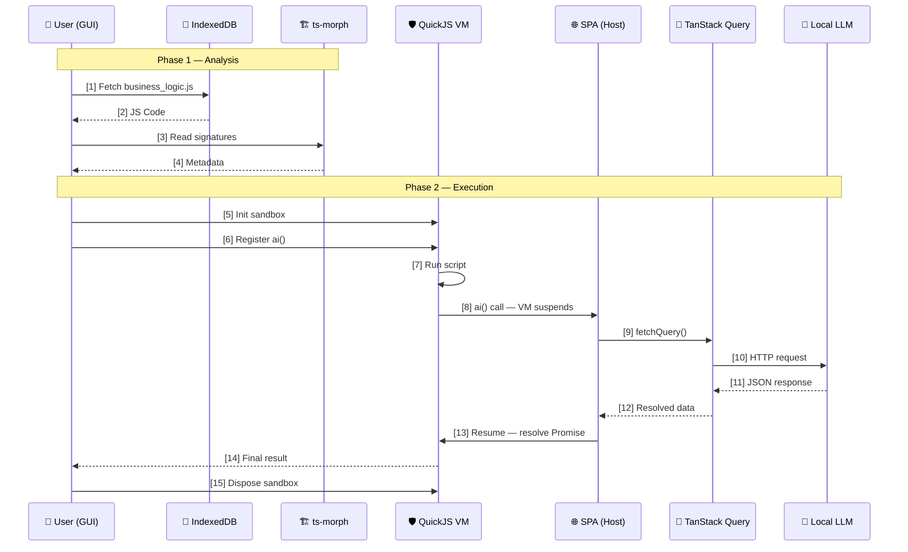

# Business Logic Execution: ai() Method Bridge

Sequence diagram for secure JS execution via QuickJS VM and LLM bridge.

## Stack

- **QuickJS VM** — Secure, isolated JavaScript sandbox for business logic execution.
- **ts-morph** — TypeScript AST analysis for signature extraction and transpilation.
- **TanStack Query** — Imperative LLM request management, caching, and retries.
- **IndexedDB** — Local storage for business logic scripts.
- **Next.js & React** — Core SPA framework for the host environment.
- **TypeScript** — Primary development language for host and logic.

## Sequence Diagram

## Phase 1 — Analysis

1.  **[1] Fetch business_logic.js** — GUI loads the script from IndexedDB.
2.  **[2] JS Code** — Raw JS returned to the caller.
3.  **[3] Read signatures** — ts-morph parses the AST to extract function names, parameter names/types, and return shapes. If the file is TypeScript, call `sourceFile.getEmitOutput()` or `project.emit()` here to get transpiled JS before passing to the VM.
4.  **[4] Metadata** — Signature metadata returned to the host so it knows what inputs to prepare before execution starts.

## Phase 2 — Execution

5.  **[5] Init sandbox** — A fresh QuickJS runtime instance is created: isolated heap, own global scope, no access to browser DOM or fetch.
6.  **[6] Register ai()** — The host injects `ai(prompt)` into the sandbox global scope before the script runs. Business logic can call it like any normal async function.
7.  **[7] Run script** — QuickJS executes business_logic.js inside the sandbox.
8.  **[8] ai() call — VM suspends** — When business logic hits `await ai("...")`, the VM yields control back to the SPA host and waits for the Promise to resolve.
9.  **[9] fetchQuery()** — Host calls `queryClient.fetchQuery()` imperatively to trigger the LLM HTTP call via TanStack Query.
10. **[10] HTTP request** — TanStack Query sends the request to the LLM endpoint, with built-in deduplication, caching, and retry.
11. **[11] JSON response** — LLM returns structured JSON.
12. **[12] Resolved data** — TanStack Query hands the result back to the host.
13. **[13] Resume — resolve Promise** — Host resolves the `ai()` Promise with the LLM result; the VM resumes from where it suspended.
14. **[14] Final result** — Business logic finishes and returns its output to the GUI.
15. **[15] Dispose sandbox** — QuickJS runtime is torn down, freeing heap memory and ensuring no state leaks into the next execution.

## Notes

### Analysis Phase
ts-morph is primarily a TypeScript AST tool but works on plain JS too. If input is TypeScript, call `sourceFile.getEmitOutput()` or `project.emit()` to get transpiled JS directly from ts-morph — no esbuild needed. For plain JS, ts-morph is purely used for signature extraction.

### Isolated Sandbox
A QuickJS sandbox is a self-contained JS runtime instance with its own heap, global scope, and event loop. It has zero access to the browser DOM, `fetch`, or any host API unless explicitly registered. This is the security boundary — business logic cannot reach outside it.

### The ai() Bridge
`ai()` is not standard JS — it is a host function registered into the sandbox global scope before execution starts. When business logic calls `await ai("...")`, the VM suspends and yields control to the SPA host. The host resolves the LLM response and resumes the VM by resolving the Promise. The business logic script sees it as a normal async call.

### TanStack Query
The LLM HTTP call is managed by TanStack Query. The host calls `queryClient.fetchQuery()` imperatively from within the `ai()` bridge handler — outside of any React component. This gives you deduplication, caching, and retry for free, without wiring up a hook.

### Context Disposal
Each execution run gets a fresh sandbox instance. Disposing it after the run frees the QuickJS heap and guarantees no globals, closures, or module-level state persist into the next run. This is intentional — business logic scripts are stateless by design.
