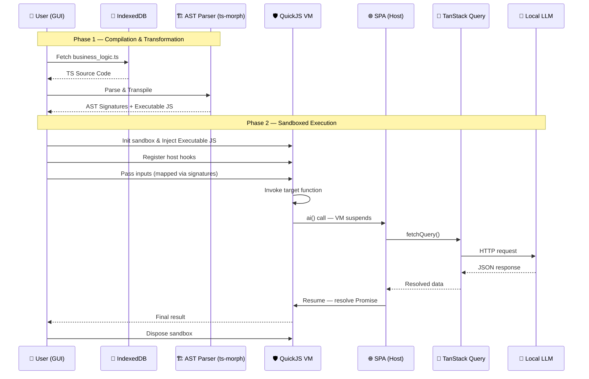
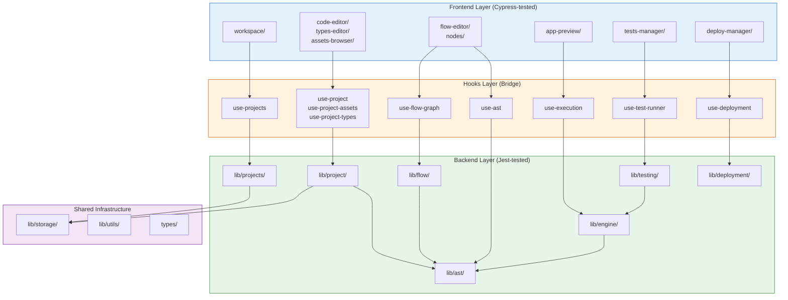

# Open Modeler TS Architecture Document

Project is in design phase.

## Documentation Structure

- Entry document: [ARCHITECTURE.md](ARCHITECTURE.md) — master overview, service map, and project structure.
- All design documents reside in the `docs/` folder with the following naming conventions:
    - `NN_SERVICE_NAME_ARCH.md` — Numerically prefixed architecture documents defining the 8 core service bounded contexts.
    - `*_REQ.md` — High-level requirements used to design proper user stories. Added after architecture is stable.
    - `*_STORY.md` — Implementation stories that guide development of specific features or components.
    - `*_SPEC.md` — Completed stories appear as specifications that can be referenced by other stories or documents.

### Current Design Documents

| Document                                                           | Service                 | Status |
| ------------------------------------------------------------------ | ----------------------- | ------ |
| [ARCHITECTURE.md](ARCHITECTURE.md)                                 | All — master overview   | Active |
| [01_PROJECTS_SERVICE_ARCH.md](01_PROJECTS_SERVICE_ARCH.md)         | Projects Management (1) | Active |
| [02_PROJECT_SERVICE_ARCH.md](02_PROJECT_SERVICE_ARCH.md)           | Project Management (2)  | Active |
| [03_AST_PARSING_ARCH.md](03_AST_PARSING_ARCH.md)                   | AST Parsing (3)         | Active |
| [04_TYPES_EDITOR_ARCH.md](04_TYPES_EDITOR_ARCH.md)               | Types Editor (4)        | Active |
| [05_FLOW_MODELING_ARCH.md](05_FLOW_MODELING_ARCH.md)               | Flow Modeling (5)       | Active |
| [06_EXECUTION_ENGINE_ARCH.md](06_EXECUTION_ENGINE_ARCH.md)         | Execution Engine (6)    | Active |
| [07_TESTING_SERVICE_ARCH.md](07_TESTING_SERVICE_ARCH.md)           | Testing Service (7)     | Active |
| [08_DEPLOYMENT_SERVICE_ARCH.md](08_DEPLOYMENT_SERVICE_ARCH.md)     | Deployment Service (8)  | OUT OF SCOPE |
| [examples/example-loan-return.ts](examples/example-loan-return.ts) | Reference example       | —      |

## Master Business Case

1. User can edit and save business logic scripts edited in a code editor (e.g. ACE Editor) within the React Flow
   low-code environment. Example of the script: [examples/example-loan-return.ts](examples/example-loan-return.ts)
2. Script is the project. Multiple projects can be stored in IndexedDB and listed in the landing page.
3. The script is parsed to the higher level OpenModel Project AST (using ts-morph) to generate the graph in the React
   Flow editor. Flow editor changes are serialized back to the script and saved in IndexedDB.
4. Script can be executed in a secure sandbox (QuickJS). Depending on hooks in the script, the sandbox can call out to
   the host environment to fetch data or call an LLM, or render graph or output table in the UI.

## Stack

- **QuickJS VM** — Secure, isolated JavaScript sandbox for business logic execution.
- **ts-morph** — TypeScript AST analysis for signature extraction and transpilation.
- **TanStack Query** — Imperative LLM request management, caching, and retries.
- **IndexedDB** — Local storage for business logic scripts.
- **ACE Editor** — High-performance code editor (`react-ace`) for script editing.
- **Next.js & React** — Core SPA framework for the host environment.
- **TypeScript** — Primary development language for host and logic.

## Sequence Diagram



## Phase 1 — Compilation & Transformation

1. **Fetch business_logic.ts** — GUI loads the TypeScript source code from IndexedDB.
2. **TS Source Code** — Raw source is returned to the caller.
3. **Parse & Transpile** — The AST parser (via `ts-morph`) extracts function names, parameter types, and return
   shapes. Concurrently, it transpiles the TypeScript source into executable JavaScript.
4. **AST Signatures + Executable JS** — Both the extracted metadata (signatures) and the executable JS are returned to
   the host. The host uses signatures to construct the visual ReactFlow graph and to map user inputs properly.

## Phase 2 — Sandboxed Execution

5. **Init sandbox & Inject Executable JS** — A fresh QuickJS runtime instance is created: isolated heap, own global
   scope, no access to
   browser DOM or fetch. The transpiled JavaScript is loaded into the VM.
6. **Register host hooks** — The host injects bridge functions like `ai(prompt)` into the sandbox global scope before the script runs. Business logic can call them like any normal async function or global variable.
7. **Pass inputs** — The host uses the previously extracted AST signatures to correctly map UI state variables and inject them as parameters into the Guest execution context.
8. **Invoke target function** — QuickJS evaluates the script and explicitly invokes the target function (the root flow or service method) by name, passing the mapped inputs.
9. **ai() call — VM suspends** — When business logic hits `await ai("...")`, the VM yields control back to the SPA
   host and waits for the Promise to resolve.
10. **fetchQuery()** — Host calls `queryClient.fetchQuery()` imperatively to trigger the LLM HTTP call via TanStack
    Query.
11. **HTTP request** — TanStack Query sends the request to the LLM endpoint, with built-in deduplication, caching,
    and retry.
12. **JSON response** — LLM returns structured JSON.
13. **Resolved data** — TanStack Query hands the result back to the host.
14. **Resume — resolve Promise** — Host resolves the `ai()` Promise with the LLM result; the VM resumes from where
    it suspended.
15. **Final result** — Business logic finishes and returns its output to the GUI.
16. **Dispose sandbox** — QuickJS runtime is torn down, freeing heap memory and ensuring no state leaks into the
    next execution.

## Notes

### Analysis Phase

ts-morph is primarily a TypeScript AST tool but works on plain JS too. If input is TypeScript, call
`sourceFile.getEmitOutput()` or `project.emit()` to get transpiled JS directly from ts-morph — no esbuild needed. For
plain JS, ts-morph is purely used for signature extraction.

### Isolated Sandbox

A QuickJS sandbox is a self-contained JS runtime instance with its own heap, global scope, and event loop. It has zero
access to the browser DOM, `fetch`, or any host API unless explicitly registered. This is the security boundary —
business logic cannot reach outside it.

### The ai() Bridge

`ai()` is not standard JS — it is a host function registered into the sandbox global scope before execution starts. When
business logic calls `await ai("...")`, the VM suspends and yields control to the SPA host. The host resolves the LLM
response and resumes the VM by resolving the Promise. The business logic script sees it as a normal async call.

### TanStack Query

The LLM HTTP call is managed by TanStack Query. The host calls `queryClient.fetchQuery()` imperatively from within the
`ai()` bridge handler — outside of any React component. This gives you deduplication, caching, and retry for free,
without wiring up a hook.

### Context Disposal

Each execution run gets a fresh sandbox instance. Disposing it after the run frees the QuickJS heap and guarantees no
globals, closures, or module-level state persist into the next run. This is intentional — business logic scripts are
stateless by design.

## Routing Strategy & SPA Architecture

To support **Static Site Generation (SSG)** and seamless deployment to **AWS S3**, the EdgeRules Modeler uses a \*
\*Hash-based Routing (`#`)\*\* strategy. This ensures that dynamic routes work without complex server-side redirects or
CloudFront error handlers, as the browser always loads the root `index.html` and parses the hash for state.

### Next.js Configuration

The project is configured for static export:

```typescript
const nextConfig: NextConfig = {
    output: 'export',
    reactStrictMode: true,
    typedRoutes: true,
    trailingSlash: true,
};
```

### Hash-Based Routing Strategy

Using Hash-based Routing is the "bulletproof" way to achieve clean-looking URLs on a static host. Anything after the `#`
is never sent to the server (S3); the browser successfully loads the physical file (usually root), and React handles
the "Dynamic State" from the hash.

#### Route Map

| View                     | Path                              | Logic                                                        |
| :----------------------- | :-------------------------------- | :----------------------------------------------------------- |
| **Landing**              | `/`                               | Workspace & Public Library.                                  |
| **Flow Editor**          | `/#flow/:projectId/`              | Visual programming canvas using ReactFlow.                   |
| **Flow Editor (Nested)** | `/#flow/:projectId/:key`          | ReactFlow for function nodes (nested).                       |
| **Context Editor**       | `/#visual-editor/:projectId/:key` | Advanced editor for decision tables, lists, etc.             |
| **Code Editor**          | `/#code-editor/:projectId/:key`   | ACE Editor for project context.                              |
| **Types**                | `/#types/:projectId`              | Custom type library & schemas.                               |
| **Tests Summary**        | `/#tests/:projectId`              | Listing of all node tests and results.                       |
| **Test Editor**          | `/#tests/:projectId/:key`         | Detailed test case management for given function or context. |
| **App Preview**          | `/#app/:projectId`                | Interactive "Workbook" GUI.                                  |
| **Deployment**           | `/#deploy/:projectId`             | Decision Service config & targets (OUT OF SCOPE FOR MVP).    |
| **Health**               | `/#health/`                       | Health check endpoint.                                       |

#### Route Parameters

- **`:projectId`**: The unique identifier for the EdgeRules project (e.g., `abc-project`).
- **`:key`**: The context key or path within the project's data structure (e.g., `abc-node`).
- **Validation**: `projectId` and `key` must be alphanumeric, allowing only `-` or `_`.
- Use `root` for the top-level project context. If key is empty, it defaults to `root`.
- Key is case-insensitive and presented as lower-case in the URL.

#### Key Context Explanation

Given the following project content for `abc-project`:

```typescript
/**
 * @nodeType function
 */
function calculateMonthlyPayment(principal: number, annualRate: number, months: number): number {
    const monthlyRate = annualRate / 100 / 12;
    if (monthlyRate === 0) return principal / months;
    return (principal * (monthlyRate * Math.pow(1 + monthlyRate, months))) / (Math.pow(1 + monthlyRate, months) - 1);
}
```

- `/#flow/abc-project/` — will open the Flow Editor for the entire project: `abc-project`.
- `/#code-editor/abc-project/calculatemonthlypayment` — will open the Code Editor focused on the
  `calculateMonthlyPayment` function within the project.

### Physical File Structure

To support the Single Page Application (SPA) architecture within a Static Site Generation (SSG) build (
`output: 'export'`), we adopt a **Feature-First & Colocated** folder structure. This keeps the `app/` directory clean
and ensures that complex views are modular and self-contained.

## Proposed Project Component Structure

The application uses a **layered, service-oriented architecture** within a single Next.js project. This is intentionally
not a multi-package monorepo — the module boundaries are enforced through directory structure, barrel exports
(`index.ts`), and a strict dependency direction rule. This gives us the separation benefits of a monorepo without the
build tooling overhead, which is the right trade-off for a browser-only SPA at this stage.

### Architecture Principles

1. **Dependency direction flows downward:** `app/ → components/ → hooks/ → lib/`. Never reverse.
2. **`lib/` is React-free:** All business logic in `lib/` must be framework-agnostic, tested with Jest.
3. **`components/` is UI-only:** React components consume `lib/` through `hooks/`. Tested with Cypress.
4. **Barrel exports enforce boundaries:** Each service exposes a public API via `index.ts`. Internal modules are
   implementation details. Consumers import from `@/lib/ast`, never from `@/lib/ast/parsers/typescript/source-parser`.
5. **Interface-driven extensibility:** Storage, parsers, and engines use abstract interfaces for future swap-ability
   (Git storage, Python parser, Pyodide engine) without touching consumers.

### High-Level Structure

```text
open-modeler-ts/
├── docs/                                     # Architecture & design documents
│   ├── ARCHITECTURE.md                       # This document — master overview
│   ├── 01_PROJECTS_SERVICE_ARCH.md           # Service 1: Workspace, Multi-project CRUD, IDB Storage
│   ├── 02_PROJECT_SERVICE_ARCH.md            # Service 2: Single Project Metadata, Assets
│   ├── 03_AST_PARSING_ARCH.md                # Service 3: ts-morph, Data Pipelines
│   ├── 04_TYPES_EDITOR_ARCH.md              # Types Editor: GUI for type management via AST
│   ├── 05_FLOW_MODELING_ARCH.md              # Service 5: ReactFlow, Sync, Layout Engine
│   ├── 06_EXECUTION_ENGINE_ARCH.md           # Service 6: QuickJS Sandbox, FFI, Host Bridge hooks
│   ├── 07_TESTING_SERVICE_ARCH.md            # Service 7: Execution orchestration, reporting
│   ├── 08_DEPLOYMENT_SERVICE_ARCH.md         # Service 8: Target adapters, environment variables
│   └── examples/
│       └── example-loan-return.ts            # Reference example script
│
├── cypress/                                  # E2E tests (frontend, Cypress)
│   ├── e2e/
│   │   ├── health.cy.ts                      # Critical: must pass before all others
│   │   ├── landing.cy.ts                     # Landing view
│   │   ├── flow-editor.cy.ts                 # Service 5 — flow graph interaction
│   │   ├── visual-editor.cy.ts               # Advanced context editor
│   │   ├── code-editor.cy.ts                 # Service 3 — code editing round-trip
│   │   ├── types.cy.ts                       # Types Editor — types management GUI
│   │   ├── tests-summary.cy.ts               # Service 7 — tests listing
│   │   ├── test-editor.cy.ts                 # Service 7 — test case management
│   │   ├── app-preview.cy.ts                 # Service 6 — Interactive app GUI
│   │   └── deployment.cy.ts                  # Service 8 — deployment configuration
│   ├── fixtures/                             # Test data (sample projects, scripts)
│   └── support/                              # Cypress helpers, commands, IndexedDB cleanup
│
├── public/                                   # Static assets, WASM binaries (pkg-*)
│
├── src/
│   ├── app/                                  # Next.js App Router
│   │   ├── layout.tsx                        # Root layout (providers, global CSS)
│   │   ├── page.tsx                          # SPA hash-based router
│   │   ├── globals.css                       # Global styles
│   │   └── health/
│   │       └── page.tsx                      # Health check endpoint
│   │
│   ├── components/                           # React UI layer (Cypress-tested)
│   │   ├── common/                           # Shared reusable UI elements
│   │   │   ├── snackbar/                     # notistack provider and notification hooks
│   │   │   │   ├── snackbar-provider.tsx
│   │   │   │   └── use-notification.ts
│   │   │   ├── dialogs/                      # Reusable dialog components
│   │   │   │   ├── confirm-dialog.tsx
│   │   │   │   └── form-dialog.tsx
│   │   │   ├── toolbar/                      # Shared toolbar components
│   │   │   │   └── action-toolbar.tsx
│   │   │   └── loading/
│   │   │       └── loading-spinner.tsx
│   │   │
│   │   ├── layouts/                          # Page-level structural templates
│   │   │   ├── landing-layout.tsx            # Multi-project management shell
│   │   │   └── project-layout.tsx            # In-project navigation shell
│   │   │
│   │   ├── nodes/                            # Custom ReactFlow node components (Service 5)
│   │   │   ├── common/                       # Shared node chrome (ports, labels)
│   │   │   │   └── node-wrapper.tsx
│   │   │   ├── function-node/
│   │   │   │   └── function-node.tsx         # Computation step node
│   │   │   ├── chart-node/
│   │   │   │   └── chart-node.tsx            # MUI X Charts visualization node
│   │   │   ├── table-node/
│   │   │   │   └── table-node.tsx            # Tabular output node
│   │   │   └── list-node/
│   │   │       └── list-node.tsx             # Data-shape / collection node
│   │   │
│   │   └── views/                            # Feature views (swapped by hash router)
│   │       ├── landing/                      # → `/` Landing view
│   │       │   └── landing-view.tsx          # Workspace & Public Library
│   │       ├── flow-editor/                  # → `/#flow/:projectId/:key`
│   │       │   ├── flow-editor-view.tsx      # Main flow canvas
│   │       │   ├── flow-toolbar.tsx          # Flow-specific actions
│   │       │   └── flow-sidebar.tsx          # Node palette / properties
│   │       ├── visual-editor/                # → `/#visual-editor/:projectId/:key`
│   │       │   └── visual-editor-view.tsx    # Context Editor View
│   │       ├── code-editor/                  # → `/#code-editor/:projectId/:key`
│   │       │   ├── code-editor-view.tsx      # Editor with TypeScript support
│   │       │   └── editor-toolbar.tsx        # Editor actions (save, format, run)
│   │       ├── types-editor/                 # → `/#types/:projectId`
│   │       │   ├── types-editor-view.tsx     # Types listing and editing
│   │       │   └── type-form.tsx             # Individual type/interface form
│   │       ├── app-preview/                  # → `/#app/:projectId`
│   │       │   ├── app-preview-view.tsx      # Preview container
│   │       │   ├── chart-panel.tsx           # chart() hook output
│   │       │   ├── table-panel.tsx           # table() hook output
│   │       │   └── console-panel.tsx         # log() hook output
│   │       ├── tests-manager/                # → `/#tests/:projectId` & `/#tests/:projectId/:key`
│   │       │   ├── tests-manager-view.tsx    # Test suite listing
│   │       │   ├── test-case-editor.tsx      # Individual test case form
│   │       │   └── test-results-panel.tsx    # Execution results display
│   │       └── deploy-manager/               # → `/#deploy/:projectId`
│   │           ├── deploy-manager-view.tsx   # Deployment targets listing
│   │           ├── target-config.tsx         # Target configuration form
│   │           └── environment-editor.tsx    # Environment variables editor
│   │
│   ├── hooks/                                # React hooks (bridge lib/ → components/)
│   │   ├── use-hash-route.ts                 # Hash-based SPA navigation
│   │   ├── use-projects.ts                   # Service 1 — projects CRUD
│   │   ├── use-project.ts                    # Service 2 — single project state
│   │   ├── use-project-assets.ts             # Service 2 — asset operations
│   │   ├── use-project-types.ts              # Types Editor — types management hook
│   │   ├── use-flow-graph.ts                 # Service 5 — flow graph state & mutations
│   │   ├── use-execution.ts                  # Service 6 — script execution
│   │   ├── use-test-runner.ts                # Service 7 — test execution
│   │   └── use-deployment.ts                 # Service 8 — deployment ops
│   │
│   ├── providers/                            # React context providers
│   │   ├── MuiProvider.tsx                   # Material UI theme provider
│   │   └── QueryProvider.tsx                 # TanStack Query provider
│   │
│   ├── theme/
│   │   └── theme.ts                          # MUI theme configuration
│   │
│   ├── lib/                                  # Core business logic (Jest-tested, React-free)
│   │   │
│   │   ├── projects/                         # ── Service 1: Projects Management ──
│   │   │   ├── index.ts                      # Public API barrel export
│   │   │   ├── projects-service.ts           # CRUD orchestration (list, create, update, delete)
│   │   │   ├── projects-repository.ts        # Storage abstraction → calls storage adapter
│   │   │   ├── projects-types.ts             # StoredProject, ProjectListItem, CreateProjectInput
│   │   │   ├── projects-validator.ts         # Input validation (name uniqueness, required fields)
│   │   │   └── __tests__/
│   │   │       ├── projects-service.test.ts
│   │   │       ├── projects-repository.test.ts
│   │   │       └── projects-validator.test.ts
│   │   │
│   │   ├── project/                          # ── Service 2: Project Management ──
│   │   │   ├── index.ts                      # Public API barrel export
│   │   │   ├── project-service.ts            # Single project operations orchestrator
│   │   │   ├── metadata/
│   │   │   │   ├── metadata-service.ts       # Project name, description, tags CRUD
│   │   │   │   └── metadata-types.ts         # ProjectMeta, UpdateMetadataInput
│   │   │   ├── types-management/
│   │   │   │   ├── types-extractor.ts        # Extract interfaces from source via AST service
│   │   │   │   └── types-service.ts          # Types asset CRUD, default types.ts creation
│   │   │   ├── assets/
│   │   │   │   ├── assets-service.ts         # Asset CRUD (add, remove, rename, list)
│   │   │   │   ├── assets-types.ts           # ProjectAsset, AssetKind (typescript | json | csv | utility | service)
│   │   │   │   ├── asset-validator.ts        # File type validation, size limits
│   │   │   │   └── importers/               # Format-specific import handlers
│   │   │   │       ├── importer-interface.ts # Abstract importer contract
│   │   │   │       ├── json-importer.ts      # JSON file import and validation
│   │   │   │       ├── csv-importer.ts       # CSV parsing and import
│   │   │   │       └── typescript-importer.ts# TypeScript file import
│   │   │   └── __tests__/
│   │   │       ├── project-service.test.ts
│   │   │       ├── metadata-service.test.ts
│   │   │       ├── types-extractor.test.ts
│   │   │       ├── assets-service.test.ts
│   │   │       └── importers/
│   │   │           ├── json-importer.test.ts
│   │   │           ├── csv-importer.test.ts
│   │   │           └── typescript-importer.test.ts
│   │   │
│   │   ├── ast/                              # ── Service 3: AST Parsing ──
│   │   │   ├── index.ts                      # Public API: parseProject, serializeAst, transpileProject
│   │   │   ├── parsers/
│   │   │   │   ├── parser-interface.ts       # Abstract parser contract (for future Python, JS parsers)
│   │   │   │   └── typescript/               # ts-morph implementation
│   │   │   │       ├── source-parser.ts      # Orchestrator: parseProject(assets: ProjectAsset[]): ProjectAST
│   │   │   │       ├── jsdoc-extractor.ts    # extractJsDoc(): @nodeType, @displayName, @visible
│   │   │   │       ├── type-resolver.ts      # resolveType(): ts-morph Type → TypeReference
│   │   │   │       └── call-graph-analyzer.ts# analyzeCallGraph(): extract call expressions
│   │   │   ├── serializers/
│   │   │   │   ├── serializer-interface.ts   # Abstract serializer contract
│   │   │   │   └── ast-serializer.ts         # serializeAst(ast: ProjectAST): string
│   │   │   ├── transpilers/
│   │   │   │   ├── transpiler.ts             # transpileProject(): Assets → JS for QuickJS
│   │   │   │   └── hook-rewriter.ts          # rewriteHookImports(): @openmodeler/hooks → openmodeler:hooks
│   │   │   ├── types/                        # AST type definitions (implements 03-AST-PARSING.md spec)
│   │   │   │   ├── project-ast-types.ts      # ProjectAST, Declaration, DeclarationBase
│   │   │   │   ├── node-types.ts             # NodeType: 'function' | 'chart' | 'table' | 'flow' | 'list'
│   │   │   │   └── annotation-types.ts       # JsDocAnnotations, SourceRange, ParseDiagnostic
│   │   │   └── __tests__/
│   │   │       ├── source-parser.test.ts     # Input/output pairs: TS string → ProjectAST
│   │   │       ├── jsdoc-extractor.test.ts   # Isolated JSDoc strings → annotations
│   │   │       ├── type-resolver.test.ts     # ts-morph types → TypeReference
│   │   │       ├── call-graph-analyzer.test.ts
│   │   │       ├── ast-serializer.test.ts    # Round-trip: parse → serialize → re-parse
│   │   │       ├── transpiler.test.ts        # TS → valid JS assertions
│   │   │       └── hook-rewriter.test.ts     # Import rewriting assertions
│   │   │
│   │   │   # Note: Types Editor (4) has no lib/ folder — it is a UI view that reads
│   │   │   # TypeDeclaration[] from AST (Service 3) and writes via SourceMutator.
│   │   │   # See: components/views/types-editor/ and hooks/use-project-types.ts
│   │   │
│   │   ├── flow/                             # ── Service 5: Flow Modeling ──
│   │   │   ├── index.ts                      # Public API: buildFlowGraph, applyFlowMutations
│   │   │   ├── flow-graph-builder.ts         # AST → ReactFlow-compatible nodes & edges
│   │   │   ├── flow-graph-sync.ts            # Flow mutations → AST updates (bidirectional)
│   │   │   ├── flow-layout-engine.ts         # Auto-layout algorithm for node positioning
│   │   │   ├── flow-types.ts                 # FlowGraph, FlowNode, FlowEdge, FlowMutation
│   │   │   └── __tests__/
│   │   │       ├── flow-graph-builder.test.ts# AST → FlowGraph assertions
│   │   │       ├── flow-graph-sync.test.ts   # Mutation → AST change assertions
│   │   │       └── flow-layout-engine.test.ts
│   │   │
│   │   ├── engine/                           # ── Service 6: Execution Engine ──
│   │   │   ├── index.ts                      # Public API: createSandbox, executeSandbox, disposeSandbox
│   │   │   ├── engines/
│   │   │   │   ├── engine-interface.ts       # Abstract engine contract (for future Pyodide, etc.)
│   │   │   │   └── quickjs/
│   │   │   │       ├── quickjs-engine.ts     # QuickJS VM lifecycle (init, execute, dispose)
│   │   │   │       ├── quickjs-module-resolver.ts # openmodeler:hooks virtual module resolution
│   │   │   │       └── quickjs-sandbox.ts    # Isolated sandbox creation with security boundaries
│   │   │   ├── hooks/
│   │   │   │   ├── hook-registry.ts          # Register/unregister hooks on a sandbox instance
│   │   │   │   ├── host-bridge.ts            # Host ↔ Guest communication bridge
│   │   │   │   ├── push-hooks.ts             # chart(), table(), log() — fire-and-forget
│   │   │   │   └── bidirectional-hooks.ts    # ai(), fetch() — async request-response
│   │   │   ├── security/
│   │   │   │   ├── domain-allowlist.ts       # fetch() domain restrictions
│   │   │   │   ├── payload-limiter.ts        # Push hook payload size limits
│   │   │   │   └── execution-timeout.ts      # Configurable execution timeouts
│   │   │   ├── execution-types.ts            # ExecutionResult, ExecutionContext, HookCallbacks
│   │   │   ├── hooks-types.ts                # ChartConfig, AiRequestOptions, FetchRequestOptions, etc.
│   │   │   └── __tests__/
│   │   │       ├── quickjs-engine.test.ts
│   │   │       ├── quickjs-module-resolver.test.ts
│   │   │       ├── hook-registry.test.ts
│   │   │       ├── host-bridge.test.ts
│   │   │       ├── push-hooks.test.ts
│   │   │       ├── bidirectional-hooks.test.ts
│   │   │       ├── domain-allowlist.test.ts
│   │   │       ├── payload-limiter.test.ts
│   │   │       └── execution-timeout.test.ts
│   │   │
│   │   ├── testing/                          # ── Service 7: Testing Service ──
│   │   │   ├── index.ts                      # Public API: createTestCase, runTests, getReport
│   │   │   ├── test-case-service.ts          # Test case CRUD operations
│   │   │   ├── test-runner.ts                # Test execution (calls Engine service)
│   │   │   ├── test-reporter.ts              # Result aggregation, pass/fail reporting
│   │   │   ├── testing-types.ts              # TestCase, TestSuite, TestResult, TestReport
│   │   │   └── __tests__/
│   │   │       ├── test-case-service.test.ts
│   │   │       ├── test-runner.test.ts
│   │   │       └── test-reporter.test.ts
│   │   │
│   │   ├── deployment/                       # ── Service 8: Deployment Service ──
│   │   │   ├── index.ts                      # Public API: deploy, getTargets, manageEnvironment
│   │   │   ├── deployment-service.ts         # Deployment orchestration
│   │   │   ├── deployment-types.ts           # DeploymentConfig, DeploymentTarget, DeploymentResult
│   │   │   ├── targets/
│   │   │   │   ├── target-interface.ts       # Abstract deployment target contract
│   │   │   │   ├── vercel-target.ts          # (future) Vercel deployment
│   │   │   │   └── aws-lambda-target.ts      # (future) AWS Lambda deployment
│   │   │   ├── environment/
│   │   │   │   ├── environment-service.ts    # Environment variables CRUD
│   │   │   │   └── environment-types.ts      # EnvironmentVariable, EnvironmentConfig
│   │   │   └── __tests__/
│   │   │       ├── deployment-service.test.ts
│   │   │       └── environment-service.test.ts
│   │   │
│   │   ├── storage/                          # ── Shared: Storage Abstraction Layer ──
│   │   │   ├── index.ts                      # Public API: getStorage
│   │   │   ├── storage-interface.ts          # Abstract storage contract (get, put, delete, list)
│   │   │   ├── indexeddb/
│   │   │   │   ├── indexeddb-client.ts       # IndexedDB setup, schema, migrations
│   │   │   │   └── indexeddb-adapter.ts      # StorageInterface implementation for IndexedDB
│   │   │   └── __tests__/
│   │   │       ├── indexeddb-client.test.ts
│   │   │       └── indexeddb-adapter.test.ts
│   │   │
│   │   └── utils/                            # ── Shared: Utility Functions ──
│   │       ├── index.ts
│   │       ├── id-generator.ts               # UUID / deterministic ID generation
│   │       ├── date-formatter.ts             # Timestamp formatting
│   │       └── validation-helpers.ts         # Common validation patterns
│   │
│   └── types/                                # Shared TypeScript type definitions
│       ├── common.ts                         # Result<T>, PaginatedList<T>, SortOrder
│       └── errors.ts                         # AppError, ValidationError, ServiceError
│
├── package.json
├── tsconfig.json
├── jest.config.ts
├── jest.setup.ts
├── cypress.config.ts
├── eslint.config.mjs
└── next.config.ts
```

## Services Architecture

The application is decomposed into **7 services**, each with a clear boundary between **backend** (`lib/`) and
**frontend** (`components/views/` + `hooks/`). Backend logic is framework-agnostic and tested with **Jest**. Frontend
components are tested with **Cypress**.

**Why 7 services, not 6?** AST Parsing (pure data transformation, Jest-tested) and Flow Modeling (ReactFlow
visualization + node components, Cypress-tested) are fundamentally different concerns. Merging them would blur the
testing boundary and make agent-driven development harder — the AST parser would risk inadequate Jest coverage when
bundled with UI code that can only be Cypress-tested.



### Service 1 — Projects Management (`lib/projects/`)

> **Architecture document:** [01_PROJECTS_SERVICE_ARCH.md](01_PROJECTS_SERVICE_ARCH.md) — structural diagram, CRUD behavioral
> flow, StoredProject/ProjectListItem interfaces.

**Responsibility:** Multi-project CRUD operations. Defines the project BOM (Bill of Materials) — the canonical type
interfaces that describe what a stored project looks like. This is the "library" that the workspace view uses to list,
create, duplicate, and delete projects.

**Storage extensibility:** `projects-repository.ts` depends on `storage-interface.ts`, not on IndexedDB directly. To
swap to Git or file-based storage in the future, implement a new adapter — no changes to the service layer.

**Frontend:** `views/workspace/` — project cards grid, create/delete dialogs.

---

### Service 2 — Project Management (`lib/project/`)

> **Architecture document:** [02_PROJECT_SERVICE_ARCH.md](02_PROJECT_SERVICE_ARCH.md) — sub-service structural diagram, asset
> import behavioral flow, ProjectAsset/AssetKind interfaces.

**Responsibility:** Operations on a single open project. Manages the three sub-domains: metadata, types, and assets.
This service is the "work surface" that the project layout views interact with.

**Sub-services:**

- **Metadata** (`metadata/`) — project name, description, tags, timestamps. Simple CRUD.
- **Types Management** (`types-management/`) — extracts TypeScript interfaces from source files (delegates to
  Service 3's parser), provides UI-editable representations, manages the default `types.ts` asset.
- **Assets** (`assets/`) — project file management with format-specific importers. See
  [02_PROJECT_SERVICE_ARCH.md](02_PROJECT_SERVICE_ARCH.md) for `ProjectAsset`, `AssetKind`, and importer interfaces.

**Frontend:** `views/code-editor/`, `views/types-editor/`, `views/assets-browser/`.

---

### Service 3 — AST Parsing (`lib/ast/`)

> **Architecture document:** [03_AST_PARSING_ARCH.md](03_AST_PARSING_ARCH.md)

**Responsibility:** Pure data transformation service. Takes TypeScript source strings and produces `ProjectAST` data
structures. It extracts function signatures, type definitions, and visual node configurations from JSDoc. It also handles the reverse path (SourceMutator) and transpilation to QuickJS-ready JavaScript.

**This service is the architectural "Schema" of the system.** Every visual node in ReactFlow must have a corresponding
`Declaration` type in the AST. The parser is responsible for identifying whether a function is a standard `function`,
a `chart`, or a `table`, and parsing their specific metadata (e.g. chart axis mapping).

**Three pipelines:**

| Pipeline      | Components                                                     | Direction             |
| ------------- | -------------------------------------------------------------- | --------------------- |
| Parsing       | SourceParser → JsDocExtractor, TypeResolver, CallGraphAnalyzer | Source → AST          |
| Mutation      | SourceMutator                                                  | Visual Edits → Source |
| Transpilation | Transpiler, HookRewriter                                       | Source → QuickJS JS   |

**Parser extensibility:** `parser-interface.ts` defines the abstract contract. The `typescript/` directory implements
it with ts-morph. Future parsers (Python via Pyodide AST, JavaScript via lighter tools) implement the same interface.

**AST types live here:** All types from `03_AST_PARSING_ARCH.md` (`ProjectAST`, `Declaration`, `TypeReference`, etc.) are
defined in `ast/types/` and re-exported from `ast/index.ts`. Other services (Flow, Engine) import these types.

**Frontend:** None. This service has no direct UI — it is consumed by Types Editor (types management), Service 5 (flow
graph building), and Service 6 (transpilation for execution).

---

### Types Editor (`components/views/types-editor/` + `hooks/use-project-types.ts`)

> **Architecture document:** [04_TYPES_EDITOR_ARCH.md](04_TYPES_EDITOR_ARCH.md) — Types Editor view, useProjectTypes
> hook, type editing workflow.

**Responsibility:** GUI component for managing project type definitions. Lists all `TypeDeclaration` entries parsed
from `types.ts` by AST Parsing (Service 3), and allows users to add, edit, and remove types and their properties
through a structured visual interface — similar to FICO Business Terms Editor.

**Not a lib-layer service:** Unlike Services 1–3 and 5–7, the Types Editor has no `lib/` folder. It reads
`TypeDeclaration[]` from the `ProjectAST` and writes changes back through `SourceMutator` (Service 3) and
`AssetsService` (Service 2). All type parsing logic lives in Service 3.

**Frontend:** `views/types-editor/` — type listing, type forms, property editors. Tested with Cypress.

---

### Service 5 — Flow Modeling (`lib/flow/` + `components/nodes/` + `views/flow-editor/`)

> **Architecture document:** [05_FLOW_MODELING_ARCH.md](05_FLOW_MODELING_ARCH.md) — node specifications, bidirectional flow,
> FlowGraphBuilder/FlowGraphSync/FlowLayoutEngine interfaces.

**Responsibility:** The visual layer. Transforms `ProjectAST` (from Service 3) into ReactFlow-compatible graphs and
handles the reverse — applying visual editor mutations back to the AST. It also manages **Reactive Nodes** (charts and tables) that subscribe to real-time data pushes from the Execution Engine.

**This service has two distinct layers with different testing strategies:** pure data transformation in `lib/flow/`
(Jest-tested) and React node components + editor view in `components/` (Cypress-tested). See 05_FLOW_MODELING_ARCH.md for
node type definitions, component paths, and the bidirectional synchronization flow.

**Frontend:** `views/flow-editor/` — the ReactFlow canvas, toolbar, and sidebar.

---

### Service 6 — Execution Engine (`lib/engine/`)

> **Architecture document:** [06_EXECUTION_ENGINE_ARCH.md](06_EXECUTION_ENGINE_ARCH.md) — Host/Guest structural diagram,
> execution lifecycle sequence, EngineInterface/HookCallbacks/ExecutionResult interfaces.

**Responsibility:** Secure script execution in a sandboxed VM. Manages the full lifecycle: sandbox creation → hook
registration → script execution → result collection → sandbox disposal.

**Engine extensibility:** `engine-interface.ts` defines the abstract contract. The `quickjs/` directory implements it.
Future engines (Pyodide for Python, Deno for enhanced JS) implement the same interface.

**Security layer:** Domain allowlists, payload size limits, execution timeouts — all configurable per project.

**Frontend:** `views/app-preview/` — chart, table, and console panels render hook output.

---

### Service 7 — Testing Service (`lib/testing/`)

> **Architecture document:** [07_TESTING_SERVICE_ARCH.md](07_TESTING_SERVICE_ARCH.md) — TestCase/TestSuite structural diagram,
> test execution behavioral flow, TestAssertion type definition.

**Responsibility:** Test case lifecycle management. Users define test cases with input data and expected outputs.
The runner executes them through the Execution Engine (Service 6) and reports results.

**Frontend:** `views/tests-manager/` — test case editor, execution controls, results panel.

---

### Service 8 — Deployment Service (`lib/deployment/`)

> **Architecture document:** [08_DEPLOYMENT_SERVICE_ARCH.md](08_DEPLOYMENT_SERVICE_ARCH.md) — DeploymentTarget/EnvironmentConfig
> structural diagram, deployment behavioral flow, environment variable interfaces.

**Responsibility:** Manages deployment targets and environment variables. This service is mostly a **skeleton for MVP**
— the interfaces and types are defined, but actual deployment integrations (Vercel, AWS Lambda) are deferred.

**MVP scope:** Environment variables management only. Users can define key-value pairs per environment (dev, staging,
prod) that are injected into script execution context.

**Frontend:** `views/deploy-manager/` — target listing, environment variable editor.

---

### Shared Infrastructure

#### Storage Abstraction (`lib/storage/`)

All services that persist data use the `StorageInterface` rather than calling IndexedDB directly:

```typescript
interface StorageInterface {
    get<T>(store: string, key: string): Promise<T | undefined>;

    getAll<T>(store: string): Promise<T[]>;

    put<T>(store: string, key: string, value: T): Promise<void>;

    delete(store: string, key: string): Promise<void>;
}
```

The `indexeddb/` adapter implements this today. Future adapters (Git-backed, filesystem) implement the same interface.

#### Shared Types (`types/`)

Cross-cutting types used across multiple services:

```typescript
// common.ts
type Result<T> = {ok: true; data: T} | {ok: false; error: AppError};

// errors.ts
interface AppError {
    code: string;
    message: string;
    details?: unknown;
}
```

## Inter-Service Dependency Rules

Services may only depend **downward and sideways within the lib/ layer**, never upward into hooks or components:

| Service      | May depend on                             |
| ------------ | ----------------------------------------- |
| Projects (1) | Storage                                   |
| Project (2)  | Storage, AST (3) for metadata extraction  |
| AST (3)      | — (pure logic, no service dependencies)   |
| Types Ed (4) | AST (3) for TypeDeclaration, Project (2) for types.ts persistence |
| Flow (5)     | AST (3) for functions, AST (3) for type declarations |
| Engine (6)   | AST (3) for transpilation, AST (3) for type info |
| Testing (7)  | Engine (6) for execution, AST (3) for type validation |

## MVP Scope

Given the ambition of the project, the MVP must lay a strong architectural foundation while deferring integrations
that can be plugged in later without refactoring. Open Modeler will act purely as a stand-alone IDE for the MVP.

> 🚫 **Service 7 (Deployment) is entirely OUT OF SCOPE for MVP.** The application acts purely as a stand-alone IDE. Environment variables and deployment targets will be evaluated post-MVP.

### MVP (Build Now)

| Service      | Scope                                                                |
| ------------ | -------------------------------------------------------------------- |
| Projects (1) | Full CRUD with IndexedDB. Asset-aware StoredProject type.            |
| Project (2)  | Metadata CRUD. TypeScript source as primary asset. Basic asset list. |
| AST (3)      | Full parsing pipeline (SourceParser + all sub-components). TypeDeclaration support. |
| Types Ed (4) | Types Editor view with useProjectTypes hook. Add/edit/remove types via GUI. |
| Flow (5)     | FlowGraphBuilder (AST → graph). Basic node components.               |
| Engine (6)   | QuickJS sandbox lifecycle. Push hooks (chart, table, log).           |
| Storage      | IndexedDB adapter with schema versioning.                            |

### Post-MVP (Interfaces Ready, Implementation Deferred)

| Service     | Scope                                                       |
| ----------- | ----------------------------------------------------------- |
| Project (2) | CSV/JSON importers. Utility and service asset kinds.        |
| Types Ed (4)| Schema validation warnings. Cross-type reference checks.    |
| AST (3)     | SourceMutator (Visual Edits → Source string). HookRewriter. |
| Flow (5)    | FlowGraphSync (mutations → SourceMutator). Layout engine.   |
| Engine (6)  | Bidirectional hooks (ai, fetch). Security layer.            |
| Testing (7) | Test case CRUD. Simple assertion runner.                    |

### Future (Not Started)

| Feature                  | Service        |
| ------------------------ | -------------- |
| Git storage adapter      | Storage        |
| Python parser (Pyodide)  | AST (3)        |
| Pyodide execution engine | Engine (6)     |
| Vercel deployment target | Deployment (8) |
| AWS Lambda target        | Deployment (8) |

## Architect Review — MVP Risks & Open Questions

> ✅ **All identified MVP architectural risks have been successfully resolved during the design phase.** The structural documents now reflect strict, "first principles" alignments for lazy loading, multi-file compilation, scope scoping, execution environment injection, and visual mutation handling.
