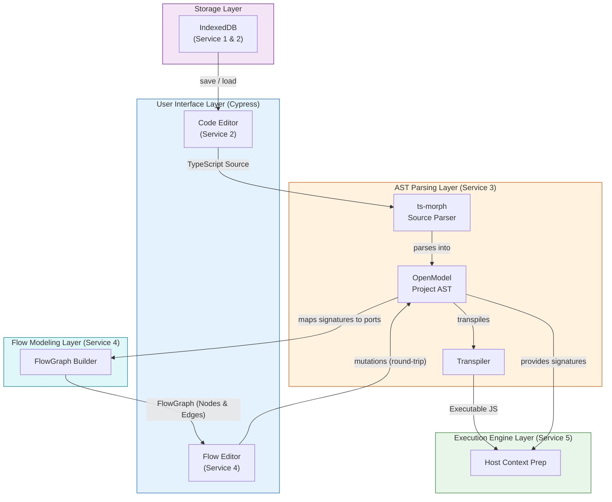
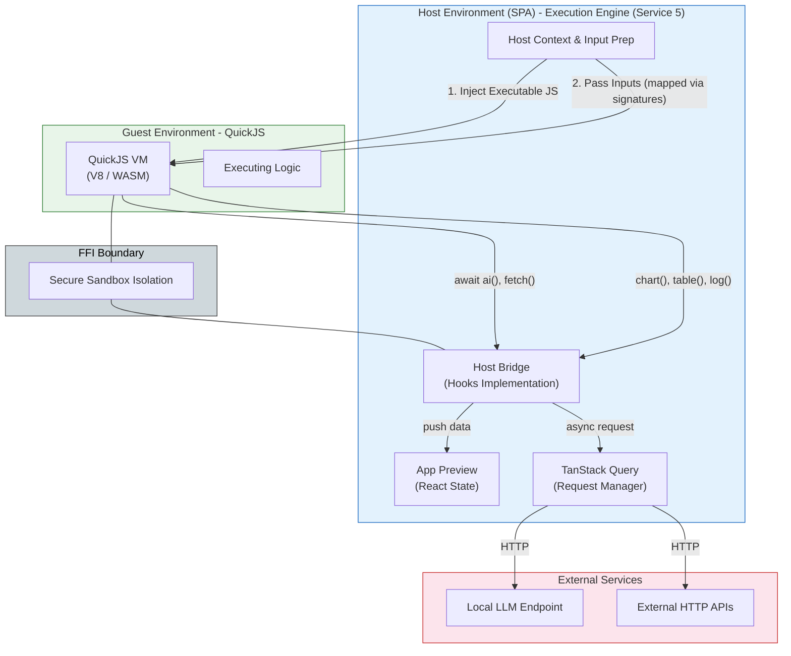
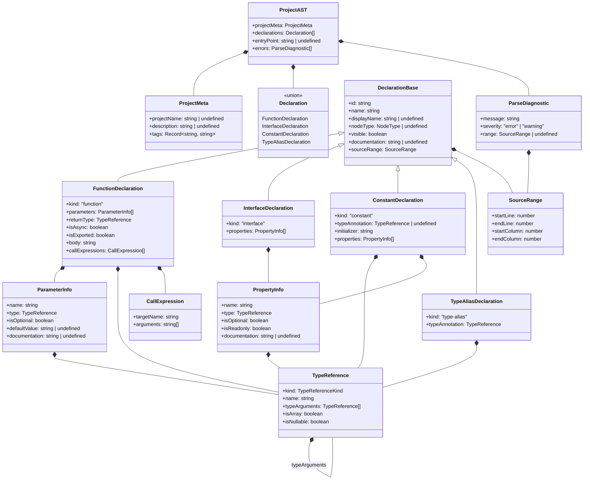
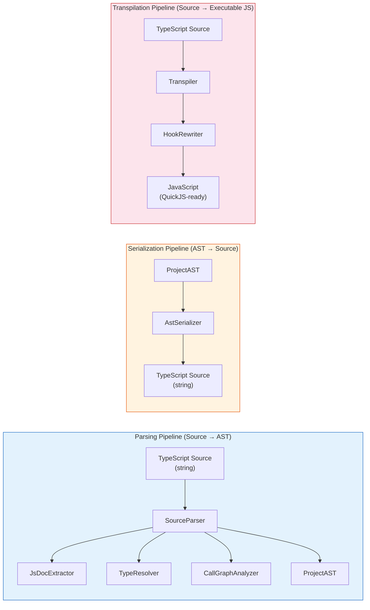
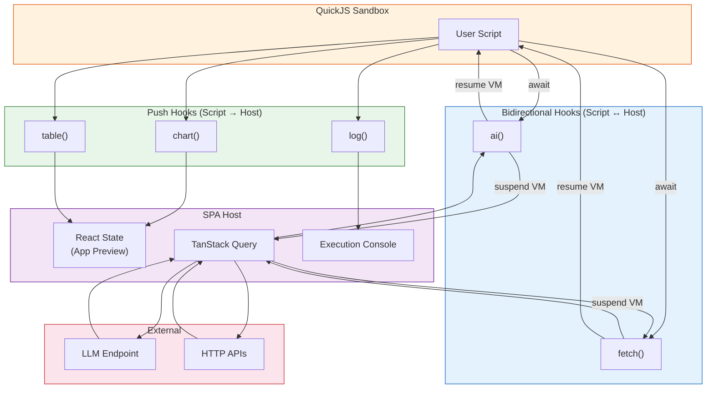
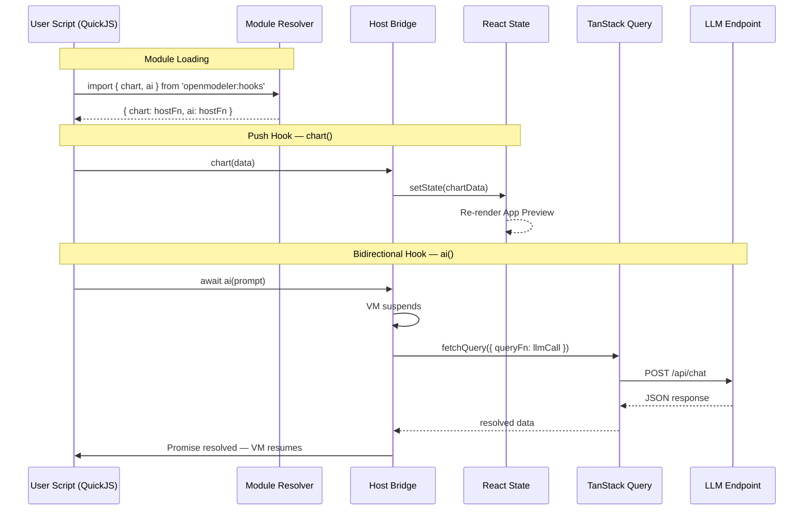

# AST Parsing — Architecture

> **Service:** AST Parsing (Service 3)
> **Testing:** Jest only — this service is strictly React-free
> **Depends on:** Nothing (pure logic, no service dependencies)
> **Consumed by:** Project Management (2), Flow Modeling (4), Execution Engine (5)

## Overview

The AST Parsing service defines the intermediate representation (`ProjectAST`) used to bridge TypeScript source code
and all downstream consumers. The AST is produced by **ts-morph** during the Analysis Phase and serves as the single
source of truth for:

- Extracting function signatures, types, and metadata from TypeScript source
- Serializing AST changes back to TypeScript source (round-trip editing)
- Transpiling TypeScript to QuickJS-ready JavaScript for execution
- Providing type information to the Flow Modeling service (see [FLOW_ARCH.md](FLOW_ARCH.md))

This document specifies all TypeScript interfaces that compose the Project AST, the parsing pipeline components,
and the hooks type system.

> **Flow graph derivation, node components, and visual editing are defined in [FLOW_ARCH.md](FLOW_ARCH.md).**
> **Persistence model (StoredProject) is defined in [ARCHITECTURE.md](ARCHITECTURE.md) under Service 1.**

## Architectural Views

To correctly model the system, we strictly separate the compilation phase from the sandboxed execution runtime. Mixing these concepts leads to blurred boundaries. The architecture is represented through two distinct models:

### 1. Compilation & Transformation Pipeline (Data Flow)

This pipeline focuses strictly on how data mutates when the user types code or edits the visual graph, aligning with the **Services Architecture**. The AST Parsing (Service 3) translates type signatures into port configurations for Flow Modeling (Service 4), while simultaneously providing executable JS and input metadata to the Execution Engine (Service 5) host environment.



### 2. Runtime Execution Architecture (Host vs. Guest)

This view focuses entirely on the Host vs. Guest execution boundary, memory isolation, and host-guest communication. The Guest (QuickJS) is completely unaware of TypeScript or the AST; it only executes transpiled JavaScript and communicates through the strict FFI (Foreign Function Interface) boundary.



## AST Structural Diagram



## TypeScript Interface Definitions

## Code Annotations For Parsing

- **@nodeType** — Specifies the visual node type for a declaration (e.g. function, chart, table) in the flow editor.
- **@displayName** — Provides a human-friendly label for nodes in the flow editor, overriding the raw declaration name.
- **@description** — A longer text description that can be used for documentation tooltips or the project README. Can
  also be wrapped to another line.
- **@visible** - when set to `none` or `hidden`, the declaration is parsed but not rendered as a node in the flow
  editor. Also, all declarations that are missing `@nodeType` will be treated as `@visible none` by default.

### Node Type Enum

The `@nodeType` JSDoc tag maps script declarations to visual node types in the flow editor.

```typescript
/**
 * Visual node types supported by the ReactFlow editor.
 *
 * - function  — A computation step rendered as a standard node.
 * - chart     — A visualization node that renders MUI X Charts output.
 * - table     — A visualization node that renders tabular output.
 * - flow      — The entry-point orchestrator (typically `main()`).
 * - list      — A data-shape node representing a collection type (e.g. an interface used as a list item).
 */
type NodeType = 'function' | 'chart' | 'table' | 'flow' | 'list';
```

### Source Range

Tracks the exact location of a declaration in the TypeScript source, enabling round-trip serialization between the code
editor and the flow graph.

```typescript
interface SourceRange {
    startLine: number;
    endLine: number;
    startColumn: number;
    endColumn: number;
}
```

### Parse Diagnostic

Captures errors or warnings emitted by ts-morph during AST analysis.

```typescript
interface ParseDiagnostic {
    message: string;
    severity: 'error' | 'warning';
    range?: SourceRange;
}
```

### Project Metadata

Top-level metadata extracted from the file-level JSDoc comment block (`@projectName`, `@description`).

```typescript
interface ProjectMeta {
    projectName?: string;
    description?: string;
    /** Arbitrary key-value tags from JSDoc (e.g. @author, @version). */
    tags: Record<string, string>;
}
```

### Type Reference

A recursive representation of TypeScript types. Supports primitives, user-defined types, arrays, generics, and
nullable unions.

```typescript
type TypeReferenceKind = 'primitive' | 'reference' | 'literal' | 'union' | 'void' | 'any' | 'unknown';

interface TypeReference {
    kind: TypeReferenceKind;
    /** The type name (e.g. "number", "PaymentLine", "string"). */
    name: string;
    /** Generic type arguments (e.g. Promise<string> → typeArguments: [{name: "string"}]). */
    typeArguments: TypeReference[];
    /** True when the type is T[] or Array<T>. */
    isArray: boolean;
    /** True when the type includes null or undefined in a union. */
    isNullable: boolean;
}
```

### Parameter Info

Describes a function parameter, including type, optionality, and default value.

```typescript
interface ParameterInfo {
    name: string;
    type: TypeReference;
    isOptional: boolean;
    defaultValue?: string;
    /** Documentation extracted from @param JSDoc tags. */
    documentation?: string;
}
```

### Property Info

Describes a property on an interface or an object literal constant.

```typescript
interface PropertyInfo {
    name: string;
    type: TypeReference;
    isOptional: boolean;
    isReadonly: boolean;
    documentation?: string;
}
```

### Call Expression

Represents a function call found inside a function body. Used to derive data-flow edges in the flow graph.

```typescript
interface CallExpression {
    /** The name of the called function. */
    targetName: string;
    /** String representations of the arguments passed to the call. */
    arguments: string[];
}
```

### Declaration Base

Common fields shared by all declaration kinds.

```typescript
interface DeclarationBase {
    /** Unique identifier derived from the declaration name. */
    id: string;
    /** The declaration name as written in source (e.g. "calculateMonthlyPayment"). */
    name: string;
    /** Human-readable label from @displayName JSDoc tag. */
    displayName?: string;
    /** Visual node type from @nodeType JSDoc tag. */
    nodeType?: NodeType;
    /**
     * Whether this declaration is visible as a node in the flow editor.
     * Derived from @visible JSDoc tag. Defaults to true when nodeType is present,
     * false when nodeType is absent or @visible is set to "none" or "hidden".
     */
    visible: boolean;
    /** Full JSDoc comment body (excluding tag lines). */
    documentation?: string;
    /** Location in the TypeScript source file. */
    sourceRange: SourceRange;
}
```

### Function Declaration

Represents a function statement or function expression extracted from the script.

```typescript
interface FunctionDeclaration extends DeclarationBase {
    kind: 'function';
    parameters: ParameterInfo[];
    returnType: TypeReference;
    isAsync: boolean;
    isExported: boolean;
    /** Raw function body source text for round-trip editing. */
    body: string;
    /** Function calls found in the body — used to derive flow edges. */
    callExpressions: CallExpression[];
}
```

### Interface Declaration

Represents a TypeScript `interface` statement.

```typescript
interface InterfaceDeclaration extends DeclarationBase {
    kind: 'interface';
    properties: PropertyInfo[];
}
```

### Constant Declaration

Represents a top-level `const` assignment (e.g. `INPUT_VARIABLES`).

```typescript
interface ConstantDeclaration extends DeclarationBase {
    kind: 'constant';
    /** Explicit type annotation, if present. */
    typeAnnotation?: TypeReference;
    /** Raw initializer source text. */
    initializer: string;
    /** Properties extracted from object literal initializers. */
    properties: PropertyInfo[];
}
```

### Type Alias Declaration

Represents a TypeScript `type` alias statement.

```typescript
interface TypeAliasDeclaration extends DeclarationBase {
    kind: 'type-alias';
    typeAnnotation: TypeReference;
}
```

### Declaration Union

The discriminated union of all declaration kinds.

```typescript
type Declaration =
    | FunctionDeclaration
    | InterfaceDeclaration
    | ConstantDeclaration
    | TypeAliasDeclaration;
```

### Project AST (Root)

The top-level AST node representing an entire parsed project script.

```typescript
interface ProjectAST {
    /** Metadata extracted from file-level JSDoc. */
    projectMeta: ProjectMeta;
    /** All top-level declarations found in the script. */
    declarations: Declaration[];
    /** Name of the entry-point function (the one tagged @nodeType flow), if any. */
    entryPoint?: string;
    /** Diagnostics emitted during parsing. */
    errors: ParseDiagnostic[];
}
```

## Example: Loan Return Script → AST

Given [example-loan-return.ts](example-loan-return.ts), the parser produces:

```typescript
const projectAST: ProjectAST = {
    projectMeta: {
        projectName: 'Example Loan Return Application',
        description: 'Configure the INPUT_VARIABLES below with your loan details...',
        tags: {},
    },
    declarations: [
        {
            kind: 'interface',
            id: 'PaymentLine',
            name: 'PaymentLine',
            displayName: 'Payment Line',
            nodeType: undefined,
            visible: false,
            documentation: undefined,
            sourceRange: {startLine: 15, endLine: 21, startColumn: 1, endColumn: 2},
            properties: [
                {
                    name: 'paymentDate',
                    type: {kind: 'primitive', name: 'Date', typeArguments: [], isArray: false, isNullable: false},
                    isOptional: false,
                    isReadonly: false
                },
                {
                    name: 'amount',
                    type: {kind: 'primitive', name: 'number', typeArguments: [], isArray: false, isNullable: false},
                    isOptional: false,
                    isReadonly: false
                },
                {
                    name: 'principalPaid',
                    type: {kind: 'primitive', name: 'number', typeArguments: [], isArray: false, isNullable: false},
                    isOptional: false,
                    isReadonly: false
                },
                {
                    name: 'interestPaid',
                    type: {kind: 'primitive', name: 'number', typeArguments: [], isArray: false, isNullable: false},
                    isOptional: false,
                    isReadonly: false
                },
                {
                    name: 'remainingBalance',
                    type: {kind: 'primitive', name: 'number', typeArguments: [], isArray: false, isNullable: false},
                    isOptional: false,
                    isReadonly: false
                },
            ],
        },
        {
            kind: 'constant',
            id: 'INPUT_VARIABLES',
            name: 'INPUT_VARIABLES',
            displayName: 'Input Variables',
            nodeType: 'list',
            visible: true,
            documentation: undefined,
            sourceRange: {startLine: 26, endLine: 31, startColumn: 1, endColumn: 3},
            typeAnnotation: undefined,
            initializer: '{ loanAmount: 100000, annualInterestRate: 5.0, termMonths: 360, startDate: new Date(\'2026-04-01\') }',
            properties: [
                {
                    name: 'loanAmount',
                    type: {kind: 'primitive', name: 'number', typeArguments: [], isArray: false, isNullable: false},
                    isOptional: false,
                    isReadonly: false
                },
                {
                    name: 'annualInterestRate',
                    type: {kind: 'primitive', name: 'number', typeArguments: [], isArray: false, isNullable: false},
                    isOptional: false,
                    isReadonly: false
                },
                {
                    name: 'termMonths',
                    type: {kind: 'primitive', name: 'number', typeArguments: [], isArray: false, isNullable: false},
                    isOptional: false,
                    isReadonly: false
                },
                {
                    name: 'startDate',
                    type: {kind: 'reference', name: 'Date', typeArguments: [], isArray: false, isNullable: false},
                    isOptional: false,
                    isReadonly: false
                },
            ],
        },
        {
            kind: 'function',
            id: 'calculateMonthlyPayment',
            name: 'calculateMonthlyPayment',
            displayName: 'Calculate Monthly Payment',
            nodeType: 'function',
            visible: true,
            documentation: 'Calculates the fixed monthly payment for a loan based on the principal, annual interest rate, and loan term in months.',
            sourceRange: {startLine: 44, endLine: 49, startColumn: 1, endColumn: 2},
            parameters: [
                {
                    name: 'principal',
                    type: {kind: 'primitive', name: 'number', typeArguments: [], isArray: false, isNullable: false},
                    isOptional: false
                },
                {
                    name: 'annualRate',
                    type: {kind: 'primitive', name: 'number', typeArguments: [], isArray: false, isNullable: false},
                    isOptional: false
                },
                {
                    name: 'months',
                    type: {kind: 'primitive', name: 'number', typeArguments: [], isArray: false, isNullable: false},
                    isOptional: false
                },
            ],
            returnType: {kind: 'primitive', name: 'number', typeArguments: [], isArray: false, isNullable: false},
            isAsync: false,
            isExported: false,
            body: '{ const monthlyRate = annualRate / 100 / 12; ... }',
            callExpressions: [],
        },
        {
            kind: 'function',
            id: 'generateLoanSchedule',
            name: 'generateLoanSchedule',
            displayName: undefined,
            nodeType: 'function',
            visible: true,
            documentation: undefined,
            sourceRange: {startLine: 59, endLine: 90, startColumn: 1, endColumn: 2},
            parameters: [
                {
                    name: 'loanAmount',
                    type: {kind: 'primitive', name: 'number', typeArguments: [], isArray: false, isNullable: false},
                    isOptional: false
                },
                {
                    name: 'monthlyPayment',
                    type: {kind: 'primitive', name: 'number', typeArguments: [], isArray: false, isNullable: false},
                    isOptional: false
                },
                {
                    name: 'annualInterestRate',
                    type: {kind: 'primitive', name: 'number', typeArguments: [], isArray: false, isNullable: false},
                    isOptional: false
                },
                {
                    name: 'termMonths',
                    type: {kind: 'primitive', name: 'number', typeArguments: [], isArray: false, isNullable: false},
                    isOptional: false
                },
                {
                    name: 'startDate',
                    type: {kind: 'reference', name: 'Date', typeArguments: [], isArray: false, isNullable: false},
                    isOptional: false
                },
            ],
            returnType: {kind: 'reference', name: 'PaymentLine', typeArguments: [], isArray: true, isNullable: false},
            isAsync: false,
            isExported: false,
            body: '{ ... }',
            callExpressions: [],
        },
        {
            kind: 'function',
            id: 'renderLoanBalanceChart',
            name: 'renderLoanBalanceChart',
            displayName: undefined,
            nodeType: 'chart',
            visible: true,
            documentation: undefined,
            sourceRange: {startLine: 96, endLine: 98, startColumn: 1, endColumn: 2},
            parameters: [
                {
                    name: 'schedule',
                    type: {kind: 'reference', name: 'PaymentLine', typeArguments: [], isArray: true, isNullable: false},
                    isOptional: false
                },
            ],
            returnType: {kind: 'void', name: 'void', typeArguments: [], isArray: false, isNullable: false},
            isAsync: false,
            isExported: false,
            body: '{ // chart_hook(schedule); }',
            callExpressions: [],
        },
        {
            kind: 'function',
            id: 'renderLoanScheduleTable',
            name: 'renderLoanScheduleTable',
            displayName: undefined,
            nodeType: 'table',
            visible: true,
            documentation: undefined,
            sourceRange: {startLine: 104, endLine: 106, startColumn: 1, endColumn: 2},
            parameters: [
                {
                    name: 'schedule',
                    type: {kind: 'reference', name: 'PaymentLine', typeArguments: [], isArray: true, isNullable: false},
                    isOptional: false
                },
            ],
            returnType: {kind: 'void', name: 'void', typeArguments: [], isArray: false, isNullable: false},
            isAsync: false,
            isExported: false,
            body: '{ // table_hook(schedule); }',
            callExpressions: [],
        },
        {
            kind: 'function',
            id: 'main',
            name: 'main',
            displayName: undefined,
            nodeType: 'flow',
            visible: true,
            documentation: undefined,
            sourceRange: {startLine: 111, endLine: 117, startColumn: 1, endColumn: 2},
            parameters: [],
            returnType: {kind: 'void', name: 'void', typeArguments: [], isArray: false, isNullable: false},
            isAsync: false,
            isExported: true,
            body: '{ ... }',
            callExpressions: [
                {targetName: 'calculateMonthlyPayment', arguments: ['loanAmount', 'annualInterestRate', 'termMonths']},
                {
                    targetName: 'generateLoanSchedule',
                    arguments: ['loanAmount', 'monthlyPayment', 'annualInterestRate', 'termMonths', 'startDate']
                },
                {targetName: 'renderLoanBalanceChart', arguments: ['schedule']},
                {targetName: 'renderLoanScheduleTable', arguments: ['schedule']},
            ],
        },
    ],
    entryPoint: 'main',
    errors: [],
};
```

## Flow Graph Derivation

> **Moved to [FLOW_ARCH.md](FLOW_ARCH.md).** The flow graph derivation rules, node component specifications,
> and persistence model are now defined in the Flow Modeling architecture document.

## Parser Components Architecture

The parsing pipeline is designed as a set of **pure, composable functions** that can be tested independently with Jest.
No component depends on React, the DOM, or IndexedDB — they operate on plain TypeScript strings and AST data
structures.

### Component Diagram



> **Note:** The Flow Pipeline (AST ↔ ReactFlow) has been moved to Service 4 — see [FLOW_ARCH.md](FLOW_ARCH.md).

### Component Specifications

Each component is a pure function or a stateless class. All live in `src/lib/ast/`.

> **FlowGraphBuilder and FlowGraphSync** have been moved to `src/lib/flow/` (Service 4).
> See [FLOW_ARCH.md](FLOW_ARCH.md) for their specifications.

#### SourceParser

The top-level orchestrator for the parsing pipeline.

```typescript
/**
 * Parses a TypeScript source string into a ProjectAST.
 * Delegates to sub-components for JSDoc extraction, type resolution, and call analysis.
 * Stateless — produces a fresh ProjectAST on every invocation.
 */
function parseSource(source: string): ProjectAST;
```

**Test strategy:** Input/output pairs. Provide TypeScript strings, assert the resulting `ProjectAST` structure.

#### JsDocExtractor

Extracts structured annotation data from JSDoc comment blocks.

```typescript
interface JsDocAnnotations {
    nodeType?: NodeType;
    displayName?: string;
    visible?: boolean;
    description?: string;
    paramDocs: Record<string, string>;
    returnDoc?: string;
    tags: Record<string, string>;
}

/** Extracts @nodeType, @displayName, @visible, @param, and @return from a JSDoc block. */
function extractJsDoc(jsDocText: string): JsDocAnnotations;
```

**Test strategy:** Unit test with isolated JSDoc strings. Verify each annotation variant, edge cases (missing tags,
multiline descriptions, unknown tags).

#### TypeResolver

Converts ts-morph type nodes into the portable `TypeReference` structure.

```typescript
/**
 * Resolves a ts-morph Type object into a TypeReference.
 * Handles primitives, references, arrays, generics, unions, void, and unknown.
 */
function resolveType(type: ts.Type): TypeReference;
```

**Test strategy:** Create ts-morph Project instances with known source, assert resolved `TypeReference` for each type
variation (primitive, array, generic, union, nullable).

#### CallGraphAnalyzer

Extracts function call relationships from function bodies.

```typescript
/**
 * Analyzes a function body to extract all call expressions that reference
 * top-level declared functions. Ignores method calls, built-ins, and chains.
 */
function analyzeCallGraph(
    functionBody: ts.Block,
    knownFunctionNames: Set<string>
): CallExpression[];
```

**Test strategy:** Provide function bodies with various call patterns (simple calls, chained calls, nested calls,
calls to unknowns). Assert only top-level function references are captured.

#### AstSerializer

Reconstructs TypeScript source from a `ProjectAST`. Used when the flow editor modifies the graph and those changes
need to be written back to source code.

```typescript
/**
 * Serializes a ProjectAST back to a TypeScript source string.
 * Reconstructs JSDoc annotations, function signatures, interfaces, and constants.
 */
function serializeAst(ast: ProjectAST): string;
```

**Test strategy:** Round-trip testing. Parse a source string to AST, serialize back, re-parse, and assert structural
equivalence. Also test incremental mutations (add a parameter, remove a function) and verify the output is valid
TypeScript.

#### Transpiler

Converts TypeScript source to JavaScript suitable for QuickJS execution.

```typescript
interface TranspileResult {
    javascript: string;
    sourceMap?: string;
    errors: ParseDiagnostic[];
}

/**
 * Transpiles TypeScript source to JavaScript using ts-morph emit.
 * Strips type annotations, resolves enums, preserves async/await.
 */
function transpileSource(source: string): TranspileResult;
```

**Test strategy:** Transpile known TypeScript inputs, assert the output is valid JavaScript. Verify type annotations
are stripped, async functions are preserved, and hook imports are rewritten.

#### HookRewriter

Rewrites `@openmodeler/hooks` imports into QuickJS-compatible module references.

```typescript
/**
 * Rewrites import statements from '@openmodeler/hooks' into
 * the QuickJS module format that the sandbox module resolver understands.
 */
function rewriteHookImports(javascript: string): string;
```

**Test strategy:** Provide JS with various import styles, assert correct rewriting.

## Hooks System Architecture

Hooks are the bridge between user-authored business logic (running inside the QuickJS sandbox) and the host SPA
environment. They enable scripts to push data to the UI and to make external requests.

### Hook Categories



### Hook Usage in Scripts

Hooks are imported as a standard ES module. The import statement is recognized by the parser and rewritten by the
`HookRewriter` during transpilation. In the user's TypeScript source, hooks look like ordinary typed function calls:

```typescript
import {chart, table, log, ai} from '@openmodeler/hooks';

/**
 * @nodeType chart
 */
function renderLoanBalanceChart(schedule: PaymentLine[]): void {
    chart(schedule);
}

/**
 * @nodeType table
 */
function renderLoanScheduleTable(schedule: PaymentLine[]): void {
    table(schedule);
}

/**
 * @nodeType function
 */
async function classifyRisk(customer: Customer): Promise<string> {
    const result = await ai(`Classify risk for customer: ${JSON.stringify(customer)}`);
    return result.text;
}
```

### Hook Type Declarations (`@openmodeler/hooks`)

This module is a **virtual module** — it has no physical file. Type declarations are provided for editor intellisense
and type checking. At runtime in QuickJS, the module resolver intercepts the import and returns host-registered
functions.

```typescript
// --- Push Hooks (fire-and-forget, script → host) ---

/**
 * Push a dataset to render as a chart in App Preview.
 * The host infers chart type (line, bar, pie) from the data shape.
 *
 * @param data - Array of objects or a ChartConfig with explicit series/axis definitions.
 */
export declare function chart(data: Record<string, unknown>[] | ChartConfig): void;

/**
 * Push a dataset to render as a table in App Preview.
 * Column headers are derived from object keys.
 *
 * @param data - Array of objects representing table rows.
 */
export declare function table(data: Record<string, unknown>[]): void;

/**
 * Log a message to the execution console panel.
 * Supports structured data (objects are serialized to JSON).
 */
export declare function log(...args: unknown[]): void;

// --- Bidirectional Hooks (async request-response, script ↔ host) ---

/**
 * Send a prompt to a configured AI/LLM endpoint and await the response.
 * The VM suspends while the host resolves the request via TanStack Query.
 *
 * @param prompt - The natural-language prompt to send.
 * @param options - Optional configuration (model, temperature, maxTokens).
 * @returns Parsed LLM response.
 */
export declare function ai(prompt: string, options?: AiRequestOptions): Promise<AiResponse>;

/**
 * Make an HTTP request through the host environment.
 * The VM suspends while the host resolves the request.
 * Restricted to configured allowlisted domains for security.
 *
 * @param url - The URL to fetch.
 * @param options - Standard request options (method, headers, body).
 * @returns Parsed response with status, headers, and body.
 */
export declare function fetch(url: string, options?: FetchRequestOptions): Promise<FetchResponse>;
```

### Hook Supporting Types

```typescript
interface ChartConfig {
    type: 'line' | 'bar' | 'pie';
    title?: string;
    xAxis?: string;
    yAxis?: string;
    series: ChartSeries[];
}

interface ChartSeries {
    name: string;
    dataKey: string;
    color?: string;
}

interface AiRequestOptions {
    model?: string;
    temperature?: number;
    maxTokens?: number;
    responseFormat?: 'text' | 'json';
}

interface AiResponse {
    text: string;
    parsed?: unknown;
    model: string;
    usage: { promptTokens: number; completionTokens: number };
}

interface FetchRequestOptions {
    method?: 'GET' | 'POST' | 'PUT' | 'DELETE' | 'PATCH';
    headers?: Record<string, string>;
    body?: string | Record<string, unknown>;
}

interface FetchResponse {
    status: number;
    headers: Record<string, string>;
    body: unknown;
    text: string;
}
```

### Hook Resolution at Runtime

When the transpiled JavaScript is loaded into QuickJS, hook resolution follows this sequence:

1. **HookRewriter** (build-time) — Rewrites `import { chart } from '@openmodeler/hooks'` into a
   QuickJS-compatible `import` referencing the virtual module ID `openmodeler:hooks`.

2. **Module Resolver** (runtime) — The QuickJS module resolver intercepts `openmodeler:hooks` and returns a module
   object whose exports are host-registered functions.

3. **Host Bridge** (runtime) — Each hook function is a thin wrapper that:
    - For **push hooks**: serializes the argument, passes it to a host callback, and returns immediately.
    - For **bidirectional hooks**: serializes the argument, passes it to a host callback that returns a QuickJS
      Promise. The VM suspends until the host resolves or rejects the Promise.

4. **Host Callback** (runtime) — On the SPA side:
    - `chart()` / `table()` → update React state → triggers re-render of App Preview.
    - `log()` → appends to the execution console buffer.
    - `ai()` → calls `queryClient.fetchQuery()` → HTTP to LLM → resolves the QuickJS Promise.
    - `fetch()` → calls `queryClient.fetchQuery()` → HTTP to API → resolves the QuickJS Promise.



### Hook Security Constraints

- **No raw `globalThis` access** — hooks are the only way scripts interact with the host.
- **Domain allowlist** — `fetch()` is restricted to domains configured in project settings.
- **Timeout** — bidirectional hooks have a configurable timeout (default: 30s). If the host does not resolve within
  the timeout, the Promise is rejected and the script receives an error.
- **Payload size limit** — push hooks enforce a maximum serialized payload size to prevent memory exhaustion in the
  host.

# Architect Comments

1. Rethink `initializer` - I have a doubt we will need it.
