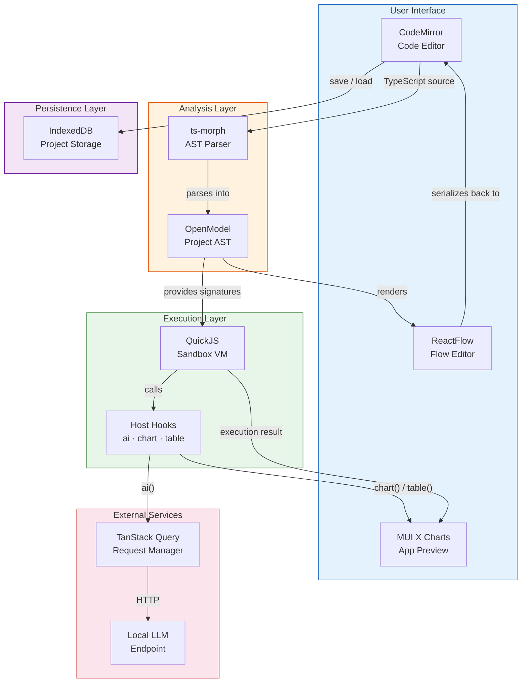
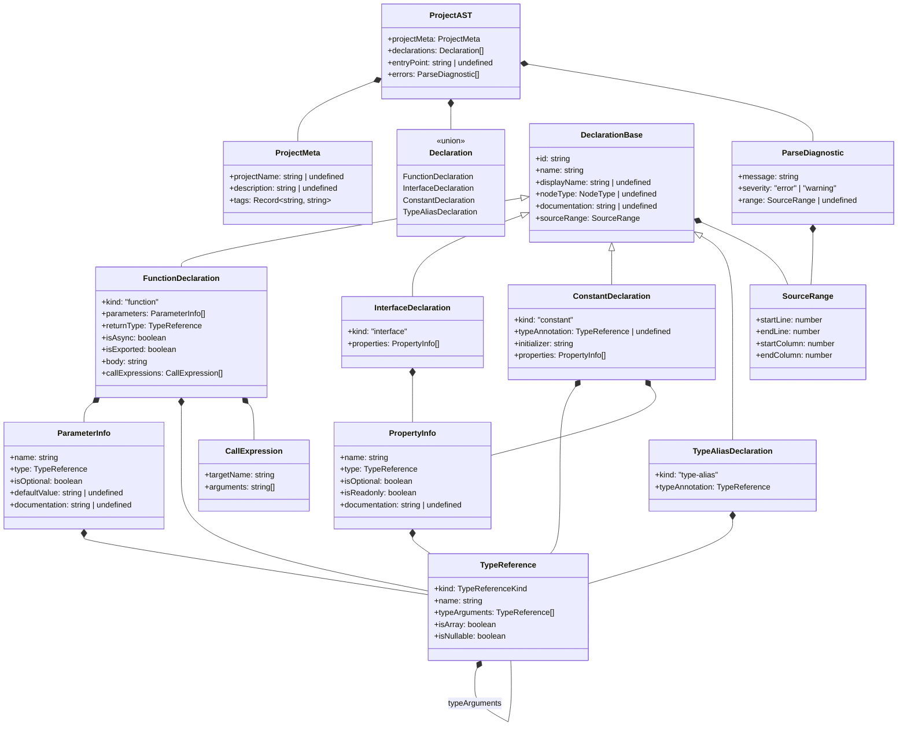

# OpenModel Project AST

## Overview

The OpenModel Project AST defines the intermediate representation used to bridge the TypeScript source code (edited in
CodeMirror) and the visual flow graph (rendered in ReactFlow). The AST is produced by **ts-morph** during the Analysis
Phase and serves as the single source of truth for:

- Rendering the flow graph (nodes and edges)
- Serializing flow graph changes back to TypeScript source
- Extracting function signatures for QuickJS sandbox execution
- Persisting project state in IndexedDB

This document specifies all TypeScript interfaces that compose the Project AST.

## Runtime Architecture



## AST Structural Diagram



## TypeScript Interface Definitions

## Code Annotations For Parsing

- **@nodeType** — Specifies the visual node type for a declaration (e.g. function, chart, table) in the flow editor.
- **@displayName** — Provides a human-friendly label for nodes in the flow editor, overriding the raw declaration name.
- **@description** — A longer text description that can be used for documentation tooltips or the project README. Can
  also be wrapped to another line.
- **@visible** - when set to `none` or `hidden`, the declaration is parsed but not rendered as a node in the flow
  editor. Also, all declarations that are missing `@nodeType` will be treated as `@visible none` by default.

### Node Type Enum

The `@nodeType` JSDoc tag maps script declarations to visual node types in the flow editor.

```typescript
/**
 * Visual node types supported by the ReactFlow editor.
 *
 * - function  — A computation step rendered as a standard node.
 * - chart     — A visualization node that renders MUI X Charts output.
 * - table     — A visualization node that renders tabular output.
 * - flow      — The entry-point orchestrator (typically `main()`).
 * - list      — A data-shape node representing a collection type (e.g. an interface used as a list item).
 */
type NodeType = 'function' | 'chart' | 'table' | 'flow' | 'list';
```

### Source Range

Tracks the exact location of a declaration in the TypeScript source, enabling round-trip serialization between the code
editor and the flow graph.

```typescript
interface SourceRange {
    startLine: number;
    endLine: number;
    startColumn: number;
    endColumn: number;
}
```

### Parse Diagnostic

Captures errors or warnings emitted by ts-morph during AST analysis.

```typescript
interface ParseDiagnostic {
    message: string;
    severity: 'error' | 'warning';
    range?: SourceRange;
}
```

### Project Metadata

Top-level metadata extracted from the file-level JSDoc comment block (`@projectName`, `@description`).

```typescript
interface ProjectMeta {
    projectName?: string;
    description?: string;
    /** Arbitrary key-value tags from JSDoc (e.g. @author, @version). */
    tags: Record<string, string>;
}
```

### Type Reference

A recursive representation of TypeScript types. Supports primitives, user-defined types, arrays, generics, and
nullable unions.

```typescript
type TypeReferenceKind = 'primitive' | 'reference' | 'literal' | 'union' | 'void' | 'any' | 'unknown';

interface TypeReference {
    kind: TypeReferenceKind;
    /** The type name (e.g. "number", "PaymentLine", "string"). */
    name: string;
    /** Generic type arguments (e.g. Promise<string> → typeArguments: [{name: "string"}]). */
    typeArguments: TypeReference[];
    /** True when the type is T[] or Array<T>. */
    isArray: boolean;
    /** True when the type includes null or undefined in a union. */
    isNullable: boolean;
}
```

### Parameter Info

Describes a function parameter, including type, optionality, and default value.

```typescript
interface ParameterInfo {
    name: string;
    type: TypeReference;
    isOptional: boolean;
    defaultValue?: string;
    /** Documentation extracted from @param JSDoc tags. */
    documentation?: string;
}
```

### Property Info

Describes a property on an interface or an object literal constant.

```typescript
interface PropertyInfo {
    name: string;
    type: TypeReference;
    isOptional: boolean;
    isReadonly: boolean;
    documentation?: string;
}
```

### Call Expression

Represents a function call found inside a function body. Used to derive data-flow edges in the flow graph.

```typescript
interface CallExpression {
    /** The name of the called function. */
    targetName: string;
    /** String representations of the arguments passed to the call. */
    arguments: string[];
}
```

### Declaration Base

Common fields shared by all declaration kinds.

```typescript
interface DeclarationBase {
    /** Unique identifier derived from the declaration name. */
    id: string;
    /** The declaration name as written in source (e.g. "calculateMonthlyPayment"). */
    name: string;
    /** Human-readable label from @displayName JSDoc tag. */
    displayName?: string;
    /** Visual node type from @nodeType JSDoc tag. */
    nodeType?: NodeType;
    /** Full JSDoc comment body (excluding tag lines). */
    documentation?: string;
    /** Location in the TypeScript source file. */
    sourceRange: SourceRange;
}
```

### Function Declaration

Represents a function statement or function expression extracted from the script.

```typescript
interface FunctionDeclaration extends DeclarationBase {
    kind: 'function';
    parameters: ParameterInfo[];
    returnType: TypeReference;
    isAsync: boolean;
    isExported: boolean;
    /** Raw function body source text for round-trip editing. */
    body: string;
    /** Function calls found in the body — used to derive flow edges. */
    callExpressions: CallExpression[];
}
```

### Interface Declaration

Represents a TypeScript `interface` statement.

```typescript
interface InterfaceDeclaration extends DeclarationBase {
    kind: 'interface';
    properties: PropertyInfo[];
}
```

### Constant Declaration

Represents a top-level `const` assignment (e.g. `INPUT_VARIABLES`).

```typescript
interface ConstantDeclaration extends DeclarationBase {
    kind: 'constant';
    /** Explicit type annotation, if present. */
    typeAnnotation?: TypeReference;
    /** Raw initializer source text. */
    initializer: string;
    /** Properties extracted from object literal initializers. */
    properties: PropertyInfo[];
}
```

### Type Alias Declaration

Represents a TypeScript `type` alias statement.

```typescript
interface TypeAliasDeclaration extends DeclarationBase {
    kind: 'type-alias';
    typeAnnotation: TypeReference;
}
```

### Declaration Union

The discriminated union of all declaration kinds.

```typescript
type Declaration =
    | FunctionDeclaration
    | InterfaceDeclaration
    | ConstantDeclaration
    | TypeAliasDeclaration;
```

### Project AST (Root)

The top-level AST node representing an entire parsed project script.

```typescript
interface ProjectAST {
    /** Metadata extracted from file-level JSDoc. */
    projectMeta: ProjectMeta;
    /** All top-level declarations found in the script. */
    declarations: Declaration[];
    /** Name of the entry-point function (the one tagged @nodeType flow), if any. */
    entryPoint?: string;
    /** Diagnostics emitted during parsing. */
    errors: ParseDiagnostic[];
}
```

## Example: Loan Return Script → AST

Given [example-loan-return.ts](example-loan-return.ts), the parser produces:

```typescript
const projectAST: ProjectAST = {
    projectMeta: {
        projectName: 'Example Loan Return Application',
        description: 'Configure the INPUT_VARIABLES below with your loan details...',
        tags: {},
    },
    declarations: [
        {
            kind: 'interface',
            id: 'PaymentLine',
            name: 'PaymentLine',
            displayName: 'Payment Line',
            nodeType: 'list',
            documentation: undefined,
            sourceRange: {startLine: 15, endLine: 21, startColumn: 1, endColumn: 2},
            properties: [
                {
                    name: 'paymentDate',
                    type: {kind: 'primitive', name: 'Date', typeArguments: [], isArray: false, isNullable: false},
                    isOptional: false,
                    isReadonly: false
                },
                {
                    name: 'amount',
                    type: {kind: 'primitive', name: 'number', typeArguments: [], isArray: false, isNullable: false},
                    isOptional: false,
                    isReadonly: false
                },
                {
                    name: 'principalPaid',
                    type: {kind: 'primitive', name: 'number', typeArguments: [], isArray: false, isNullable: false},
                    isOptional: false,
                    isReadonly: false
                },
                {
                    name: 'interestPaid',
                    type: {kind: 'primitive', name: 'number', typeArguments: [], isArray: false, isNullable: false},
                    isOptional: false,
                    isReadonly: false
                },
                {
                    name: 'remainingBalance',
                    type: {kind: 'primitive', name: 'number', typeArguments: [], isArray: false, isNullable: false},
                    isOptional: false,
                    isReadonly: false
                },
            ],
        },
        {
            kind: 'constant',
            id: 'INPUT_VARIABLES',
            name: 'INPUT_VARIABLES',
            displayName: 'Input Variables',
            nodeType: undefined,
            documentation: undefined,
            sourceRange: {startLine: 26, endLine: 31, startColumn: 1, endColumn: 3},
            typeAnnotation: undefined,
            initializer: '{ loanAmount: 100000, annualInterestRate: 5.0, termMonths: 360, startDate: new Date(\'2026-04-01\') }',
            properties: [
                {
                    name: 'loanAmount',
                    type: {kind: 'primitive', name: 'number', typeArguments: [], isArray: false, isNullable: false},
                    isOptional: false,
                    isReadonly: false
                },
                {
                    name: 'annualInterestRate',
                    type: {kind: 'primitive', name: 'number', typeArguments: [], isArray: false, isNullable: false},
                    isOptional: false,
                    isReadonly: false
                },
                {
                    name: 'termMonths',
                    type: {kind: 'primitive', name: 'number', typeArguments: [], isArray: false, isNullable: false},
                    isOptional: false,
                    isReadonly: false
                },
                {
                    name: 'startDate',
                    type: {kind: 'reference', name: 'Date', typeArguments: [], isArray: false, isNullable: false},
                    isOptional: false,
                    isReadonly: false
                },
            ],
        },
        {
            kind: 'function',
            id: 'calculateMonthlyPayment',
            name: 'calculateMonthlyPayment',
            displayName: 'Calculate Monthly Payment',
            nodeType: 'function',
            documentation: 'Calculates the fixed monthly payment for a loan based on the principal, annual interest rate, and loan term in months.',
            sourceRange: {startLine: 44, endLine: 49, startColumn: 1, endColumn: 2},
            parameters: [
                {
                    name: 'principal',
                    type: {kind: 'primitive', name: 'number', typeArguments: [], isArray: false, isNullable: false},
                    isOptional: false
                },
                {
                    name: 'annualRate',
                    type: {kind: 'primitive', name: 'number', typeArguments: [], isArray: false, isNullable: false},
                    isOptional: false
                },
                {
                    name: 'months',
                    type: {kind: 'primitive', name: 'number', typeArguments: [], isArray: false, isNullable: false},
                    isOptional: false
                },
            ],
            returnType: {kind: 'primitive', name: 'number', typeArguments: [], isArray: false, isNullable: false},
            isAsync: false,
            isExported: false,
            body: '{ const monthlyRate = annualRate / 100 / 12; ... }',
            callExpressions: [],
        },
        {
            kind: 'function',
            id: 'generateLoanSchedule',
            name: 'generateLoanSchedule',
            displayName: undefined,
            nodeType: 'function',
            documentation: undefined,
            sourceRange: {startLine: 59, endLine: 90, startColumn: 1, endColumn: 2},
            parameters: [
                {
                    name: 'loanAmount',
                    type: {kind: 'primitive', name: 'number', typeArguments: [], isArray: false, isNullable: false},
                    isOptional: false
                },
                {
                    name: 'monthlyPayment',
                    type: {kind: 'primitive', name: 'number', typeArguments: [], isArray: false, isNullable: false},
                    isOptional: false
                },
                {
                    name: 'annualInterestRate',
                    type: {kind: 'primitive', name: 'number', typeArguments: [], isArray: false, isNullable: false},
                    isOptional: false
                },
                {
                    name: 'termMonths',
                    type: {kind: 'primitive', name: 'number', typeArguments: [], isArray: false, isNullable: false},
                    isOptional: false
                },
                {
                    name: 'startDate',
                    type: {kind: 'reference', name: 'Date', typeArguments: [], isArray: false, isNullable: false},
                    isOptional: false
                },
            ],
            returnType: {kind: 'reference', name: 'PaymentLine', typeArguments: [], isArray: true, isNullable: false},
            isAsync: false,
            isExported: false,
            body: '{ ... }',
            callExpressions: [],
        },
        {
            kind: 'function',
            id: 'renderLoanBalanceChart',
            name: 'renderLoanBalanceChart',
            displayName: undefined,
            nodeType: 'chart',
            documentation: undefined,
            sourceRange: {startLine: 96, endLine: 98, startColumn: 1, endColumn: 2},
            parameters: [
                {
                    name: 'schedule',
                    type: {kind: 'reference', name: 'PaymentLine', typeArguments: [], isArray: true, isNullable: false},
                    isOptional: false
                },
            ],
            returnType: {kind: 'void', name: 'void', typeArguments: [], isArray: false, isNullable: false},
            isAsync: false,
            isExported: false,
            body: '{ // chart_hook(schedule); }',
            callExpressions: [],
        },
        {
            kind: 'function',
            id: 'renderLoanScheduleTable',
            name: 'renderLoanScheduleTable',
            displayName: undefined,
            nodeType: 'table',
            documentation: undefined,
            sourceRange: {startLine: 104, endLine: 106, startColumn: 1, endColumn: 2},
            parameters: [
                {
                    name: 'schedule',
                    type: {kind: 'reference', name: 'PaymentLine', typeArguments: [], isArray: true, isNullable: false},
                    isOptional: false
                },
            ],
            returnType: {kind: 'void', name: 'void', typeArguments: [], isArray: false, isNullable: false},
            isAsync: false,
            isExported: false,
            body: '{ // table_hook(schedule); }',
            callExpressions: [],
        },
        {
            kind: 'function',
            id: 'main',
            name: 'main',
            displayName: undefined,
            nodeType: 'flow',
            documentation: undefined,
            sourceRange: {startLine: 111, endLine: 117, startColumn: 1, endColumn: 2},
            parameters: [],
            returnType: {kind: 'void', name: 'void', typeArguments: [], isArray: false, isNullable: false},
            isAsync: false,
            isExported: true,
            body: '{ ... }',
            callExpressions: [
                {targetName: 'calculateMonthlyPayment', arguments: ['loanAmount', 'annualInterestRate', 'termMonths']},
                {
                    targetName: 'generateLoanSchedule',
                    arguments: ['loanAmount', 'monthlyPayment', 'annualInterestRate', 'termMonths', 'startDate']
                },
                {targetName: 'renderLoanBalanceChart', arguments: ['schedule']},
                {targetName: 'renderLoanScheduleTable', arguments: ['schedule']},
            ],
        },
    ],
    entryPoint: 'main',
    errors: [],
};
```

## Flow Graph Derivation

The flow graph is derived from the Project AST using these rules:

1. **Nodes** — Each `Declaration` with a `nodeType` becomes a ReactFlow node. The `id`, `displayName` (or `name`),
   and `nodeType` map directly to the node's visual representation.

2. **Edges** — Edges are derived from `FunctionDeclaration.callExpressions`. For each call expression in a function
   body, an edge is created from the called function's node to the calling function's node (data flows from callee
   output to caller input).

3. **Ports** — Input ports are derived from `ParameterInfo[]` and output ports from `returnType`. Port type labels
   come from `TypeReference.name`.

4. **Constants as Input Nodes** — A `ConstantDeclaration` that is destructured in the entry-point function becomes an
   input node with output ports matching its properties.

## Persistence Model

The Project AST is **not persisted directly**. The TypeScript source string is the canonical stored form. The AST is
re-derived on load via ts-morph parsing. IndexedDB stores:

```typescript
interface StoredProject {
    /** UUID for the project. */
    id: string;
    /** User-defined project name. */
    name: string;
    /** Full TypeScript source code — the single source of truth. */
    source: string;
    createdAt: string;
    updatedAt: string;
}
```

## Nodes

- **Node Type:** function, chart, table, flow, list
- **Node Display:** how node is displayed in ReactFlow
- **Node Edit:** how node is edited

### Function Node

- **Node Type:** function
- **Node Display:** Parameters become input ports, and the return type becomes the output port. Rendered as a ReactFlow
  node. Input ports are always on the left side, and output ports on the right side. In the same line as a port, the
  parameter name and type are displayed (e.g. `loanAmount: number`).
- **Node Edit:** (`code-editor`) separate edit page is opened with CodeMirror for the function body. Parameters and
  return type are edited via a form UI. Changes to the body are parsed back to update the AST and re-derive the graph.

### Chart Node

- **Node Type:** chart
- **Node Display:** based on the data either a line/bar chart or a pie chart is rendered in the ReactFlow node. MUI X
  Charts are used for rendering.
- **Node Edit:** none, TBC (maybe change chart type via dropdown in the node)

### Flow Node

- **Node Type:** flow
- **Node Display:** the very root node is not displayed as a node, because this is ReactFlow's definition. If other
  functions are tagged as `@nodeType flow`, they will be treated as a sub-graph and will be rendered as `Function Node`.
  Root node must be called `main()` and will be the entry point for execution.
- **Node Edit:** (`flow-editor`) ReactFlow page

# Architect Comments

1. Rethink `initializer` - I have a doubt we will need it.
