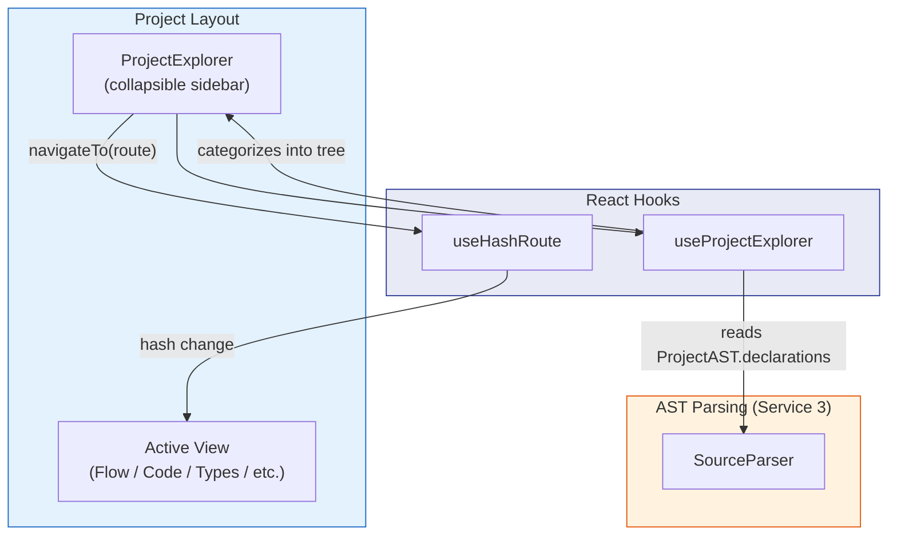
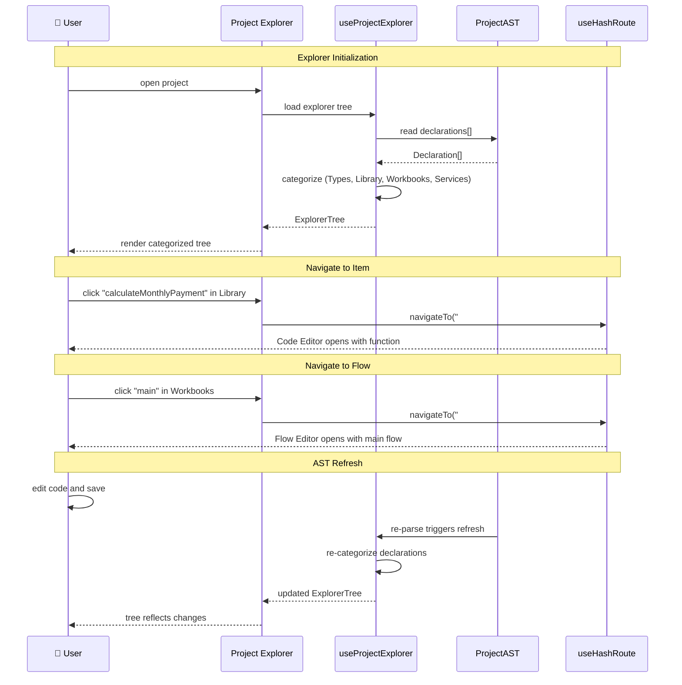

# Project Explorer — Architecture

> **Component:** Project Explorer (UI Component)
> **Testing:** Cypress (`views/project-explorer/`)
> **Depends on:** AST Parsing (Service 3) for `ProjectAST` declarations
> **Consumed by:** Project Layout (navigation shell)

## Overview

The Project Explorer is a **collapsible sidebar** component that displays the structural contents of an open project
as a categorized tree. It serves as the primary navigation mechanism for discovering and opening project items —
types, functions, and flows.

The explorer reads exclusively from the `ProjectAST` (produced by AST Parsing, Service 3) as its single source of
truth. When the AST is re-parsed (e.g., after a code edit), the explorer tree automatically refreshes.

**Architectural position:** The Project Explorer is embedded in the `ProjectLayout` component (left sidebar). It is
visible across all project-scoped views (Flow Editor, Code Editor, Types Editor, etc.) and can be collapsed to
maximize workspace area.

## Tree Categories

The explorer organizes `ProjectAST.declarations` into four top-level categories:

| Category       | Contents                                             | Filter Criteria                                                 |
| :------------- | :--------------------------------------------------- | :-------------------------------------------------------------- |
| **Types**      | All `TypeDeclaration` entries                        | `declaration.nodeType === 'type'`                               |
| **Library**    | All functions (computation steps)                    | `declaration.nodeType === 'function'`                            |
| **Workbooks**  | Flows with no input arguments                        | `declaration.nodeType === 'flow' && declaration.parameters.length === 0` |
| **Services**   | Flows with input arguments                           | `declaration.nodeType === 'flow' && declaration.parameters.length > 0`  |

> **Note:** `chart`, `table`, and `list` declarations are not shown as separate categories — they appear as nodes
> within the flow canvas when the user opens a flow. `InternalDeclaration` items (nodeType `'none'`) are hidden.

### Tree Structure Example

```
📁 Types
  ├── Customer
  ├── OrderLine
  └── PaymentLine
📁 Library
  ├── calculateMonthlyPayment
  ├── generateLoanSchedule
  ├── renderLoanBalanceChart
  └── renderLoanScheduleTable
📁 Workbooks
  └── main
📁 Services
  └── (empty)
```

## Navigation Behavior

Clicking an item in the explorer navigates to the appropriate editor view:

| Category       | Click Action                                        | Route                                    |
| :------------- | :-------------------------------------------------- | :--------------------------------------- |
| **Types**      | Opens Types Editor                                  | `/#types/:projectId`                     |
| **Library**    | Opens Code Editor for the function                  | `/#code-editor/:projectId/:functionId`   |
| **Workbooks**  | Opens Flow Editor for the flow                      | `/#flow/:projectId/:flowId`              |
| **Services**   | Opens Flow Editor for the flow                      | `/#flow/:projectId/:flowId`              |

### Default Flow on Project Open

When a project is first opened (navigated to via the workspace), the Project Explorer determines which flow to
display:

1. If a flow named `main` exists → open it (`/#flow/:projectId/main`).
2. If no `main` flow but other flows exist → open the first flow found.
3. If no flows exist → this should not happen due to the
   [Project Validation Step](01_PROJECTS_SERVICE_ARCH.md#project-validation-step), which guarantees at least one
   flow exists.

This replaces the previous `rootFlowId` / `modelType` detection algorithm with a simple, deterministic lookup.

## Structural Diagram



## Behavioral Diagram



## Components

### ProjectExplorer (`project-explorer.tsx`)

The main sidebar component rendered inside `ProjectLayout`. Displays a collapsible tree with category headers
(Types, Library, Workbooks, Services). Each category can be expanded/collapsed independently.

**UI elements:**
- Collapse/expand toggle for the entire sidebar
- Category headers with item count badges
- Tree items showing declaration `displayName` (or `name` fallback)
- Active item highlighting (matches current route)

**Test strategy (Cypress):** Open a project, verify all categories render correctly, click items and verify
navigation, verify tree updates after code edits.

### useProjectExplorer Hook

The bridge between the `ProjectAST` and the explorer UI.

```typescript
interface ExplorerCategory {
    label: string;
    items: ExplorerItem[];
}

interface ExplorerItem {
    id: string;
    name: string;
    displayName?: string;
    nodeType: NodeType;
    route: string;
}

interface UseProjectExplorerReturn {
    categories: ExplorerCategory[];
    isLoading: boolean;
    activeItemId: string | null;
}

function useProjectExplorer(projectId: string): UseProjectExplorerReturn;
```

**Implementation pattern:**
1. Read `ProjectAST.declarations` from the AST query cache (TanStack Query)
2. Filter and group declarations into the four categories
3. Generate route strings for each item
4. Derive `activeItemId` from the current hash route

## Layout Integration

The Project Explorer is integrated into `ProjectLayout` as a resizable left sidebar:

```
┌─────────────────────────────────────────────────────────┐
│  ◄ Back to Workspace          Project Name              │
├────────────┬────────────────────────────────────────────┤
│            │                                            │
│  📁 Types  │        Active View                         │
│    ├ ...   │    (Flow Editor / Code Editor / etc.)      │
│            │                                            │
│  📁 Library│                                            │
│    ├ ...   │                                            │
│            │                                            │
│  📁 Work-  │                                            │
│    books   │                                            │
│    ├ main  │                                            │
│            │                                            │
│  📁 Serv-  │                                            │
│    ices    │                                            │
│            │                                            │
├────────────┴────────────────────────────────────────────┤
│  [Editor] [Tests] [Types] [App] [Deploy]  (tab bar)     │
└─────────────────────────────────────────────────────────┘
```

- **Default width:** 240px
- **Collapsed:** Icon-only rail or fully hidden with a toggle button
- **Persistent state:** Collapse state and category expand/collapse state stored in `localStorage`

> For file structure, see
> [ARCHITECTURE.md — Proposed Project Component Structure](ARCHITECTURE.md#proposed-project-component-structure).
