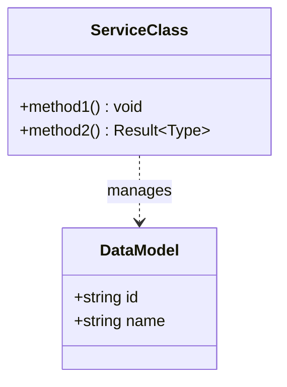
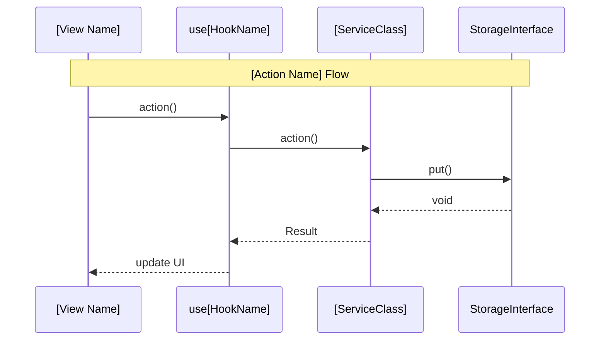

# Service N: [SERVICE NAME] — Architecture

- **Testing:** Jest (`lib/[service-path]/`) | Cypress (`views/[view-path]/`)
- **Depends on:** [DEPENDENCY 1], [DEPENDENCY 2]
- **Consumed by:** [CONSUMER 1], [CONSUMER 2]
- **Defined types:** `[Type1]`, `[Type2]`, `[Type3]`

## Overview

[Brief high-level description of the service's responsibility and its role in the system.]

## Structural Diagram



## Behavioral Diagram



## Key Interfaces

```typescript
interface [Type1] {
    id: string;
    // ...
}
```

## Components

### [Component Name] (`[file-path].ts`)

[Description of the component's responsibility.]

**Test strategy (Jest):** [Description of testing approach.]

### [Component Name] (`[file-path].ts`)

[Description of the component's responsibility.]

**Test strategy (Jest):** [Description of testing approach.]

> For file structure, see
> [ARCHITECTURE.md — Proposed Project Component Structure](ARCHITECTURE.md#proposed-project-component-structure).
