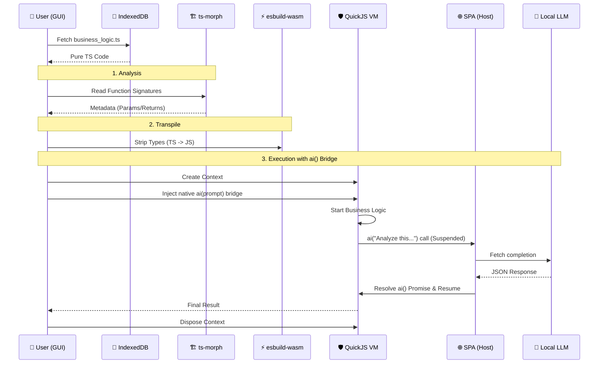

# Business Logic Execution: ai() Method Bridge

Sequence diagram for secure TypeScript (TS) execution via QuickJS VM and LLM bridge.

## Execution Workflow

## Key Phases

### 1. Analysis Phase
Uses **ts-morph** to extract AST metadata. The host knows exactly what inputs the script requires before it hits the VM.

### 2. Transpilation
**esbuild-wasm** strips types. Runs entirely within the browser's worker threads — no server round-trip.

### 3. The Bridge
`ai()` is a native injection, not standard JS. When called, it suspends the VM until the host resolves the LLM request.

### 4. Context Disposal
Each execution is ephemeral. Disposing the **QuickJS** context prevents memory leaks and ensures no state bleeds between runs.
